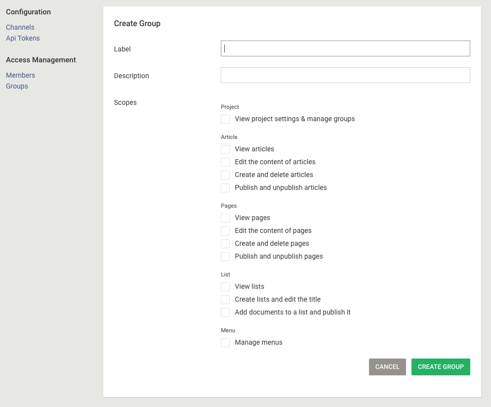

# Access rights

In Livingdocs, access rights are set on a group. A group is a many-2-many relation of users to projects.
So in general for a given project you will have many groups. One group, the "Owners" group is always created by default.
The screenshot below shows you how to set the access rights for a given group.

*You reach this screen by clicking on "Project Settings" in the main menu*

## Roles and scopes

Livingdocs has roles (the settings in the screenshot above) and scopes which are more granular system level access controls. Normally, a role clusters a bunch of scopes, for example "Publish and unpublish articles" in the screenshot above.
So setting a role on a group gives users of this group certain scopes in the system.

## Available Scopes

This lists all available scopes with their system identifiers.
In the configuration you might find `scope` settings in some places, e.g. for the [sidePanelItems](../reference-docs/editor-configuration/editing-features.md#main-menu).

Articles:

- `readArticles`, users that can read articles
- `createArticles`, users that can create articles
- `writeArticles`, users that can write articles
- `publishArticles`, users that can publish articles
- `unpublishArticles`, users that can unpublish articles
- `deleteArticles`, users that can delete articles

Pages:

- `readPages`, users that can read pages
- `createPages`, users that can create pages
- `writePages`, users that can write pages
- `publishPages`, users that can publish pages
- `unpublishPages`, users that can unpublish pages

Data:

- `readData`, users that can read data
- `createData`, users that can create data
- `writeData`, users that can write data
- `publishData`, users that can publish data
- `unpublishData`, users that can unpublish data

Lists (main menu entry):

- `readLists`, users that can read lists
- `manageLists`, users that can manage (edit) lists
- `publishLists`, users that can publish lists

Menus:

- `manageMenus`, users that can edit, publish and delete menus

Project Settings:

- `administerProject`, users that can change project settings (project admin role)

Server Admin:

- `manageUsers`, create / edit / delete users (server admin role)
