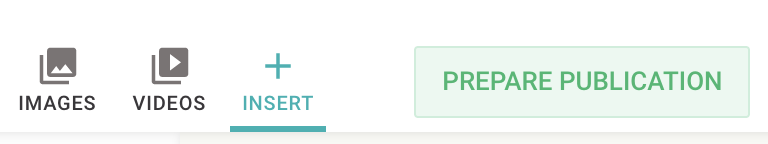

Livingdocs contains a Media Library that solves management and delivery of Images and Videos.
There are different pieces that can be used to cover custom needs per project.

This guide will walk you through setting up a basic Media Library for your project with Images and Videos support, you will learn about some details along the way.

At heart, the Media Library is based around configured `Media Types`. You might be familiar already with the concept of `Content Types`. `Media Types` are very similar.
You can configure as many different `Media Types` as you want. Usually you want to have at least 1 for Images (in fact, if you don't define one yourself, there is one added automatically at runtime).

See the [mediaType reference]() for a full reference of the `mediaType` configuration options.

When you have configured mediaTypes, you will get buttons to let users insert `Images` and `Videos` from the Document Editing Toolbar automatically.


The [Main Navigation]() will automatically hold entries for `Images` and `Videos` as well if you have a `liItem: 'mediaLibrary'` entry in your `mainNavigation` config.

## Images

### Server Config
First, you need to make sure your Media Library can [store images]().

### Image Services
To render images in documents, Livingdocs uses so called [Image Services](). You need to [configure one in your project]() to make use of images in documents.

### Basic Media Type
Let's setup a `mediaType` for the images first. You add it to your [project config]() in an array at the top-level property `mediaTypes`.

```js
//media-types/image.js
module.exports = {
  handle: 'image', // one mediaImage must have the handle 'image', additional ones can be named as you like
  type: 'mediaImage',
  info: {
    label: 'Images', // used in dashboards generated for this mediaType
    description: ''
  },
  metadata: [ // any metadata configuration as you know it from contentTypes already
    {
      handle: 'title',
      type: 'li-text',
      config: {
        required: true, // if a metadata property is required, the user will see a form to enter the metadata during upload
        requiredErrorMessage: 'Please provide a title',
        maxLength: 200,
        index: true
      },
      ui: {component: 'liMetaTextForm'}
    },
    {
      handle: 'description',
      type: 'li-text',
      config: {
        index: true
      },
      ui: {component: 'liMetaTextForm'}
    },
    {
      handle: 'credit',
      type: 'li-text',
      config: {
        required: true,
        requiredErrorMessage: 'Please provide a source',
        index: true
      },
      ui: {component: 'liMetaTextForm'}
    },
    {
      handle: 'namedCrops',
      type: 'li-named-crops',
      config: {
        index: true,
        namedCrops: [
          {
            name: 'mobile',
            isOptional: true
          },
          {
            name: 'desktop'
          }
        ]
      },
      ui: {
        label: 'Named Crops',
        component: 'liMetaNamedCropsForm'
      }
    }
  ],
  editor: {
    // the dashboard seen by users when opening Images/Videos from the document editor
    dashboard: {
      displayFilters: [
        {
          filterName: 'liDateTimeRange'
        }
      ]
    },
    // the dashboard opened through the main navigation
    managementDashboard: {
      displayFilters: [
        {
          filterName: 'liDateTimeRange'
        }
      ]
    }
  }
}
```

### IPTC extraction
Since many image files (especially those you get from image agencies) hold metadata defined by the IPTC standard, you want to configure extraction for certain metadata fields, so your users don't have to manually type them.
You do this by adding the `exifExtraction` property to the `mediaType`. See [the list of all IPTC fields]() and how to configure them.

The exif extraction will run when an image is imported through the [Import API]() or when a user uploads an image through the UI.
The user has the chance to manually change the extracted Metadata before the image is actually stored in the Media Library.

```js
// media-types/image.js
module.exports = {
  handle: 'image',
  type: 'mediaImage',
  // ...
  exifExtraction: {
    mappings: [
      {
        field: 'Title',
        metadataPropertyName: 'title'
      },
      {
        field: 'Description',
        metadataPropertyName: 'description'
      },
      {
        field: 'Credit Line',
        metadataPropertyName: 'credit'
      }
    ]
  },
  // ...
}
```

### Named Crops
With Livingocs, you can manage multiple crops per Image. We call it `Named Crops` and it works like this:
- You can define the crops hold with an image in the Media Library
- A user can edit these crops during upload or from within the Media Library Management Dashboard
- Whenever an image is used in a document, the crops are copied into the document and can be changed locally within the document

There are different strategies how to configure the crops:

1. Configure Named Crops with names after the usage, e.g. `desktop`, `mobile`
2. Configure Named Crops with aspect ratio names, e.g. `16:9`, `4:3`


We are going to configure strategy 1 in this guide. There are 4 points where we need to configure this:

1. designSettings
2. mediaType
3. Design: image components `doc-image` directive
4. Metadata: `li-image` metadata properties (for a teaser image for example)

#### designSettings
In the [designSettings]() of the project config, all the `namedCrops` need to be configured. You can then use all or some of them in `mediaType`s and `doc-image` directives.

```js
projectConfig.designSettings: {
  //...
  namedCrops: [
    {
      handle: 'mobile',
      label: 'Mobile',
      description: 'this image will be shown on small screens',
      // on small screens, having exact same ratios across all images is not that important
      // we let the user pick one but change freely
      recommendedRatios: ['1:1', '16:9']
    },
    {
      handle: 'desktop',
      label: 'Desktop',
      description: 'this image will be shown on wide screens',
      // for large screens, we want consistent 16:9 image ratios, the user can't change that
      imageRatios: ['16:9']
    },
    {
      handle: 'sm-teaser',
      label: 'SM Teaser',
      description: 'this image will be shown on wide screens',
      // for social media, we might want to use a different crop, but the ratio is fixed
      imageRatios: ['16:9']
    }
  ],
  //...
}
```

#### mediaType
In order to hold default crops on images in the Media Library we configure the special purpose metadata plugin `li-named-crops`. It allows users to set crops during image upload and later on within the Media Library.
These default crops will be copied into documents at the time an image is inserted into a document (well, a `doc-image` directive technically). They are copied so a user can change the crops locally for this specific usage of the image. Later changes to the crops in the Media Library won't affect the usages in `doc-image` anymore.

To define which default crops to store in the Media Library, we configure a metadata property of type `li-named-crops` within the metadata config of a `mediaType` of type `mediaImage`.

```js
// media-types/image.js
module.exports = {
  handle: 'image',
  type: 'mediaImage',
  // ...
  metadata: [
    // ...
    {
      handle: 'namedCrops',
      type: 'li-named-crops',
      config: {
        // configure all the namedCrops defined in the designSettings
        // that you want to keep a default within every mediaLibrary image for
        namedCrops: [
          {
            // the mobile crop is optional, the user can add it at will
            name: 'mobile', // name references the handle of a namedCrop in the designSettings
            isOptional: true
          },
          {
            // the desktop crop will always be defined after upload
            // the user can't remove it but only change according to the
            // configuration in the designSettings
            name: 'desktop'
          },
          {
            name: 'sm-teaser',
            isOptional: true
          }
        ]
      },
      ui: {
        label: 'Named Crops',
        component: 'liMetaNamedCropsForm'
      }
    }
  ],
  // ...
}
```

#### doc-image directive
Now we need to configure the `namedCrops` on the [doc-image]() directive of our image component in the [design]().

```js
module.exports = {
  name: 'image',
  label: 'Image',
  iconUrl: `https://livingdocs-assets.s3.amazonaws.com/magazine-design/assets/images/icons-components/icon_image.svg`,
  directives: [{
    name: 'image',
    type: 'image',
    // for images in documents, only the desktop and mobile namedCrops
    // are used, the desktop is the default (shown in the document)
    // the mobile crop can be added by a user at will
    namedCrops: [{
      name: 'desktop', // the name references the handle of a namedCrop in the designSettings
      isDefault: true
    }, {
      name: 'mobile',
      isOptional: true
    }]
  }],
  html: dedent`
  <div class="m-asset-image m-asset-image--numbered">
    <div class="m-asset-image__image">
      
    </div>
    <div class="m-asset-image__options">
      <div class="a-asset-input" doc-editable="caption">Caption</div>
      <div class="a-asset-input" doc-editable="source">Source</div>
    </div>
  </div>
  `
}
```

#### Metadata li-image
Last but not least, we configure the namedCrops on our teaserImage components. In this example, there are two teasers, one used internally called `Teaser Image` and one for social media shares called `Social Media Teaser Image`. We are going to configure both. This goes into the metadata configuration of a [contentType]().

```js
module.exports = {
  handle: 'regular',
  documentType: 'article',
  // ...
  metadata: [
    // ...
    {
      handle: 'teaserImage',
      type: 'li-image',
      config: {
        namedCrops: [
          {
            name: 'desktop',
            isDefault: true
          },
          {
            name: 'mobile',
            isOptional: true
          }
        ]
      },
      ui: {component: 'liMetaImageForm'}
    },
    {
      handle: 'socialMediaTeaserImage',
      type: 'li-image',
      config: {
        namedCrops: [{
          name: 'socialMediaTeaser',
          isDefault: true
        }]
      },
      ui: {component: 'liMetaImageForm'}
    }
    // ...
  ],
  // ...
}
```

## Videos
Since `release-2021-03` you can manage your Videos with the Livingdocs Media Library as well. It works pretty similar to the images. The solution still has some shortcomings you need to be aware of:

- No render strategies or video services like you know them from images are available yet. That means the system works well if you render from the JSON in the delivery, but not so well if you let Livingdocs do the rendering to HTML.
- As with images, you don't want to deliver the original Video file to your customers directly but have some kind of transcoding to different formats and sizes. There is no integrated solution to this in Livingdocs yet.

Nevertheless if you find solutions to these problems outside of Livingdocs, you can very well make use of the Video Management System already.

### Server Config

You need to make sure your Media Library can [store videos]().

### Basic Media Type
Let's setup a `mediaType` for the videos. You add it to your [project config]() in an array at the top-level property `mediaTypes`.

```js
//media-types/video.js
module.exports = {
  handle: 'video', // the handle is free, but one mediaVideo must have the handle 'video'
  type: 'mediaVideo',
  info: {
    label: 'Videos', // used in dashboards generated for this mediaType
    description: ''
  },
  metadata: [ // any metadata configuration as you know it from contentTypes already
    {
      handle: 'title',
      type: 'li-text',
      config: {
        required: true, // if a metadata property is required, the user will see a form to enter the metadata during upload
        requiredErrorMessage: 'Please provide a title',
        maxLength: 200,
        index: true
      },
      ui: {component: 'liMetaTextForm'}
    },
    {
      handle: 'description',
      type: 'li-text',
      config: {
        index: true
      },
      ui: {component: 'liMetaTextForm'}
    },
    {
      handle: 'credit',
      type: 'li-text',
      config: {
        required: true,
        requiredErrorMessage: 'Please provide a source',
        index: true
      },
      ui: {component: 'liMetaTextForm'}
    }
  ],
  editor: {
    // the dashboard seen by users when opening Images/Videos from the document editor
    dashboard: {
      displayFilters: [
        {
          filterName: 'liDateTimeRange'
        }
      ]
    },
    // the dashboard opened through the main navigation
    managementDashboard: {
      displayFilters: [
        {
          filterName: 'liDateTimeRange'
        }
      ]
    }
  }
}
```

### Poster Image
For Videos, you want to have a poster image displayed in your Video Player before the Video starts playing. Livingdocs provides a metadata plugin to manage this image.

When configured, a UI to manage the image is provided.


You can even select a specific frame of the video by pausing the player and selecting the current frame as the poster image.


Images stored with this metadata plugin will contain one crop in the aspect ratio of the video file automatically. A user can change the zoom and position but not the aspect ratio of that crop.

Poster Images are stored withing the Media Library as images when uploaded through the poster image metadata plugin or a frame of the video is selected. You probably want to configure a separate `mediaType` for these, since there are different requirements to the metadata.

#### mediaType for the images
Don't forget to add this the the `mediaTypes` in your [project config]().

```js
// /media-types/poster-image.js
module.exports = {
  handle: 'posterImage',
  type: 'mediaImage',
  info: {
    label: 'Poster Images'
  },
  hidden: true, // This makes sure these images are not shown in the regular Image Library
  metadata: [{
    handle: 'title',
    type: 'li-text',
    ui: {
      component: 'liMetaTextForm'
    }
  }]
}
```

#### li-poster-image metadata plugin
Now you can add the `li-poster-image` metadata plugin to your video `mediaType`:

```js
//media-types/video.js
module.exports = {
  handle: 'video',
  type: 'mediaVideo',
  // ...
  metadata: [
    // ...
    {
      handle: 'posterImage',
      type: 'li-poster-image',
      ui: {
        component: 'liMetaPosterImageForm',
        config: {
          uploadMediaType: 'posterImage' // this is the handle of the mediaType used for uploaded images
        }
      }
    }
  ],
  // ...
}
```


## Files

Since `release-2021-06` you can manage other files than videos and images with the Livingdocs Media Library as well.

### Server Config

You need to make sure your Media Library can [store files]().

### Basic Media Type
Let's setup a `mediaType` for the files. You add it to your [project config]() in an array at the top-level property `mediaTypes`.

```js
//media-types/file.js
module.exports = {
  handle: 'file', // the handle is free, but one mediaFile must have the handle 'file'
  type: 'mediaFile',
  info: {
    label: 'Files', // used in dashboards generated for this mediaType
    description: ''
  },
  metadata: [ // any metadata configuration as you know it from contentTypes already
    {
      handle: 'title',
      type: 'li-text',
      config: {
        required: true, // if a metadata property is required, the user will see a form to enter the metadata during upload
        requiredErrorMessage: 'Please provide a title',
        maxLength: 200,
        index: true
      },
      ui: {component: 'liMetaTextForm'}
    },
    {
      handle: 'description',
      type: 'li-text',
      config: {
        index: true
      },
      ui: {component: 'liMetaTextForm'}
    },
    {
      handle: 'credit',
      type: 'li-text',
      config: {
        required: true,
        requiredErrorMessage: 'Please provide a source',
        index: true
      },
      ui: {component: 'liMetaTextForm'}
    }
  ],
  editor: {
    // the dashboard seen by users when opening from the document editor
    dashboard: {
      displayFilters: [
        {
          filterName: 'liDateTimeRange'
        }
      ]
    },
    // the dashboard opened through the main navigation
    managementDashboard: {
      displayFilters: [
        {
          filterName: 'liDateTimeRange'
        }
      ]
    }
  }
}
```
