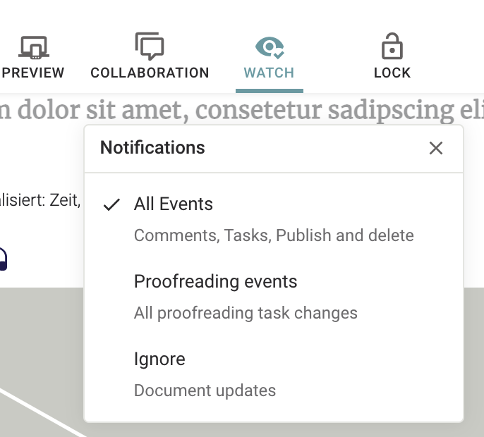

This guide explains to you how to enable Livingdocs _Notifications_ and what they are.
In a nutshell, _Notifications_ enable editors to actively track interesting changes on documents.

Let's have an example with a _Proofreading task_. Let's assume Proofreaders are interested to know if a certain article has been marked for proofreading so that the article can be published with lightspeed once they finished the task.

If they subscribe for changes on a specific document they will get an E-Mail or Slack notification that the document was marked for proofreading.

The basic idea is to improve production speed by pushing information to the editors instead of pulling, so going to a colleague and asking if an article is ready for proofreading, review, or publishing.

## Server config

First, the feature and the available channels will have to be configured in the server environment configs.

```js
// all.js
module.exports = {
  notifications: {
    enabled: true,
    enableConsumers: true,
    // only email and slack are available at the moment
    channels: {
      email: {
        enabled: true,
        fromAddress: 'noreply@your-company.io'
      },
      slack: {
        enabled: true,
        // Slack documentation on how to create and retrieve that token
        // https://api.slack.com/authentication/token-types#bot
        botUserToken: 'botUserToken'
      }
    }
  },

  // A valid email configuration is required:
  // https://docs.livingdocs.io/reference-docs/server-config/config#user-management-emails
  emails: {
    transports: {
      default: {
        from: '<noreply@your-company.io>',
        module: 'nodemailer-ses-transport',
        config: {
          accessKeyId: 'secret',
          secretAccessKey: 'secret',
          region: 'eu-west-1',
        }
      }
    },
    // defining your own email templates
    templates: {
      notifications: {
        transport: 'default',
        subject: 'Changes on a document you are subscribed to',
        htmlTemplatePath: require.resolve('@livingdocs/server/plugins/email-templates/notifications.html')
      }
    }
  }
}
```


### Project config
Certain _actions groups_ can be defined within the [project config for notifications]().

With the _action groups_ you can define the types of changes a certain group is interested in.

Enabling the feature and project configuration will be output like this in the editor.



```js
module.exports = {
  v: 2,
  notifications: {
    actionGroups: [
      // First example group, interested in ALL changes
      {
        handle: 'all',
        label: 'All Events',
        description: 'Comments, Tasks, Publish and delete',
        actions: [
          'task.change',
          'document.publish',
          'document.unpublish',
          'document.copy',
          'document.delete',
          'document.transform',
          'comment.add'
        ]
      },
      // Second example group, interested only in Task changes
      {
        handle: 'proofreading',
        label: 'Proofreading events',
        description: 'All proofreading task changes',
        actions: [
          {
            type: 'task.change',
            taskName: 'proofreading',
            statusChange: ['requested', 'accepted', 'completed']
          }
        ]
      }
    ],
    // the task requester is notified on task changed even without subscription
    notifyTaskRequester: true,
    // the author is auto subscribed to the document with the specified actionGroup
    autoSubscribeOwner: {enabled: true, actionGroup: 'all'}
  }
}
```

Possible action to register on at the moment:
- document.publish
- document.unpublish
- document.copy
- document.delete
- document.transform
- comment.add
- task.assign
- task.change
   config options:
   ```js
    // assign to all tasks and statusChanges
   'task.change'
   
    // assign to task proofreading on statusChanges 'requested', 'accepted', 'completed'
   {type: 'task.change', taskName: 'proofreading', statusChange: ['requested', 'accepted', 'completed']}
   ```


#### Comments mentioning
As soon as the comments are enabled it is possible to mention another user in a comment. The other user will get a notification when they are enabled. The user doesn't have to watch a document to get the notification.


### Setup Slack
1. Go to https://api.slack.com/apps/
2. “Create new app” 
3. select from scratch
4. Add it to your workspace
5. Go to the app & go to ‘oauth and permissions’
6. use the Bot User OAuth Access Token and add the following scopes:
   - `chat:write`
   - `chat:write.customize`
   - `users:read`
   - `users:read.mail`
7. install the app on the workspace
8. Add `Bot User OAuth Token` to the livingdocs `notifications.channels.slack.botUserToken` config