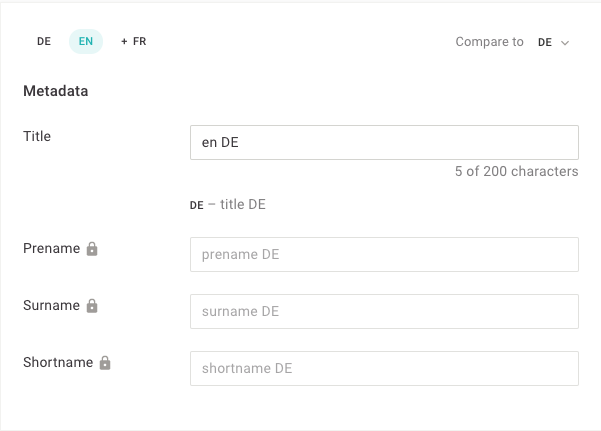

This guide explains you how to enable metadata translations for Data Records.



## Add Available Languages

On the server, we first need to provide which languages we want to support in our project. This is defined per [project](). Add these top-level properties to your project config:

```js
settings: {
  languages: {
    available: [
      {label: 'German', locale: 'de'},
      {label: 'English', locale: 'en'}
    ],
    defaultLanguage: {
      label: 'German',
      locale: 'de'
    }
  }
}
```

### Add Plugin to Enable Translations

As a next step, you have to add the `li-metadata-translations` metadata plugin to enable the Translations behavior for the data record.

```js
//content-types/author.js
module.exports = {
  metadata: [
    {
      handle: 'language',
      type: 'li-metadata-translations'
    }
  ]
}
```

### Translatable metadata properties

For every metadata property in a Data Record, you can set `config.translatable: true` to enable translations.

```js
//content-types/author.js
module.exports = {
  documentType: 'data-record',
  metadata: [
    {
      handle: 'title',
      type: 'li-text',
      config: {
        maxLength: 200,
        translatable: true // <-------- add this property
      }
    }
  ]
}
```
