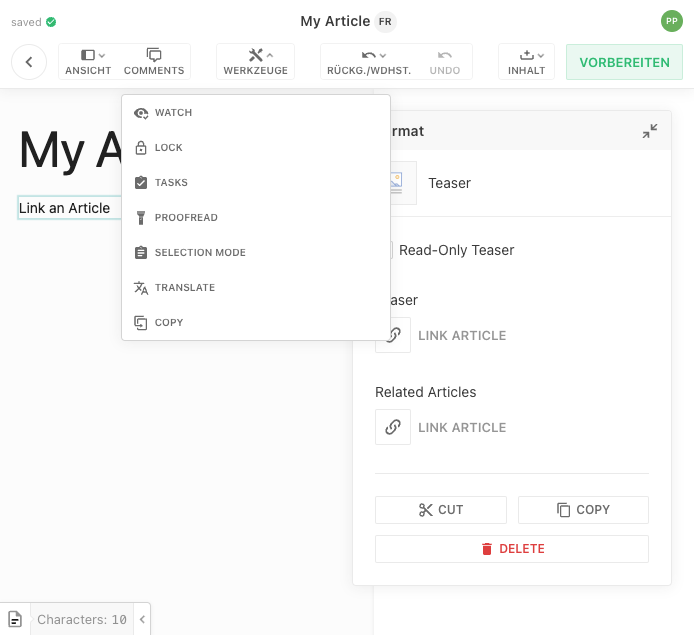
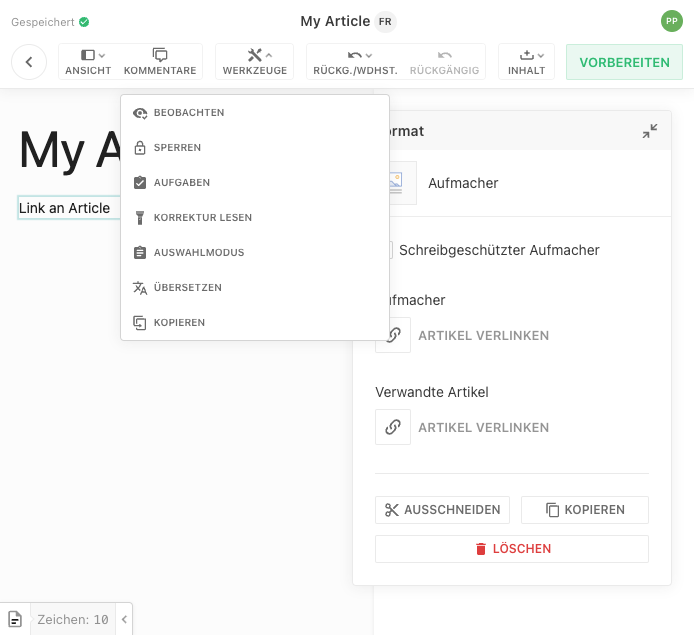
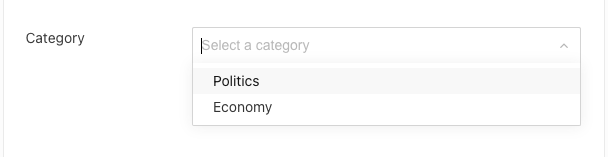

This guide explains how to configure Livingdocs to show the UI in different languages. Starting with  the default UI language can be configured and labels from the config, e.g. metadata plugin label, can be declared in multiple languages.
With the next release () a language switcher will be added to the UI.

UI in English:



UI in German:



## Configure Default UI Language

Set the default Editor UI language in the Editor config:

```js
app: {
  locale: 'de'
}
```

Currently the UI is available in English and German.

## Translating Config Labels, Placeholders and Titles

Any configurable `label`, `title` or `placeholder` in the project config e.g. metadata plugin labels/placeholders, button labels like the document creation button flow label or the page title of a table dashboard, etc., can be declared in multiple languages. The label will be displayed in the language of the current UI language.

Example: Translating a metadata plugin label in the project config:

```js
metadata: [
  {
    handle: 'category',
    type: 'li-string-list',
    ui: {
      label: {
        en: 'Category',
        de: 'Kategorie'
      },
      config: {
        placeholder: {
          en: 'Select a category',
          de: 'Wählen Sie eine Kategorie aus'
        }
      }
    },
    config: {
      dataProvider: {
        type: 'labelValuePair',
        items: [
          {label: {en: 'Politics', de: 'Politik'}, value: 'politics'},
          {label: {en: 'Economy', de: 'Wirtschaft'}, value: 'economy'}
        ]
      }
    }
  },
]
```




