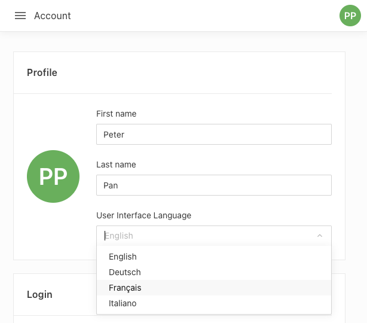
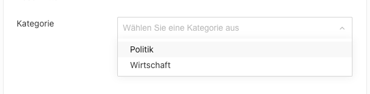

This guide explains how to configure Livingdocs to show the UI in different languages. Starting with  the default UI language can be configured and labels from the config, e.g. metadata plugin label, can be declared in multiple languages.
A language switcher has been added to user profile menu with .



## Configure Default UI Language

Set the default Editor UI language in the [Editor config]():

```js
app: {
  locale: 'de', // optional, language to show UI in - defaults to 'en'
  availableLocales: ['de', 'en', 'fr', 'it'] // optional - languages available in UI language switcher
}
```

If `app.availableLocales: undefined | undefined` then the language switcher will be hidden.

As of , the UI is available in English (`en`) and German (`de`).

As of , the UI is additionally available in French (`fr`) and Italian (`it`).

## Translating Config Labels, Placeholders and Titles

Any configurable `label`, `title` or `placeholder` in the project config e.g. metadata plugin labels/placeholders, button labels like the document creation button flow label or the page title of a table dashboard, etc., can be declared in multiple languages. The label will be displayed in the language of the current UI language.

Example: Translating a metadata plugin label in the project config:

```js
metadata: [
  {
    handle: 'category',
    type: 'li-string-list',
    ui: {
      label: {
        en: 'Category',
        de: 'Kategorie',
        fr: 'Catégorie',
        it: 'Categoria'
      },
      config: {
        placeholder: {
          en: 'Select a category',
          de: 'Wählen Sie eine Kategorie aus',
          fr: 'Sélectionnez une catégorie',
          it: 'Seleziona una categoria'
        }
      }
    },
    config: {
      dataProvider: {
        type: 'labelValuePair',
        items: [
          {
            label: {
              en: 'Politics',
              de: 'Politik',
              fr: 'Politique',
              it: 'Politica'
            },
            value: 'politics'
          },
          {
            label: {
              en: 'Economy',
              de: 'Wirtschaft',
              fr: 'Économie',
              it: 'Economia'
            },
            value: 'economy'
          }
        ]
      }
    }
  }
]
```

Metadata plugin displayed with German translations.


