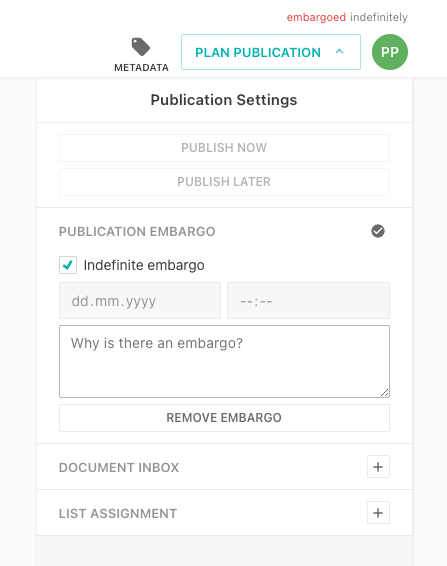
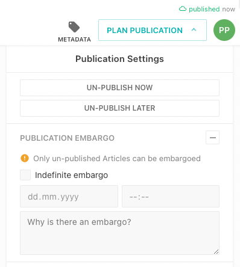
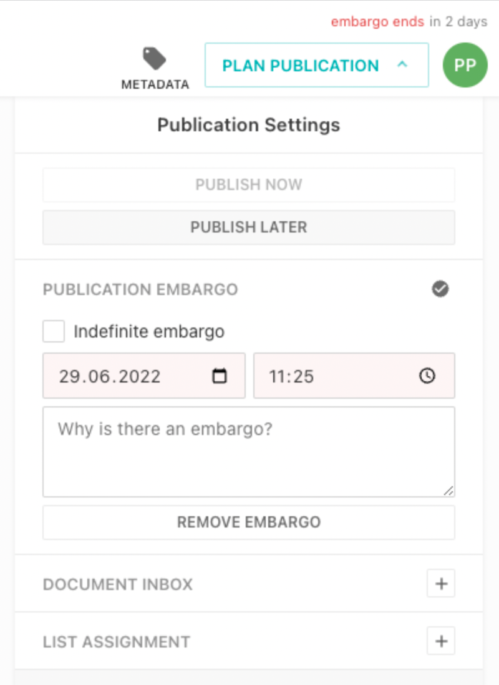
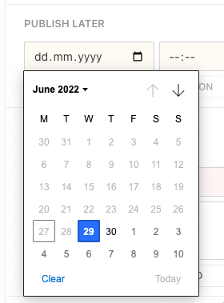

This guide will show you how to set a publication embargo to prevent the publication of an article.



Embargos can only be set for un-published articles.



## Indefinite Embargo

An article gets indefinitely embargoed by checking the "Indefinite embargo" checkbox. This will prevent the publication of the article and also prohibits scheduling a "Publish Later" date.


## Embargo with an expiration date

When an embargo is set with an expiration date, then any publication is prevent but a publication can be scheduled for after the expiration of the embargo.





## Configuration

The publication embargo is by default disabled.

```js
{
  handle: 'myArticle',
  // ...
  publishControl: {
    embargo: true, // default: false
  }
}
```
