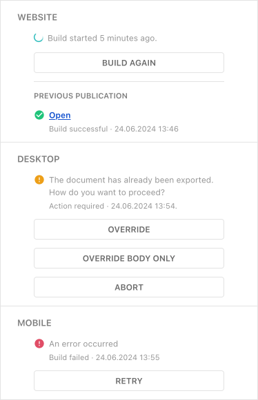

This guide will show you how trigger a delivery build and see its build status.



As soon a document has been published, the delivery section will show up. Clicking on a build button of a delivery will trigger a build in an external system. The external system can report back with the current build status and an optional message.

`POST /api/v1/documents/360/addDeliveryStatus`

Payload:

```json
{
  "reportId": "2SG2MAA9RwPn",
  "publicationId": 524,
  "deliveryHandle": "mobile",
  "status": "success",
  "message": "More info see <a href=\"https://google.ch\" target=\"_blank\">here</a>"
}
```

## Server Downstream Configuration

`/example-server/projects/<project-name>/index.js`

```js
{
  ...
  deliveries: [
    {
      handle: 'web',
      label: 'Website',
      isPrimary: true,
      icon: 'book-open',
      url: {
        origin: 'https://livingdocs.io',
        pathPattern: '/doc/:id'
      },
      build: {
        enabled: true,
        triggerButtonLabel: 'Build',
        retriggerButtonLabel: 'Build again',
        retryButtonLabel: 'Retry'
      }
    }
  ],
  ...
}
```

`/example-server/projects/<project-name>/content-types/<data-record-name>.js`

```js
{
  ...
  documentType: 'data-record',
  publishControl: {},
  deliveries: [
    {
      deliveryName: 'web',
      isPrimary: true
    }
  ]
}

```
