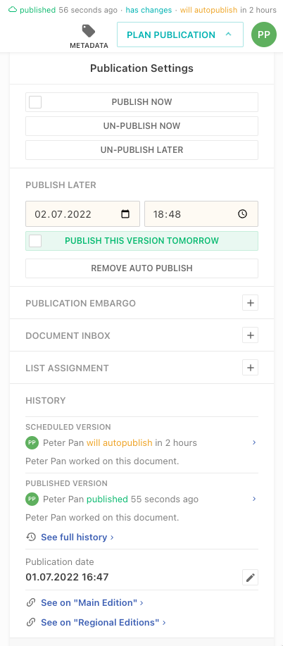
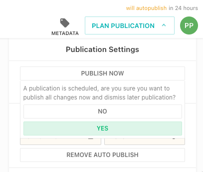
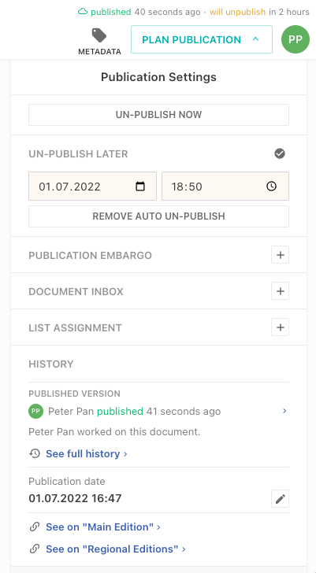

This guide will show you how to enable and use scheduled auto publishing / un-publishing.

Click the "Publish later" button to set a future auto publish date.



A confirmation message is shown, if one wants to publish instantly while a publish later date is set.



Click the "Un-Publish Later" button to set a future auto un-publish date.



## Configuration

Publish later and un-publish later is by default disabled.

```js
{
  handle: 'myArticle',
  // ...
  publishControl: {
    publishSchedule: true, // default: false
    unpublishSchedule: true // default: false
  }
}
```
