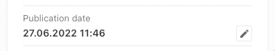
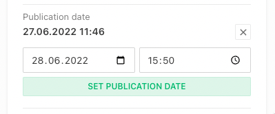

This guide will show you how to view and edit the visible publication date of an article. One can find the publication date in the lower section of the publication control panel.




## Configuration

Editing the visible publication date is by default disabled.

```js
{
  handle: 'myArticle',
  // ...
  publishControl: {
    visiblePublicationDateOverride: true, // default: false,
  }
}
```

### Publication Date Preferences

By default, the visible publication date will show the date set manually or fallback to the first publication date.

The preferences of which date is shown, can be configured with the help of the `visiblePublicationDatePreference` property.

```js
{
  handle: 'myArticle',
  // ...
  publishControl: {
    visiblePublicationDateOverride: true, // default: false,
    visiblePublicationDatePreference: [
      'publishControl.visiblePublicationDateOverride', // show visible publication override date (the date that is set when editing the date manually) if defined
      'metadata.publicationDate', // fallback to metadata publication date (the date defined in a custom metadata field) if defined
      'publishControl.firstPublicationDate' // fallback to first publication date
    ]
  }
}
```

### Access to visiblePublicationDate

All APIs provide the `visiblePublicationDate` via `systemdata`, e.g.

```JSON
{
  "systemdata": {
    "documentId": 42,
    "documentType": "article",
    "visiblePublicationDate": "2022-06-27T07:32:01.977Z"
  }
}
```
