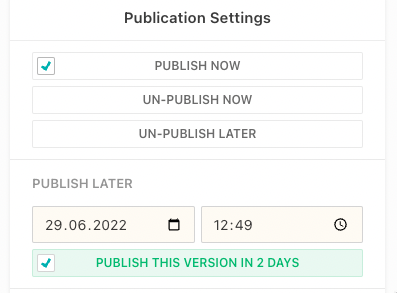

This guide will show you how to publish changes marked as "Significant update".



## Configuration

Significant updates are by default disabled.

```js
{
  handle: 'myArticle',
  // ...
  publishControl: {
    significantPublicationDate: true // default: false
  }
}
```

## Reset Visible Publication Date on Significant Update

If you like to reset the visible publication when a significant update is made, then set the `resetVisiblePublicationDateOverrideOnSignificantUpdate` to `true`.

```js
{
  handle: 'myArticle',
  // ...
  publishControl: {
    visiblePublicationDateOverride: true, // default: false,
    significantPublicationDate: true, // default: false
    resetVisiblePublicationDateOverrideOnSignificantUpdate: true, // default: false
    visiblePublicationDatePreference: [
      'publishControl.visiblePublicationDateOverride', // show visible publication override date (the date that is set when editing the date manually) if defined
      'publishControl.significantPublicationDate', // fallback to significant publication date if defined
      'publishControl.firstPublicationDate' // fallback to first publication date
    ]
  }
}
```
