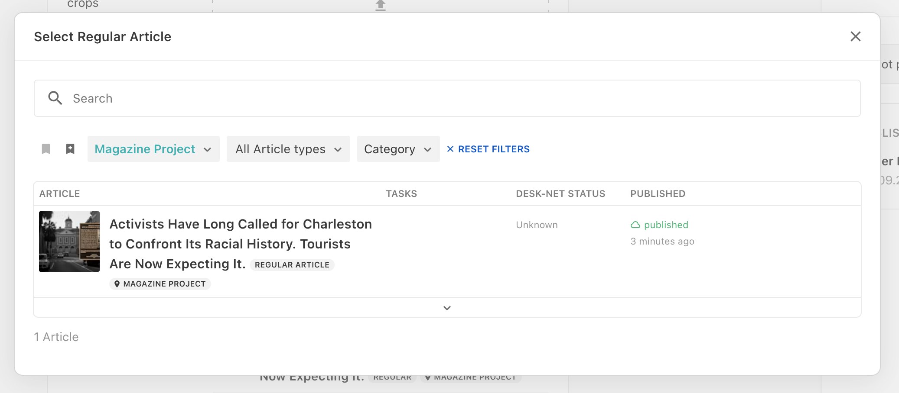
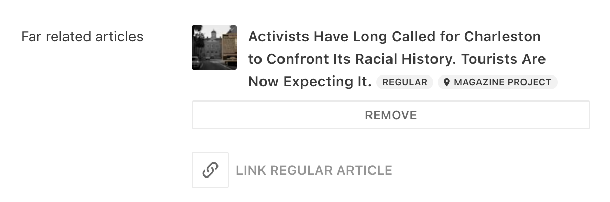

### Overview

Cross Project Content Sharing enables you to share content between different Livingdocs projects.

1. Dashboards can be used to search and filter those external documents and link them to your content in metadata properties.

   

2. The document card of li-document-references shows the externalSystem as label. In this case `Magazine Project`
   

3. Metadata Plugins that support referencing external documents:
   - `li-document-reference`
   - `li-document-references`
   - `li-tree`

## Prerequisite

The Livingdocs Server instances where the cross project configuration should be supported, have some constraints:

1. Instances need to set the `clusterId` via Server Config. The config value must be unique per Livingdocs cluster/installation.

   ```js
   {
     clusterId: 'cAdwxNycQa'
   }
   ```

   Keep attention, if you change this config on an already-existing server, you will need to reindex document on Elasticsearch as document ids get prefixed using the cluster id.

   ```bash
   livingdocs-server elasticsearch-index --handle=li-documents -y
   livingdocs-server elasticsearch-index --handle=li-publications -y
   livingdocs-server elasticsearch-index --handle=li-media -y
   ```

2. Instances need to set the same `indexNamePrefix` via Server Config (`elasticIndex.indexNamePrefix`)
3. All instances need to run against the same Elasticsearch Cluster.

## Project Setup

1. Create a source project with the content types in it you want to share
2. Create an access token in the source project. The token requires the `Enable cross project content sharing` permission.
3. Create a destination project with the same content type as the source project.
   It requires the following configurations:

   1. Configure the `externalSystems` property in the destination project configuration.
      ```js
      externalSystems: [
        {
          type: 'livingdocs',
          // do not change this once you have content referenced,
          // references will break and result in a 404 error.
          handle: 'magazine-project',
          label: 'Magazine Project',
          livingdocsServerUrl: 'http://localhost:9090',
          livingdocsServerToken: {
            $secretRef: {name: 'crossProjectTokenOnRemoteProject'}
          }
        }
      ],
      ```
   2. Create a dashboard that includes the `crossProjectContentSearch` filter.
      Please consult the [dashboard config documentation]() for a full configuration.

      ```js
      {
        handle: 'articlesWithExternalDocuments',
        type: 'tableDashboard',
        displayFilters: [
          {filterName: 'crossProjectContentSearch', config: {filterLabel: 'Content Hubs'}},
          'contentType',
          'liDateTimeRange'
        ],
        columns: [...]
      }
      ```

   3. Use the created dashboard on one of the metadata properties that should support embedding external documents.
      ```js
      {
        handle: 'relatedArticles',
        type: 'li-document-references',
        config: {documentType: 'article'},
        ui: {
          label: {en: 'Related articles', de: 'Verwandte Artikel'},
          config: {
            // reference the dashboard here
            useDashboard: 'articlesWithExternalDocuments',
            sortable: true,
            style: 'default'
          }
        }
      }
      ```

## Usage

After setting up the configuration as above, you're able to link content of external projects and then consume that using the public api.

In metadata properties of type `li-document-reference` and `li-document-references`, this gets represented with the usual structure, but with an additional `externalSystem` property.

For `li-document-references`:

```js
"metadata": {
  "relatedArticles": {
    "$ref": "documents",
    "references": [
      // Document references of the external system have the externalSystem property
      {
        "id": "46",
        "externalSystem": "magazine-project"
      },
      // Documents of the current project don't have a externalSystem property
      {
        "id": "50"
      }
    ]
  }
}
```

For `li-document-reference`:

```js
"metadata": {
  "relatedArticle": {
    "$ref": "document",
    "reference": {
      "id": "46",
      "externalSystem": "magazine-project"
    }
  }
}
```
