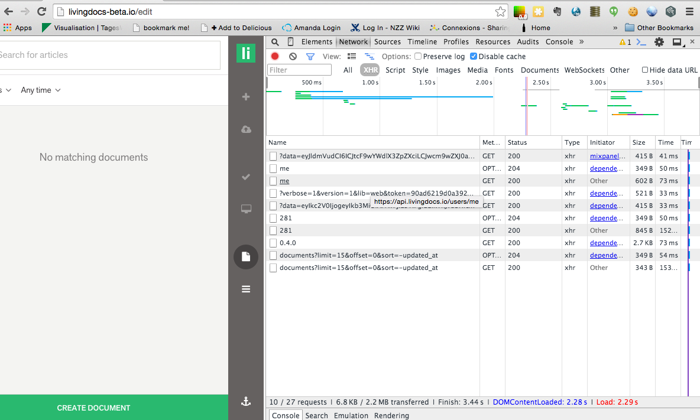
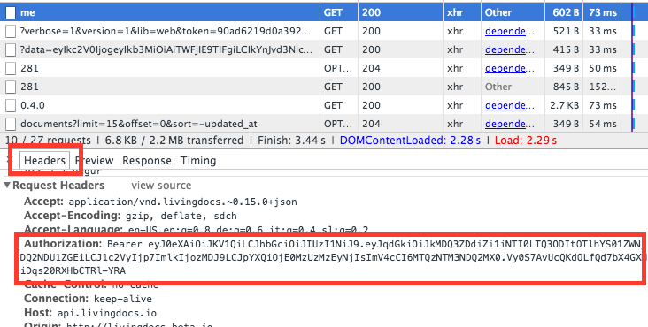
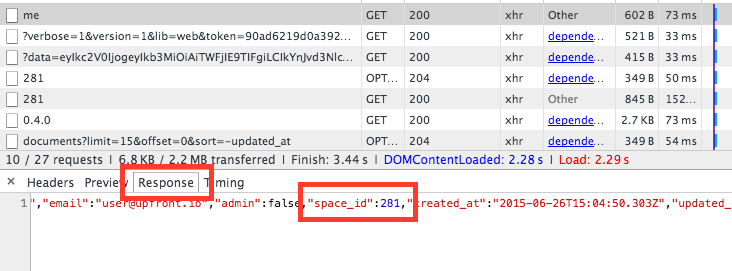

# Upload your design to livingdocs-beta

## Table of contents

- Uploading a design (this document)
- [Updating a design](./update_design.md)

## Overview

To be quite honest, this process is a bit bumpy and we lacks UI support. Please bear with us, we will make this super-easy for you in the future. For now though there are quite a lot of requirements.

### Livingdocs Beta account

 You currently need a Livingdocs Beta account with us to test out your designs.If you don't have one yet, go and sign up for one at [https://livingdocs.io/trial/](https://livingdocs.io/trial/)

### Upload manager

 In order to upload designs to Livingdocs you need the `livingdocs-design-manager` command line tool. In order to install it run:
 ```
 npm install -g livingdocs-design-manager
 ```

 With this out of the way you can now upload your design to the Livingdocs beta server. Make sure to use a unique name for your design. We currently don't reserve names so if your name is not unique enough it could be overwritten by somebody else.

 From a command line run:
 ```
 ldm publish folder-with-your-design/
 ```
 (if you use the `livingdocs-design-boilerplate` setup then "folder-with-your-design" is the dist/ folder that is created when you run `grunt build`)

The tool will ask you to provide a host (the default is fine) and enter your email and password for the Livingdocs Beta environment. If everything goes well you should get an output like this: `info publish Published the design boilerplate@0.3.0 to http://api.livingdocs.io/designs/boilerplate/0.3.0` (of course with your own design name and version).

Go ahead and fetch the URL by simply pasting it into a browser. You should see the JSON design configuration file.

### Using the design in your account

In your Livingdocs Beta account you will not yet see your design. You will first need to configure it with your account. This is where it gets really bumpy (sorry...).

In order to make the required API call to your account you first need 2 kinds of information:
* Your access token for the Beta account
* Your "space_id" (this is the id of your account)
Unfortunately, you will find this information nowhere in the user interface. You will need to look at the network traffic with the Livingdocs server. I'll walk you through in this example with the Chrome inspector but you can use any network inspector you like.



You are looking for the `GET` request for `me` (third entry in the screenshot).
In this request look at the Header value for `Authorization` and copy this. It should look like `Bearer someCrypticString`. You will also want to look at the response from this request which contains a JSON with a field `space_id` (an integer). Copy this value as well.




With those values in hand you can now make the required configuration call to the Livingdocs server. Below is an example for a curl request that you can run from the command line after replacing:
* The-authorization-header-you-copied (looks like "Bearer 123")
* your-design-name (looks like "boilerplate")
* your-design-url (looks like "http://api.livingdocs.io/designs/boilerplate/0.3.0")
* your-design-version (looks like "0.3.0")
* your-space-id (looks like "281")

```
curl -X PUT \
-H "Content-Type: application/json" \
-H "Authorization: The-authorization-header-you-copied" \
-d '{
  "default_design": {
"name": "your-design-name",
"url": "your-design-url",
"version": "your-design-version"
  }, "designs": [
{
  "name": "your-design-name",
  "url": "your-design-url",
  "version": "your-design-version",
  "is_selectable": true
},
{
  "name": "timeline",
  "is_selectable": true,
  "url": "http://api.livingdocs.io/designs/timeline/0.4.0",
  "version": "0.4.0"
},
{
  "name": "vanilla",
  "is_selectable": true,
  "url": "http://api.livingdocs.io/designs/vanilla/0.1.1",
  "version": "0.1.1"
}
  ]
}' http://api.livingdocs.io/spaces/your-space-id/config
```

NOTE: Of course you can use any HTTP request command or tool you like.

Congrats, you've done it! Now reload the browser page within your Livingdocs Beta account and press "Create Document" and you should see a new document with your design.
