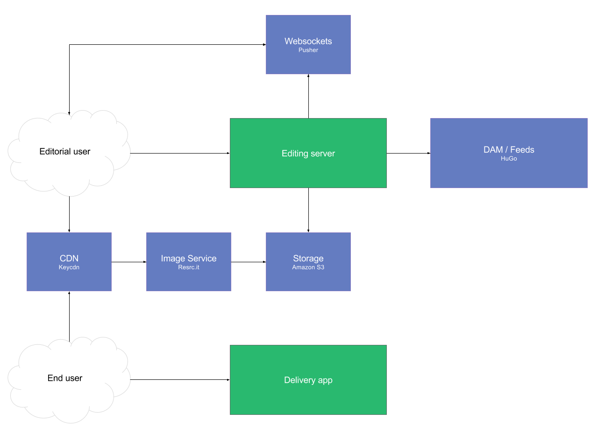

## External services
For specific features, livingdocs uses external services. By default only ports 443 and 80 are required. Additional ports might depend on your configuration.

- **Image service (eg. imgix)**: 
  - Used by the server in editing mode for cropping images.
  - Used by the editorial users browser to deliver responsive images.
- **Avatar service (imgr.io)**: Used to generate avatar images for user profiles.  
- **Cloud storage (eg. Amazon S3)**: Used by the server in editing mode to store uploaded images and to serve static assets for the livingdocs design to the end- and editorial users browser.
- **Iframely**:
  - Design components with automatic metadata fetching from a third-party source (such components are optional) in the editorial users browser.
  - Automatic validity checks of entered links. Used by the editorial users browser.
- **CDN (eg. keyCDN, optional)**: Caching for static assets
- **Mail server (eg. Amazon SES)**: For sending welcome and password reset emails.
- **Websockets (Pusher, optional)**: To support real-time collaboration in the editor. The feature can be disabled, so this is optional. Used by the server in editing mode, as well as the editorial users browser.
- **Spellchecker (optional)**: Livingdocs supports the integration of third-party spellcheckers. The feature can be disabled, so this is optional. Used by the editorial users browser.
- **Metrics and Logging (optional)**: Newrelic, Mixpanel, Loggly. Used by the server in editing mode.

There are other external services, called from the editorial- and / or end users browser. They don’t have an impact on the infrastructure and are solely listed for the sake of completeness. 
- **Track.js**: for tracking javascript errors
- **Analytics**: for tracking users and behavior on the site

### External services whitelist

### Editor
The following external service hosts have to be whitelisted on the proxy for the editor. Please note that this happens in the network where the editors browser is running, not the editor process.

- https://imgr.io
- https://usage.trackjs.com
- https://stats.pusher.com
- wss://ws-eu.pusher.com
- https://api.mixpanel.com
- The host for your S3 asset bucket (eg. https://livingdocs-evaluation-images.s3.amazonaws.com if you're using our evaluation account)
- The host for your S3 design bucket (eg. https://livingdocs-evaluation-designs.s3.amazonaws.com if you're using the default design server)
- The host for your image service (eg. https://xyz.imgix.net or https://app.resrc.it)
- Any host your customizations are using

### Server
The following external service hosts have to be whitelisted on the proxy for the server. This concerns the network where the server process is running.

- The host to your livingdocs design server (eg. http://api.livingdocs.io if you're using the default design server)
- The host for your S3 asset bucket (eg. https://livingdocs-evaluation-images.s3.amazonaws.com if you're using our evaluation account)
- The host for your S3 design bucket (eg. https://livingdocs-evaluation-designs.s3.amazonaws.com if you're using the default design server)
- The host for your mail server (eg. https://email.eu-west-1.amazonaws.com if you're using our evaluation account
- The host for your Hugo instance
- Any host your customizations are using

### Delivery
- The host to your livingdocs design server (eg. http://api.livingdocs.io if you're using the default design server)
- The host to your livingdocs server (if it's not in the same network)

### Connecting to external services through a proxy

Often times, the application processes are not allowed to have direct access to the internet for security reasons. In this case, Livingdocs can be configured to run all outgoing connections through a proxy    
 

