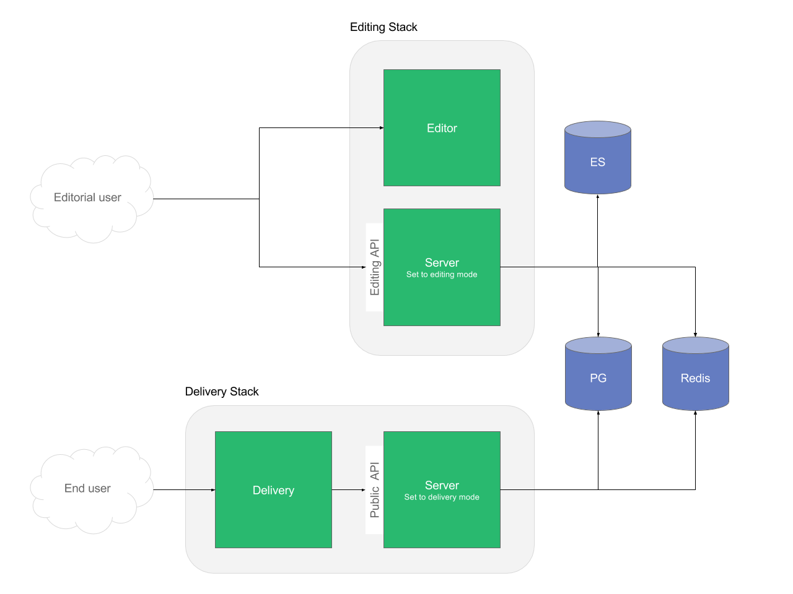

# Livingdocs architecture

_Architecture diagrams master files can be found [on google drive](https://docs.google.com/document/d/1TQhW3HtzurI78kinxUCqf5OxG3RSoiEURXEn4AIztP0/edit#heading=h.snjxmn1ywzn)_

## Stacks
On a high level, livingdocs can be divided in two different stacks. These stacks can be scaled independently from each other, depending on the requirements. 

- **Editing stack**: Services allowing the editorial user to write content in a web interface and persisting it. The content is made accessible to the delivery stack.
- **Delivery stack**: Services allowing the end user to read the content on the website or mobile application.

## Applications
- **Editor**: A single page application serving the editors web interface. It consists of static assets only. This is where the editorial user logs in and writes content.
- **Server**: A node.js application. It can be started in two different modes: 
  - In _editing mode_, it acts as the backend for the li-editor, storing content, handling file uploads, cropping, authentication and so on. It does expose a REST API for the li-editor to connect to.
  - In _delivery mode_, the purpose of it is to provide a REST API for the delivery to present the content to the user
- **Delivery**: A node.js application. Makes content written in livingdocs is available to end users. Its primary purpose is to render a website.

## Services
- **Postgres (PG)**: Primary data store for the server. For example pages, articles, menus, users are persisted here. Both servers in delivery, as well as servers in editing mode access the same data.
- **Elasticsearch (ES)**: The editor provides the user with a search, powered by an elasticsearch secondary index. Only servers in editing mode need access to this service.
- **Redis**: Key value store for the server. Used by specific features for queuing and caching. Depending on the feature set you are using, Redis is optional.
