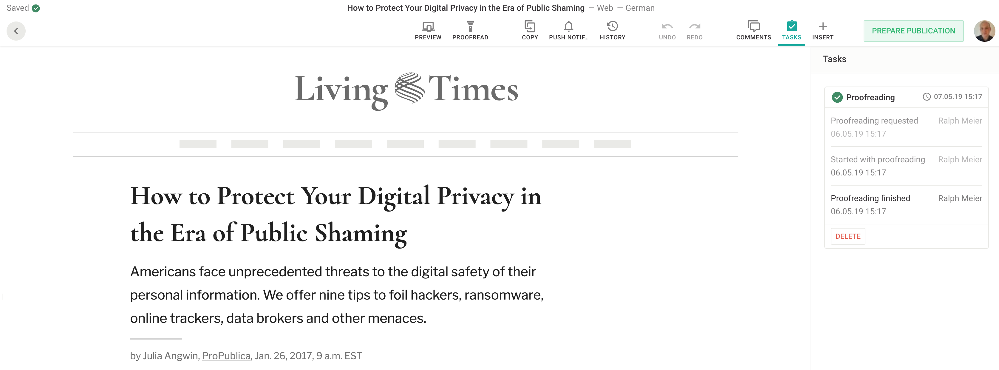

# Add your custom proofreading task

This guide will show you how to add a custom `proofreading` task. A `proofreading` task is a special form of a task with some additional config settings and plugins. If you want to know how to add a custom task in general, you can read more [here](./add-custom-task.md)

The screenshot below shows the task in question.




## Server plugin

On the server we need to configure a new metadata field `proofreading` (more about metadata fields you can read [here](../reference-docs/server-api/metadata.md))

```js
metadata: [
{
  // metadata field name
  handle: 'proofreading',
  // plugin
  type: 'li-task-v2',
  config: {
    label: 'Proofreading',
    showInTaskList: true,
    // flag to declare that this metadata field is a proofreading task
    isProofreading: true
    // flag to control the differ from the poofreading feature in the editor
    updateLastProofreadRevision: true,
    // you can pick a deadline date in the editor when starting with a task
    requestDeadline: true,
    // define a link from the task to a dashboard. 'kanban-proofreading' is the handle of the dashboard in the editor-config
    linkToDashboard: 'kanban-proofreading',
    // flag to enable an option to mark a task as a high priority task
    setPriority: true,
    // define beforeLabel/afterLabel of the 3 states requested/accepted/completed
    requested: {
      beforeLabel: 'Request proofreading',
      afterLabel: 'Proofreading requested'
    },
    accepted: {
      beforeLabel: 'Begin proofreading',
      afterLabel: 'Started with proofreading'
    },
    completed: {
      beforeLabel: 'Finish proofreading',
      afterLabel: 'Proofreading finished'
    },
    // when the relative deadline date is nearer than the relative time in the config,
    // a task is set as highly urgent
    urgency: {
      high: {value: 2, unit: 'hours'}
    }
  }
}
]
```

## Register a deadline computation in the editor

If `requestDeadline: true` in the configuration, you are asked to set a deadline date when starting a task.

The default behavior is
- default date: now + 1 day
- allowed date range (validation): now + 7 days


If you want to change that default behavior, you can register you own deadline computation in the editor via the `liEditor`.

```js
// return an Error if validation fails
const validation = (date, handle) => {
  const daysInFuture = 10
  const from = moment().startOf('minute')
  const to = moment().add(daysInFuture, 'days')
  const toErr = moment().add(daysInFuture, 'days').subtract(1, 'minutes').format('LLL')

  if (!moment(date).isBetween(from, to)) {
    return new Error(`Date must be between now and ${toErr}`)
  }
}

suggestDeadline = (document, handle) => {
  if (document.contentType === 'regular') return moment().add(1, 'days')
  return moment().add(2, 'days')
}

liEditor.taskDeadline.register(suggestDeadline, validation)
```