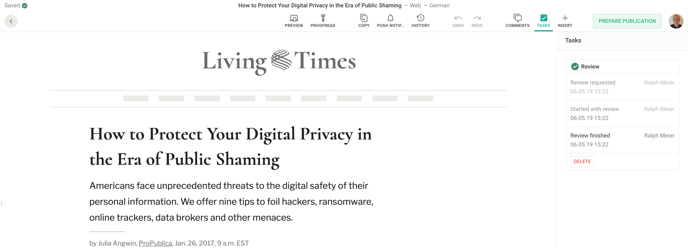

# Add your custom task

This guide will show you how to add a custom `review` task. If you want to know how to add a custom proofreading tasks, you can read more [here](./add-custom-proofreading-task.md)

The screenshot below shows the task in question.



#### Basic information about tasks
- You can add as much tasks as you want (additionally to the `review` task)
- A task has 3 states: `requested`, `accepted`, `completed`. 
- A task can be configured individually on the server.


## Server plugin

On the server we need to configure a new metadata field `review` (more about metadata fields you can read [here](../reference-docs/server-api/metadata.md))

```js
metadata: [
{
  // metadata field name
  handle: 'review',
  // plugin
  type: 'li-task-v2',
  config: {
    label: 'Review',
    showInTaskList: true,
    // define beforeLabel/afterLabel of the 3 states requested/accepted/completed
    requested: {
      beforeLabel: 'Request review',
      afterLabel: 'Review requested'
    },
    accepted: {
      beforeLabel: 'Begin review',
      afterLabel: 'Started with review'
    },
    completed: {
      beforeLabel: 'Finish review',
      afterLabel: 'Review finished'
    }
  }
}
]
```
