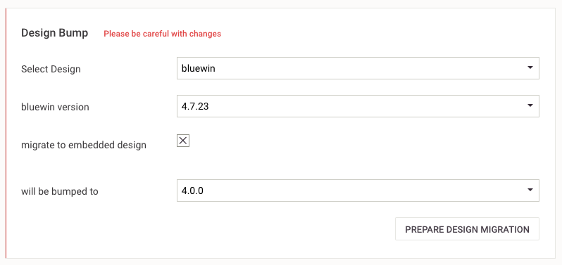

# Migrate reference design to embedded design

Embedded designs are around for a while now and several Livingdocs customers use them productively. The main difference to a reference design is that embedded designs are stored in the Livingdocs server database and are part of the project config. This means that updates to an embedded design are done via the CLI as described [here](../livingdocs-cli/sync-configs.md).

The main benefit for customers is that they can completely separate Livingdocs designs from whatever technology they want to use in the frontend. E.g. Swisscom has embedded designs in the server project and uses the HTML framework nitro in the frontend (without any dependency on Livingdocs).

## Overview

Prerequesites: you need to have a configurable channel, meaning that your Livingdocs configuration is done via a seeding process of project configuration files in your server repository and **not via static configuration files**.

In order to go from a reference design to an embedded design the following steps are necessary:
- migrate the design config from v1 to v2 (currently, all reference designs we know of are v1)
- move all design specific files (design_settings and all components) to the server repository (and out of your frontend)
- setup an asset workflow (css and js)
- migrate all existing documents to the embedded design

## Migrate design config

The rules on how to migrate the design are described [here](../reference-docs/legacy-design/design_config_v1_to_v2.md).
We have an unofficial helper script that can be used but still has some shortcomings. We hope that we can fix the shortcomings soon and release the taks with the livingdocs-cli. For now, you need to decide for yourself if you want to take the adventure to use an experimental script.

### For the adventerous

The script can be called from the code repository of the [livingdocs-cli](https://github.com/livingdocsIO/livingdocs-cli).
With the checked out code, you can run the following command from the cli:
```
./bin/run project-config:import-design --designUri="https://your-design-host.com/path-to-your-design/your-version" -d="/path/on/your/drive"
```

The path on your drive needs to be a project config folder. This can either be an existing project config in your server project (if you have this) or one that you downloaded via the livingdocs cli.

The task will create a file `design_settings` and a `components` folder with all components and link them in the config respectively.

We mentioned that the task is not yet complete. Those things will require manual post-processing:
- component groups are not added to design settings
- editor wrapper is not added to content types
- components is not added to the content types
- sometimes the directive definition for a component is not taken (we don't know which pattern this follows)

## Add design to your server

In your server project you will want to add a seeding config containing your new design. An example for a local seeding config is given below.

In app/server.js
```
await tasksApi.setupProjects({
    users: [],
    projects: [{
      __recreateIfExists: false,
      __update: true,
      handle: 'my-project',
      label: 'Foo Bar',
      owner: ':developer',
      groups: [{
          label: 'Editors',
          scope: ['articles:read', 'articles:write']
      }],
      groupMemberships: {'Editors': [':editor']},
      config: require('path/to/your/config')
    }]
}, {useDevUsers: true})
```

The important line is `config: require('path/to/your/config')`. Here you point your project setup to the project config containing the embedded design (basically what you did in the first step).
If you already have a project config, make sure that you require the new file `design_settings` as well as all components in the `components` folder that you migrated above.

You can easily test your embedded desig with a local seeding config by just restarting the server and observing the command line. If the project seeding succeeds, your config is fine.

## Setup asset workflow

TODO Dibran

## Migrate old documents to embedded design

A migration from a reference design to an embedded design should always be a bump migrations. You are responsible to make sure of this. The migration of a certain version, say 1.2.3 of a reference design to the first version (1.0.0) of an embedded design is always non-breaking, i.e. the migration itself does not change anyhting to the logic of the design. **You should never mix a migration to an embedded design with new design features or refactoring, take those aparat into 2 steps**.
Also, you need to make sure that you always migrate from the last version of your reference design (1.2.3 in the example above) to the first version of your embedded design (1.0.0). If you migrate older documents, say 0.8.1, then split into 2 steps:
- migrate your reference design from 0.8.1 to 1.2.3 (with a migration file if necessary)
- bump reference design 1.2.3 to embedded design 1.0.0

There is currently no support for bump from a reference design to an embedded design over the CLI, but the UI allows you to do so.

Navigate to "Project Setup / Design Migration". If your project config is setup correctly and contains an embedded design then you will have the option to choose "migrate to embedded design" in the Design Bump setup. Just check this and make sure the version of the reference design and the embedded design are correct.

