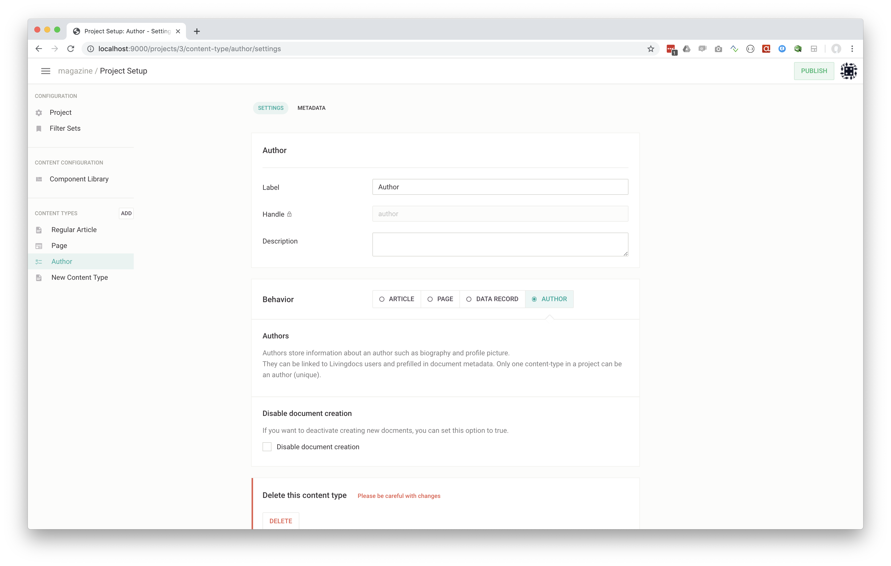
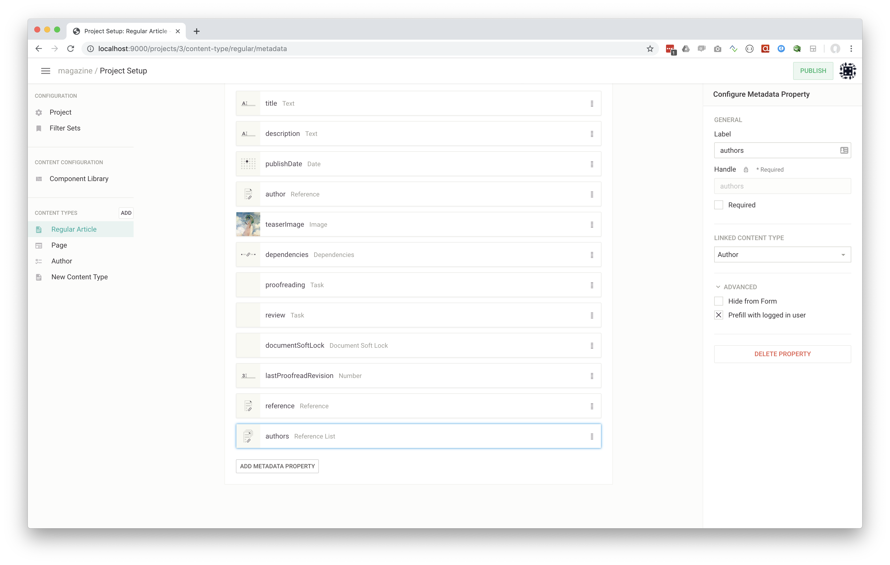
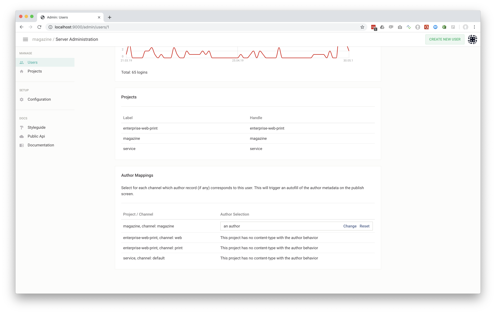

# Author Management

Livingdocs provides the ability to manage authors as structured data within their own content-types. Those can be linked as document references in articles in order to assign an author to a document. In some situations we want to provide a prefilling option for the author by using the currently logged in user. This saves time for the journalists so they don't always have to explicitly link their author record.

## Configuration

The author management can be completely setup using the Project Setup and Server Admin UIs.

### Author content type

If you don't have an author content-type yet, create one in the Project setup by selecting the "Author" behavior as shwon in the screenshot below.



Note that only one content-type in a project can have the "Author" behavior. In the metadata for your "Author" content-type you will want to add fields such as a profile picture, biography, etc.
Once you're done setting up your author content-type, publish it.

If you don't want to use the UI, you can also add the author content type programmatically. A sample JSON is shown below:
```
{
  id: '3',
  handle: 'author',
  documentType: 'data-record',
  isAuthor: true,
  info: {
    label: 'Author'
  },
  metadata: [
    {
      id: '14',
      handle: 'title',
      type: 'li-text',
      ui: {
        component: 'liMetaTextForm'
      },
      config: {
        maxLength: 200
      }
    },
    {
      id: '15',
      handle: 'prename',
      type: 'li-text',
      ui: {
        component: 'liMetaTextForm'
      }
    },
    {
      id: '16',
      handle: 'surname',
      type: 'li-text',
      ui: {
        component: 'liMetaTextForm'
      }
    },
    {
      id: '17',
      handle: 'shortname',
      type: 'li-text',
      ui: {
        component: 'liMetaTextForm'
      }
    }
  ]
}
```

Note that internally, the `documentType` is `data-record` with a special flag `isAuthor`.

### Author reference

In order to select an author for an article we need to reference it in the metadata of the article. The screenshot below shows the situation.



The selected metadata property must be of type `reference` or `reference-list` depending on whether there is only one author or if there can be multiple ones.
In the "Advanced" tab you also have the option to select the prefilling option. If this is selected an author record is automatically assigned in the metadata property using the currently logged in user.

If you don't want to use the UI, you can also add the metadata property programmatically. A sample JSON is shown below:
```
{
  handle: 'authors',
  type: 'li-reference-list',
  config: {
    referenceType: 'documents',
    documentType: 'data-record',
    contentType: 'author',
    prefillAuthor: true,
    displayFilters: []
  },
  ui: {
    component: 'liMetaReferenceForm',
    label: 'authors'
  }
}
```

### Prefilling configuration

If you want to prefill authors from the currently logged in user (see previous step), you need to associate users of the system with author records. This can be done in the server admin UI. The screenshot below shows the mapping on the user detail screen in the admin panel.



For each project/channel combination you can assign an author record to the selected user. If this user subsequently logs in and creates an article, the author record will be prefilled to the metadata.
This operation can only be performed via the UI.
