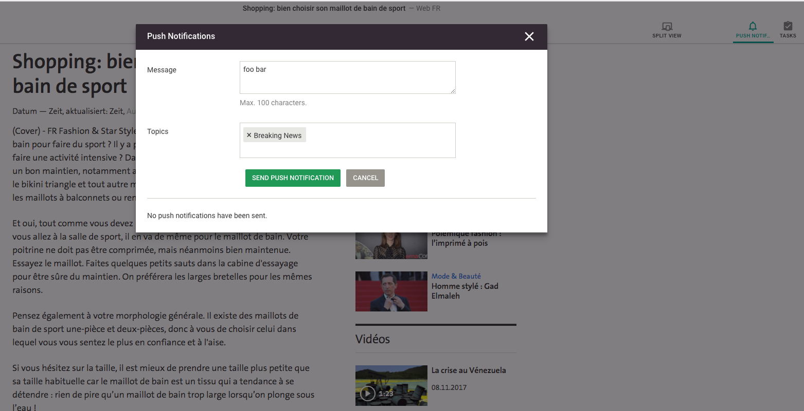
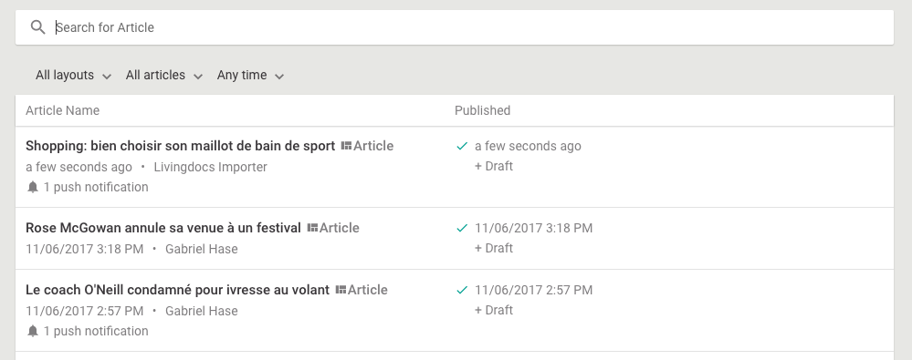

# Push notifications with custom dashboard item

This guide explains 2 things:
1. how to enable the push notifications feature in the [livingdocs server boilerplate](https://github.com/livingdocsIO/livingdocs-server-boilerplate)
2. how to do a custom dashboard item for your articles that shows push notification information

Livingdocs supports three push notification services.
- Google Firebase: The free [Google Firebase](https://firebase.google.com/) service for push notifications. Livingdocs sends push notifications to Google Firebase and you can setup Google Firebase in such a way that it passes those notifications on to your native apps and other targets.
- Urban airship
- Ethinking

The resulting feature looks as follows.



*Users can write a push notification inside of an article by pressing the "Push Notification" button in the Toolbar.*



*Users see on the dashboard which articles have push notifications (custom dashboard item)*

## Enable push notifications

To enable push notifications you need to do 3 things:
1. setup the firebase config in your [server configuration](../reference-docs/server-configuration/config.md#push-notifications), you will need to create a Google firebase key for this
2. in every channel that should support push notifications, [configure the required metadata field](../reference-docs/project-config/content_types.md#push-notifications)
3. in every channel that should support push notifications, [configure your topics](../reference-docs/project-config/content_types.md#push-notifications)
4. setup the push notifications field in your elasticsearch mapping

The [livingdocs server boilerplate](https://github.com/livingdocsIO/livingdocs-server-boilerplate) has commented out sections for all three things so you can check there.
(4) is already done in the boilerplate server so if you are running with this, you don't need to do anything. Otherwise add the following ES mapping block to `app/search/custom-mappings/metadata.json`
```
"pushNotifications": {
  "properties": {
    "messageCount": {
      "type": "integer",
      "index": "not_analyzed"
    },
    "messages": {
      "properties": {
        "message": {
          "type": "string"
        },
        "sentAt": {
          "type": "date",
          "index": "not_analyzed",
          "format": "strict_date_time"
        },
        "topics": {
          "properties": {
            "label": {
              "type": "string",
              "index": "not_analyzed"
            },
            "value": {
              "type": "string",
              "index": "no"
            }
          }
        }
      }
    }
  }
}
```

After doing those three things, push notifications are enabled and you can see the "Push Notifications" button in the toolbar and write push notifications.

## Add a custom dashboard item

You need to do 3 things to have your custom dashboard item that shows push notification information:
1. [whitelist the push notification metadata for use in the dashboard](../reference-docs/server-configuration/config.md#search)
2. create an angular component for the dashboard item
3. [configure the angular component in the editor](../reference-docs/editor-configuration/editing-features.md#dashboard)

Below is a sample implementation for (2).

index.js
```
module.exports = (editorModule) => {
  editorModule.component('customDashboardListItem', {
    template: require('./template.html'),
    controller: require('./controller.js'),
    bindings: {
      document: '=',
      hoverAction: '@',
      onHoverAction: '&'
    }
  })
}
```

controller.js
```
const _get = require('lodash/get')

module.exports = class ArticleListItemController {
  static get $inject () { return ['session'] }

  constructor (session) {
    this.session = session
  }

  hasPushNotifications () {
    return _get(this.document, 'metadata.pushNotifications.messageCount')
  }

  pushNotificationsSent () {
    return _get(this.document, 'metadata.pushNotifications.messageCount')
  }

  hasPastPublication () {
    return this.document.hasPublication() && !this.document.hasFuturePublicationDate()
  }

  hasFuturePublication () {
    return this.document.hasPublication() && this.document.hasFuturePublicationDate()
  }

  hasNoPublication () {
    return this.document.isUnpublished()
  }

  shouldShowDeleteButton () {
    const abilityKey = 'deleteArticles'
    return !!this.session.current.getAbility(abilityKey).active
  }
}
```

template.html
```
<a class="ld-hover ld-rich-item ld-rich-list__row">
  <div>
    <h2 class="ld-rich-item__title">
      {{$ctrl.document.title}}
    </h2>
    <div>
      <span class="ld-rich-item__secondary" title="last updated: {{$ctrl.document.updatedAt | moment: 'datetime'}}">
        {{ $ctrl.document.updatedAt | datetimeFromNow }}
      </span>
      <span class="ld-rich-item__separator"> • </span>
      <span class="ld-rich-item__secondary" title="last updated by">
        {{$ctrl.document.updatedBy.fullName()}}
      </span>
    </div>
    <div ng-if="$ctrl.hasPushNotifications()">
      <span class="ld-rich-item__push-notifications ld-rich-item__secondary">
        <ld-icon name="bell" class="ld-icon ld-icon--default ld-icon--small"/>
        {{$ctrl.pushNotificationsSent()}}
        push notification{{ $ctrl.pushNotificationsSent() > 1 ? 's' : ''}}
      </span>
    </div>
  </div>

  <div class="ld-rich-item__secondary">
    <div class="ld-rich-item__published"
         ng-if="$ctrl.hasPastPublication() || $ctrl.hasFuturePublication()">
      <div class="ld-rich-item__published-icon">
        <ld-icon name="check" class="ld-icon ld-icon--small ld-icon--cyan"
                 ng-if="$ctrl.hasPastPublication()"/>
        <ld-icon name="calendar-clock" class="ld-icon ld-icon--small"
                 ng-if="$ctrl.hasFuturePublication()"/>
      </div>
      <div class="ld-rich-item__published-date">
        <div title="last published: {{$ctrl.document.updatedAt | moment: 'datetime'}}">
          {{ $ctrl.document.updatedAt | datetimeFromNow }}
        </div>
        <div ng-if="$ctrl.document.hasUpdates()">
          + Draft
        </div>
      </div>
    </div>

    <div ng-if="$ctrl.hasNoPublication()">
      -
    </div>
  </div>

  <div class="ld-rich-list__cell--actions ld-position">
    <ld-hover-action
      ng-if="$ctrl.shouldShowDeleteButton()"
      hover-action="{{$ctrl.hoverAction}}"
      on-action="$ctrl.onHoverAction($ctrl.document)">
    </ld-hover-action>
  </div>
</a>
```

The component is registered like all other custom components in `app/editor.js`, e.g. with
`require('./custom/dashboard-item')(editorModule)`

After following those 3 steps you should see the push notification information on the article dashboard as shown in the initial screenshot (of course provided you sent a push notification on an article).
