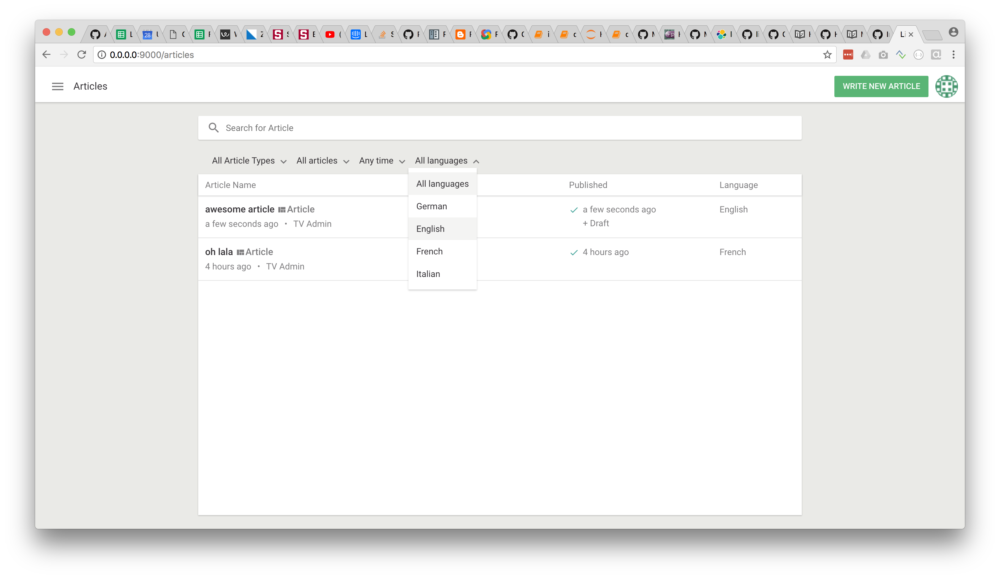
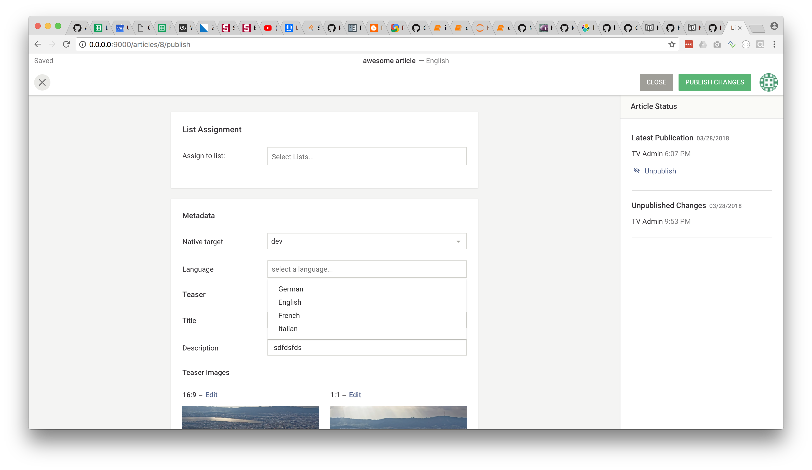

# Enable multi-language in Livingdocs

This guide explains you how to enable the Livingdocs core setup for multi-language support.
The core setup also includes a translation workflow that can be enabled via configuration in the "Project Setup" section (UI).

The following shows the search dashboard that gets a new language column and filter if the multi-language feature is configured.


The metadata screen gets a new language select box if the multi-language feature is configured.



## Server-side

### Languages

On the server, we first need to provide which languages we want to support in our project. This is defined per [channel](../reference-docs/project-config/README.md). In the configuration file for your channel
add code as follows.

```js
// defines the languages that a user can select for a document
availableLanguages: [{
  'name': 'English',
  'value': 'en-US'
}, {
  'name': 'German',
  'value': 'de-DE'
}],

// used to create new documents
defaultLanguage: {
  name: 'English',
  value: 'en-US'
},
```

The `defaultLanguage` defines with what language a new document is created. The `availableLanguages` define the set of
languages from which a user can choose for a document. The `defaultLanguage` must be contained in the `availableLanguages`.

### Metadata

The language of a document is stored within the documents metadata. In order to enable this, we need to add a metadata field for every
[content-type](../reference-docs/project-config/content_types.md) that we want to have in multiple languages. An example is
given below.

```js
metadata: [{
  handle: 'language',
  plugin: 'li-language',
  ui: {
    component: 'liMetaSelectForm',
    service: 'languageSelection',
    config: {
      label: 'Language',
      placeholder: 'select language..'
    }
  }
}]
```

There are several important things to note in the example:
1. the metadata plugin used is `li-language`, this is a core metadata plugin that enables multi-language
2. the use of `li-language` **must be unique within a content-type**, i.e. you can only have one metadata property in a content-type that uses the `li-language` plugin
3. the form arrangement uses a select box with the core service `languageSelection`, we strongly advise you to use our core metadata service

Once you have the metadata field defined on the channel, you also need to update your custom elasticsearch metadata mapping with an entry as follows:

```json
{
  "properties": {
    "language": {
      "type": "object",
      "properties": {
        "locale": {"type": "string"},
        "label": {"type": "string"}
      }
    }
  }
}
```

The details about adding a new metadata field can be seen in the [metadata examples](./metadata/metadata-examples.md)

### Dashboard

As soon as we have the multi-language feature configured, the dashboard will show a new column `languages` in the search results.
In order for the dashboard to have the required metadata, you will need to configure the [`documentsMetadataFields`](../reference-docs/project-config/README.md) in the server config to include your metadata property. You need to use the metadata property name here. In our example from before this would be:
```js
{
  search: {
    documentsMetadataFields: [
      'language'
    ]
  }
}
```

Note: if you did your [own dashboard item](./push_notifications.md#add-a-custom-dashboard-item), the language column will not work out-of-the-box and you will need to customize your dashboard item to show the language

## Editor

The editor side is relatively easy to configure. You only need to add the provided language [core filter](../reference-docs/project-config/editor_settings.md#dashboards) to your dashboard so that you are able to filter documents by language. This is done in the editor environment config file.

```js
{
  filters: {
    articleList: {
      displayFilters: ['language']
    }
  }
}
```

Equivalently for pages if you want to have it there too.
