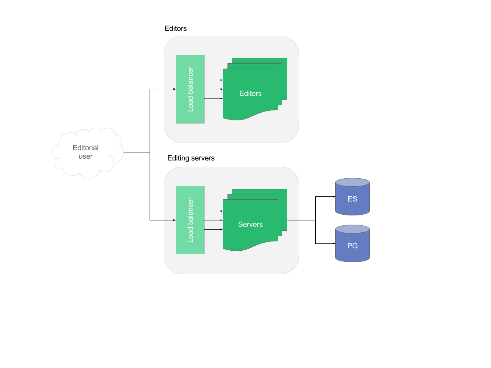
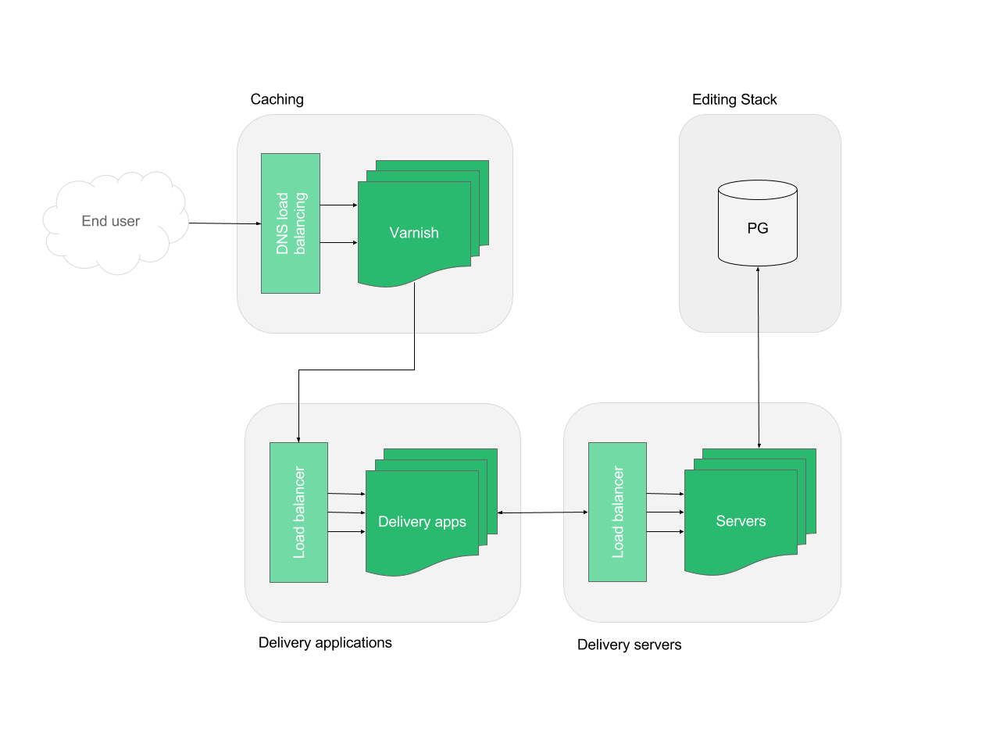

# Livingdocs architecture

_Architecture diagrams master files can be found [on google drive](https://docs.google.com/document/d/1TQhW3HtzurI78kinxUCqf5OxG3RSoiEURXEn4AIztP0/edit#heading=h.snjxmn1ywzn)_

## Stacks
On a high level, livingdocs can be divided in two different stacks. These stacks can be scaled independently from each other, depending on the requirements. 

- **Editing stack**: Services allowing the editorial user to write content in a web interface and persisting it. The content is made accessible to the delivery stack.
- **Delivery stack**: Services allowing the end user to read the content on the website or mobile application.

## Applications
- Editor: A single page application serving the editors web interface. It consists of static assets only. This is where the editorial user logs in and writes content.
- **Server**: A node.js application. It can be started in two different modes: 
  - In editing mode, it acts as the backend for the li-editor, storing content, handling file uploads, cropping, authentication and so on. It does expose a REST API for the li-editor to connect to.
  - In delivery mode, the purpose of it is to provide a REST API for the delivery to present the content to the user
- **Delivery**: A node.js application. Makes content written in livingdocs is available to end users. Its primary purpose is to render a website.

## Services
Postgres (PG): Primary data store for the server. For example pages, articles, menus, users are persisted here. Both servers in delivery, as well as servers in editing mode access the same data.
Elasticsearch (ES): The editor provides the user with a search, powered by an elasticsearch secondary index. Only servers in editing mode need access to this service.

## External services
For specific features, livingdocs uses external services.

- **Image service (resrc.it)**: 
  - Used by the server in editing mode for cropping images.
  - Used by the editorial users browser to deliver responsive images.
- Cloud storage (Amazon S3): Used by the server in editing mode to store uploaded images and to serve static assets for the livingdocs design to the end- and editorial users browser.
- **Iframely**:
  - Design components with automatic metadata fetching from a third-party source (such components are optional) in the editorial users browser.
  - Automatic validity checks of entered links. Used by the editorial users browser.
- **Websockets (Pusher, optional)**: To support real-time collaboration in the editor. The feature can be disabled, so this is optional. Used by the server in editing mode, as well as the editorial users browser.
- **Spellchecker (optional)**: Livingdocs supports the integration of third-party spellcheckers. The feature can be disabled, so this is optional. Used by the editorial users browser.
- **Metrics and Logging (optional)**: Newrelic, Mixpanel, Loggly. Used by the server in editing mode.

There are other external services, called from the editorial- and / or end users browser. They don’t have an impact on the infrastructure and are solely listed for the sake of completeness. 
- **Track.js**: for tracking javascript errors
- **Analytics**: for tracking users and behavior on the site

## Hosting Livingdocs

### Hardware requirements
See the [hardware requirements](/core/requirements/hardware-requirements.md) for the requirements of each application and the services.

### Applications
The server and delivery are both applications written in node.js. Node.js is single threaded, but it can handle concurrency through the asynchronous event loop. If a node.js process crashes, it has to be restarted and it is not able to accept requests during startup. 

For a production setup, node.js processes should always be redundant to prevent downtime in case of crashes.

### Docker
We recommend to use Docker as we provide Dockerfiles for every application and service. Compatibility is ensured with every release.

### Services
Both elasticsearch and postgres will need a persistent volume mounted.
Any custom configuration, as well as the supported versions for elasticsearch and postgres are visible in the respective Dockerfile.

- https://github.com/upfrontIO/dockerfile-elasticsearch
- https://github.com/upfrontIO/dockerfile-postgres

### Applications
The applications are stateless and follow the 12 factor app methodology.
Any system level dependency and the required environment variables are visible in the respective Dockerfile. 

- https://github.com/upfrontIO/livingdocs-docker/tree/master/server
- https://github.com/upfrontIO/livingdocs-docker/tree/master/editor

### Health checks
- **Editor**: HTTP GET /version.json, Port 9000
- **Server**: HTTP GET /status, Port 9090
- **Postgres**: TCP, Port 5432
- **Elasticsearch**: TCP, Port 9200

### Deployment
We recommend building docker images on CI and pushing them to the registry. Deployment can be done manually or triggered by CI continuously.

## High availability setup

### Editing stack
The editing stack is usually accessed by a limited number of editorial users. For most setups, the requirements for redundancy are lower than in the delivery stack. It does not have a caching layer. 

- **Editor**: It is unlikely that it needs scaling as it serves static assets only. In case it needs to be redundant, you can always run two instances behind a load balancer.
- **Editing servers**: Scaled based on the load generated by the editorial users. Because of the nature of node.js processes, it is recommended to always build in redundancy and run at least three processes, even in a simple production setup.
- **Elasticsearch (ES)**: Scaled based on the number of objects in the database (mainly articles and pages) and read/write throughput. The load generated by the editorial users is unlikely a need to scale. Redundancy can be achieved through configuring shards and replicas.
- **Postgres (PG)**: Scaled based on the number of objects in the database (mainly articles and pages) and read/write throughput. The load generated by the editorial users is unlikely a need to scale. Redundancy can be achieved through standby servers and failover.

### Delivery stack

- **Caching**: The entry point is a Varnish cache server. Redundancy can be achieved through DNS load balancing.
- **Delivery applications**: Should be scaled based on the load generated by the end users. Because of the nature of node.js processes, it is recommended to always build in redundancy and run at least three processes, even in a simple production setup.
- **Delivery servers**: Should be scaled based on the load generated by the end users. Because of the nature of node.js processes, it is recommended to always build in redundancy and run at least three processes, even in a simple production setup.
- **Postgres (PG)**: Scaled based on the load generated by the end users. In most cases, it can be a shared database with the editing stack. Separation of the two stacks can be achieved through running a read only slave database within the delivery stack, following the data from the read/write master in the editing stack. Redundancy can be achieved through standby servers and failover.


