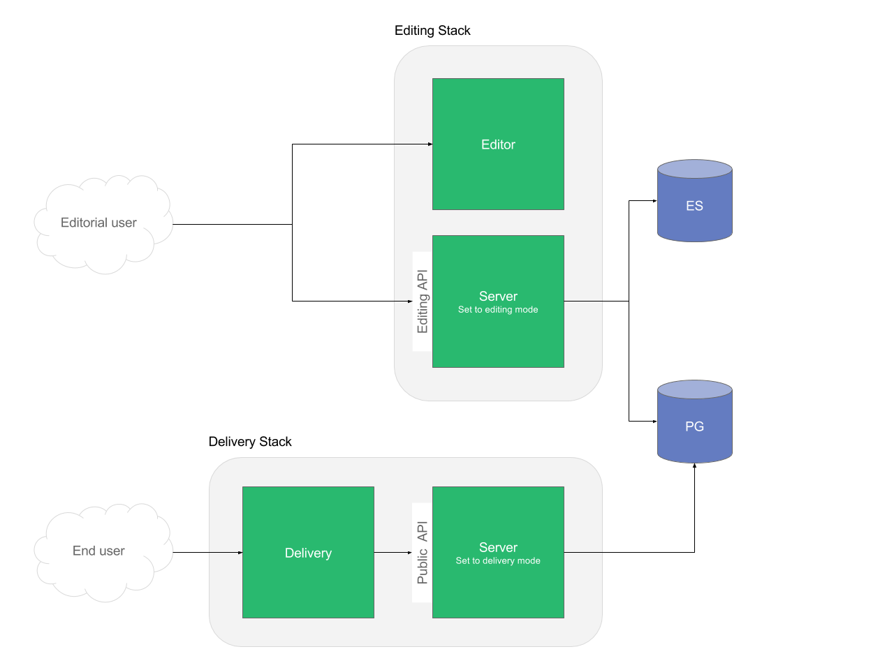
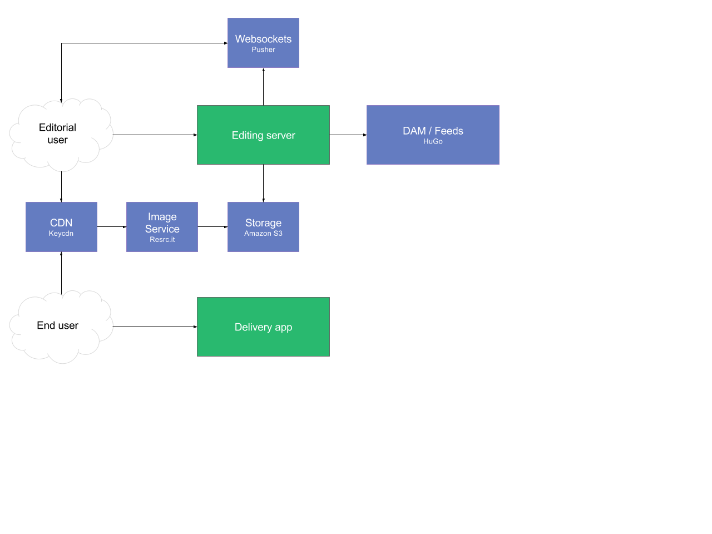

# Livingdocs architecture

_Architecture diagrams master files can be found [on google drive](https://docs.google.com/document/d/1TQhW3HtzurI78kinxUCqf5OxG3RSoiEURXEn4AIztP0/edit#heading=h.snjxmn1ywzn)_

## Stacks
On a high level, livingdocs can be divided in two different stacks. These stacks can be scaled independently from each other, depending on the requirements. 

- **Editing stack**: Services allowing the editorial user to write content in a web interface and persisting it. The content is made accessible to the delivery stack.
- **Delivery stack**: Services allowing the end user to read the content on the website or mobile application.

## Applications
- **Editor**: A single page application serving the editors web interface. It consists of static assets only. This is where the editorial user logs in and writes content.
- **Server**: A node.js application. It can be started in two different modes: 
  - In _editing mode_, it acts as the backend for the li-editor, storing content, handling file uploads, cropping, authentication and so on. It does expose a REST API for the li-editor to connect to.
  - In _delivery mode_, the purpose of it is to provide a REST API for the delivery to present the content to the user
- **Delivery**: A node.js application. Makes content written in livingdocs is available to end users. Its primary purpose is to render a website.

## Services
- **Postgres (PG)**: Primary data store for the server. For example pages, articles, menus, users are persisted here. Both servers in delivery, as well as servers in editing mode access the same data.
- **Elasticsearch (ES)**: The editor provides the user with a search, powered by an elasticsearch secondary index. Only servers in editing mode need access to this service.
- **Redis**: Key value store for the server. Used by specific features for queuing and caching. Depending on the feature set you are using, Redis is optional.

## External services
For specific features, livingdocs uses external services. All external systems expose a REST interface, so only ports 443 and 80 are required.

- **Image service (resrc.it)**: 
  - Used by the server in editing mode for cropping images.
  - Used by the editorial users browser to deliver responsive images.
- **Cloud storage (Amazon S3)**: Used by the server in editing mode to store uploaded images and to serve static assets for the livingdocs design to the end- and editorial users browser.
- **Iframely**:
  - Design components with automatic metadata fetching from a third-party source (such components are optional) in the editorial users browser.
  - Automatic validity checks of entered links. Used by the editorial users browser.
- **CDN (keyCDN)**: Caching for static assets
- **Websockets (Pusher, optional)**: To support real-time collaboration in the editor. The feature can be disabled, so this is optional. Used by the server in editing mode, as well as the editorial users browser.
- **Spellchecker (optional)**: Livingdocs supports the integration of third-party spellcheckers. The feature can be disabled, so this is optional. Used by the editorial users browser.
- **Metrics and Logging (optional)**: Newrelic, Mixpanel, Loggly. Used by the server in editing mode.

There are other external services, called from the editorial- and / or end users browser. They don’t have an impact on the infrastructure and are solely listed for the sake of completeness. 
- **Track.js**: for tracking javascript errors
- **Analytics**: for tracking users and behavior on the site

### Connecting to external services through a proxy

Often times, the application processes are not allowed to have direct access to the internet for security reasons. In this case, Livingdocs can be configured to run all outgoing connections through a proxy    
 

### External services whitelist

### Editor
The following external service hosts have to be whitelisted on the proxy for the editor. Please note that this happens in the network where the editors browser is running, not the editor process.

- https://imgr.io
- https://usage.trackjs.com
- https://stats.pusher.com
- wss://ws-eu.pusher.com
- https://api.mixpanel.com
- The host for your S3 asset bucket (eg. https://livingdocs-evaluation-images.s3.amazonaws.com if you're using our evaluation account)
- The host for your S3 design bucket (eg. https://livingdocs-evaluation-designs.s3.amazonaws.com if you're using the default design server)
- The host for your image service (eg. https://xyz.imgix.net or https://app.resrc.it)
- Any host your customizations are using

### Server
The following external service hosts have to be whitelisted on the proxy for the server. This concerns the network where the server process is running.

- The host to your livingdocs design server (eg. http://api.livingdocs.io if you're using the default design server)
- The host for your S3 asset bucket (eg. https://livingdocs-evaluation-images.s3.amazonaws.com if you're using our evaluation account)
- The host for your S3 design bucket (eg. https://livingdocs-evaluation-designs.s3.amazonaws.com if you're using the default design server)
- The host for your Hugo instance
- Any host your customizations are using

### Delivery
- The host to your livingdocs design server (eg. http://api.livingdocs.io if you're using the default design server)
- The host to your livingdocs server (if it's not in the same network)
