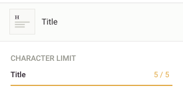

# Editable

Defined on an HTML tag so that the user can edit the text within.

## Example
```javascript
module.exports = {
  "name": "p",
  "label": "Paragraph",
  "iconUrl": "https://livingdocs-assets.s3.amazonaws.com/magazine-design/assets/images/icons-components/icon_text.svg",
  "directives": [{
    "name": "p",
    "type": "editable",
    "plainText": true,
    "excludeFromTextCount": true,
    "maxLength": 20
  }],
  "html": "<p class=\"text\" doc-editable=\"text\">\n  Paragraph\n</p>"
}
```

## Config Options 

### `plainText`, `tagWhitelist` and `tagBlacklist`

Only one of these options can be used on a single directive. `plainText` does not allow any markup. `tagWhitelist` can be used to have exact control about the possible tags in content. `tagBlacklist` can be used to filter out only a few specific tags and allow everything else.

Note: Block level elements and elements like script and style are already prohibited in editable directives. Use the above options only to filter inline elements like `<a>` or `<strong>`.

`plainText`: true | false, Ensures that a text can not contain any HTML tags (decodes HTML).
`tagWhitelist`: Only allows selected tags in the content, e.g. `"tagWhitelist": ['a', 'em']` would only allow a and em tags, but would remove e.g. a strong tag.
`tagBlacklist`: Removes certain tags from the content, e.g. `"tagBlacklist": ['a']` would remove all a tags.

### Other

`excludeFromTextCount`, true | false

By default, the text counter counts the text of all editable directives. With this option a single directive can be excluded. The value can be true or false (default).

`placeholder`, string

The default placeholder that is shown in the editor as long as the directive is still empty. So you don't have to use lorem ipsum ;)

`optional`, true | false

If optional is set to true, then the directive will only be rendered if a value is actually filled in, otherwise the tag is skipped.

`maxLength`, number

Defines the maximum lenght in characters that the text may contain. The editor will display a text counter next to the directive. In the editor you can go over the limit, but while the limit is exceeded, publishing is not possible.

