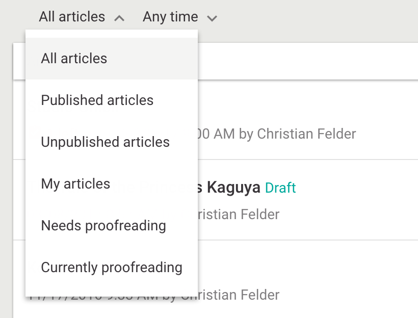

# Search and Filters



## Overview

Filters on a dashboard are highly customisable in Livingdocs.

- One can define filters in a dashboard (`displayFilters`)
- One can use [Core DisplayFilter](../project-config/search/display_filter.md) or [Custom DisplayFilter](../../guides/register_custom_dashboard_filters.md).
- One can define the default search behaviour (`defaultQueries`/`emptySearchQueries`)

Example:
```js
// static editor config
filters: {
  // filter groups
  articleList: {
    // visible filters on the top of the dashboard
    // core filter plugins and custom filter plugins can be defined here
    displayFilters: ['channels', 'contentType', 'timeRange', 'sortBy'],
    // invisible
    defaultQueries: [{type: 'documentType', value: 'article'}],
    // invisibile
    emptySearchQueries: [{type: 'documentType', value: 'article'}]
  },
  inlineArticleList: {
    displayFilters: [],
    defaultQueries: [
      {type: 'documentType', value: 'article'},
      {type: 'sortBy', value: 'relevance'}
      // because `sortBy` is used here, it cannot be used as `displayFilters`
    ],
    emptySearchQueries: [
      {type: 'documentType', value: 'article'},
      {type: 'sortBy', value: '-updated_at'}
    ]
  },
  pageList: {
    displayFilters: [],
    defaultQueries: [
      {type: 'documentType', value: 'page'},
      {type: 'sortBy', value: 'relevance'}
    ],
    emptySearchQueries: [
      {type: 'documentType', value: 'article'},
      {type: 'sortBy', value: '-updated_at'}
    ]
  },
  dataRecordList: {
    displayFilters: ['timeRange'],
    defaultQueries: [
      {type: 'documentType', value: 'data-record'},
      {type: 'sortBy', value: '-updated_at'}
    ]
  },
  documentListList: {
    displayFilters: ['timeRange'],
    defaultQueries: [
      {type: 'documentType', value: 'article'},
      {type: 'documentState', value: 'published'},
      {type: 'channelHandle', value: 'web'},
      {type: 'sortBy', value: 'relevance'}
    ],
    emptySearchQueries: [
      {type: 'documentType', value: 'article'},
      {type: 'documentState', value: 'published'},
      {type: 'sortBy', value: '-updated_at'}
    ]
  }
}
```

#### Filter groups (see example)
- `articleList` - This configures the articles screen.
- `inlineArticleList` - This configures inline article search like the one used in the List screen.
- `pageList` - This configures the pages screen.
- `menuList` - This configures the Menu screen.
- `mediaList` - This configures the media screen.
- `dataRecordList` - This configures the data-record screen.
- `documentListList` - This configures the List screen.


#### Filter config properties (see example)

- `displayFilters`

  The filters that are shown to the user. One can use [Core DisplayFilter](../project-config/search/display_filter.md) or [Custom DisplayFilter](../../guides/register_custom_dashboard_filters.md).

- `defaultQueries`

  `defaultQueries` determines a set of default filter (not visible in UI). This filter is discarded as
  soon as a user manually selects a filter and reapplied when all manually
  chosen filters are deselected.

- `emptySearchQueries`

  `emptySearchQueries` determines the empty search filter. This filter is taken into
  account when there is no search query input present. Note that this filter is
  treated mutually exclusive with the default filter that is used in case there is
  a query present.
