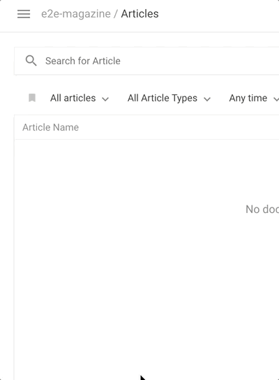

# Main Menu

This documentation describes the configuration possibilities within the editor (instance-wide). There are also project-wide configuration options. [See our project config docs](../project-config/editor_settings.md)

## Triggering the main menu
You can define the way the main menu will be triggered. It can be triggered by `clicking`, `hovering` or both. The default way of opening the navigation menu is by `clicking`.

#### Config options

```js
// editor config
app: {
  sidePanelBehaviour: {
    // you can also enable both.
    click: true,
    hover: false
  }
}
```

#### Example opening the main-nav by clicking



## Menu items
You can also customize the entries you want to have in the main navigation (the burger icon in the top left of the screen as seen in the previous gif).

Default Configuration:
```js
// project config on the server
editorSettings: {
  mainNavigation: [{
    {liItem: 'articles'},
    {liItem: 'pages'},
    {liItem: 'dataRecords'},
    {liItem: 'mediaLibrary'},
    {liItem: 'lists'},
    {liItem: 'menus'},
    {liItem: 'contentSetup'},
    {liItem: 'projectSettings'},
    {liItem: 'serverAdmin'}
  }]
}
```

Add a custom dashboard entry:
```js
// project config on the server
editorSettings: {
  mainNavigation: [
  // other entries...
  {
    label: 'Proofreading',
    // 'kanban-proofreading' is the dashboard config handle we will define in the next step
    dashboard: 'kanban-proofreading',
    icon: 'file-document'
  }]
}
```

Extend a `liItem` entry:
```js
// project config on the server
editorSettings: {
  mainNavigation: [
  // other entries...
  {
    liItem: 'articles',
    label: 'My articles',
    icon: 'file-document'
  }]
}
```

Fully custom entry:
```js
// project config on the server
editorSettings: {
  mainNavigation: [
  // other entries...
  {
    label: 'Articles',
    sref: 'app.editor.articles',
    icon: 'file-document',
    scope: 'readArticles',
    group: 'dashboards' // one of 'dashboards', 'preferences', 'admin'
  }]
}
```


To hide an entry, simply delete it from the list.
You can also customize the scopes that you assign to a menu item to control access rights. See [all available scopes](../../guides/access_rights.md#available-scopes).
You can also customize the icons. We use https://materialdesignicons.com/ just use the respective icon string.

To link to an external page add an entry as follows:
```js
{
  label: 'Your page',
  href: 'https://www.livingdocs.io',
  icon: 'settings'
}
```

Note that you use `href` instead of `sref` for external links.


# Dashboard

Define a custom item for the dashboard list of articles. This is useful when you want to show additional data on the dashboard such as the open tasks on an article.

```js
// editor config
search: {
  articleSearch: {
    listItemComponent: 'custom-dashboard-list-item'
  }
}
```

Note that the custom component can only use document metadata that has been explicitly [whitelisted](../server-configuration/config.md#search).

## Media Library Dashboard

After linking the media library on the mainNavigation (see above), one can also define `displayFilters` to customise the media library dashboard.

```js
// project config on the server
editorSettings: {
  mediaLibrary: {
    enabled: true
    dashboard: {
      // displayFilters for the media library dashboard
      displayFilters: ['liDateTimeRange']
    },
    // displayFilters for the media library editor sidepanel and the medialibrary metadata modal
    editorSelection: {
      displayFilters: ['timeRange']
    }
  }
}
```


## Custom Dashboards

Custom Dashboards are configurable versions of the current Articles / Pages / Date-Records Screens. You can add as many custom dashboards as you want in the Editor configuration.

First add a navigation entry into the main navigation:
```js
// project config on the server
editorSettings: {
  mainNavigation: [
  // other entries...
  {
    label: 'Proofreading',
    // 'kanban-proofreading' is the dashboard config handle we will define in the next step
    dashboard: 'kanban-proofreading',
    icon: 'file-document'
  }]
}
```

There are three types of dashboard configurations
- `dashboard`
- `kanbanBoard`
- `taskBoard` (predefined `kanbanBoard` for a task)

These configurations also go into your editor config file.

Kanban Boards are very similar to dashboards, except they do have multiple result columns. Each result column will show a list of documents the same as a single dashboard does. The documents cannot be manually sorted or moved between columns, instead each column typically has its own filter settings.

For example a task board will show all tasks in the `requested` state in one column and tasks with the state `inProgress` and `done` in the other columns. In order to move a card into another column you simply have to open the document and move the task into another state.

#### Example: Dashboard
```js
// project config on the server
// { editorSettings: { dashboard: [...] }
dashboards: [{
  handle: 'gallery-dashboard',
  type: 'dashboard',
  pageTitle: 'Gallery Board',
  // Label used to describe the documents in this Dashboard
  entityLabel: 'Article',
  // Invisible base filters applied to every search (including the default result list)
  baseFilters: [{type: 'documentType', value: 'article'}],
  // Filters shown to the user below the search input
  displayFilters: ['documentState', 'timeRange'],
  sort: '-updated_at',
  // fields to be returned from the server (not all metadata fields are returned by default)
  fields: ['metadata.*'],
  // This is the name of the angular component used in the result list
  componentName: 'liHeroCard',
  // The componentOptions are injected into the component `liHeroCard` (in this example)
  componentOptions: {teaserImage: 'teaserImage'},
  // CSS class set as a wrapper around the result list
  cssWrapper: 'li-result-columns'
}]
```


#### Example: Taskboard (simple config)

```js
// project config on the server
dashboards: [{
  handle: 'kanban-proofreading',
  type: 'taskBoard',
  pageTitle: 'Proofreading',
  // This is the name of a metadataProperty of `type: 'li-task-v2'`
  taskName: 'proofreading',
  displayFilters: ['documentState', 'timeRange']
}]
```

#### Example: Kanbanboard (full config)

```js
// project config on the server
dashboards: [{
  handle: 'kanban-proofreading',
  type: 'kanbanBoard',
  pageTitle: 'Proofreading',
  // Label used to describe the documents in this KanbanBoard
  entityLabel: 'Article',
  displayFilters: [],
  // Base filters are applied to all columns
  baseFilters: [{type: 'documentType', value: 'article'}],
  // This is the name of the angular component to use in all columns
  // (can also be defined for each columns separately)
  componentName: 'liTaskCard',
  // include all metadata properties in the search response data
  fields: ['metadata.*'],
  // Set the target when clicking on a card. Currently supported:
  // - 'article' (default setting)
  // - 'tasks'
  openState: 'tasks',
  showFooter: true,
  columns: [{
    handle: 'requested',
    label: 'Needs Proofreading',
    // Filter applied for this column on top of the `baseFilter`
    columnFilter: [{type: 'metadata', key: 'proofreading.state', value: 'requested'}],
    sort: [`metadata.proofreading.priority`, `metadata.proofreading.deadline`]
    // The componentOptions are injected into the component `liTaskCard` (in this example)
    componentOptions: {column: 'todo', taskName: 'proofreading'}
  }, {
    handle: 'in-progress',
    label: 'In Progress',
    columnFilter: [{type: 'metadata', key: 'proofreading.state', value: 'accepted'}],
    sort: [`metadata.proofreading.priority`, `-metadata.proofreading.accepted.date`],
    componentOptions: {column: 'doing', taskName: 'proofreading'}
  }, {
    handle: 'done',
    label: 'Finished Proofreading',
    columnFilter: [{type: 'metadata', key: 'proofreading.state', value: 'completed'}],
    sort: [`-metadata.proofreading.completed.date`],
    componentOptions: {column: 'done', taskName: 'proofreading'}
  }]
}]
```

# Search Filters


## Overview

Filters on a dashboard are highly customisable in Livingdocs.

- One can define filters in a dashboard (`displayFilters`)
- One can use core filters provided by Livingdocs or custom filters registered over the editors `coreApi` in the `displayFilters`.
- One can define the default search behaviour (`defaultQueries`/`emptySearchQueries`)

Example:
```js
// editor config
filters: {
  // filter groups
  articleList: {
    // visible filters on the top of the dashboard
    // core filter plugins and custom filter plugins can be defined here
    displayFilters: ['channels', 'contentType', 'timeRange', 'sortBy'],
    // invisible
    defaultQueries: [{type: 'documentType', value: 'article'}],
    // invisibile
    emptySearchQueries: [{type: 'documentType', value: 'article'}]
  },
  inlineArticleList: {
    displayFilters: [],
    defaultQueries: [
      {type: 'documentType', value: 'article'},
      {type: 'sortBy', value: 'relevance'}
      // because `sortBy` is used here, it cannot be used as `displayFilters`
    ],
    emptySearchQueries: [
      {type: 'documentType', value: 'article'},
      {type: 'sortBy', value: '-updated_at'}
    ]
  },
  pageList: {
    displayFilters: [],
    defaultQueries: [
      {type: 'documentType', value: 'page'},
      {type: 'sortBy', value: 'relevance'}
    ],
    emptySearchQueries: [
      {type: 'documentType', value: 'article'},
      {type: 'sortBy', value: '-updated_at'}
    ]
  },
  dataRecordList: {
    displayFilters: ['timeRange'],
    defaultQueries: [
      {type: 'documentType', value: 'data-record'},
      {type: 'sortBy', value: '-updated_at'}
    ]
  },
  documentListList: {
    displayFilters: ['timeRange'],
    defaultQueries: [
      {type: 'documentType', value: 'article'},
      {type: 'documentState', value: 'published'},
      {type: 'channelHandle', value: 'web'},
      {type: 'sortBy', value: 'relevance'}
    ],
    emptySearchQueries: [
      {type: 'documentType', value: 'article'},
      {type: 'documentState', value: 'published'},
      {type: 'sortBy', value: '-updated_at'}
    ]
  }
}
```

#### Filter groups (see example)
- `articleList` - This configures the dashboard that users see after logging in.
- `inlineArticleList` - This configures inline article search like the one used in the List screen.
- `pageList` - This configures the pages screen.
- `menuList` - This configures the Menu screen.
- `mediaList` - This configures the media screen.
- `dataRecordList` - This configures the data-record screen.
- `documentListList` - This configures the List screen.


#### Filter config properties (see example)

- `displayFilters`

  The filters that are shown to the user.

- `defaultQueries`

  `defaultQueries` determines a set of default filter (not visible in UI). This filter is discarded as
  soon as a user manually selects a filter and reapplied when all manually
  chosen filters are deselected.

- `emptySearchQueries`

  `emptySearchQueries` determines the empty search filter. This filter is taken into
  account when there is no search query input present. Note that this filter is
  treated mutually exclusive with the default filter that is used in case there is
  a query present.


## Core Filter Plugins (displayFilters)

The following filters can be used in `displayFilters`:

- `channels` give the user a dropdown to filter by a specific channel
- `documentState`, unpublished, published, not yet published, my articles, needs proofreading, currently proofreading
- `timeRange`, filter the search results in time ranges such as last 24 hours
- `sortBy`: `relevance` (default), `creation_date`, `updated_at`, `alphabetical`
  **ATTENTION:** if you use the `sortBy` in the displayFilters you can not at the same time configure a `sortBy` in the `defaultQueries`, only one is allowed.
- `language`: uses the channel configuration for [available languages](../project-config/README.md) to offer a select box to filter for languages (requires multi-language feature to be enabled)
- `contentType`: uses the content-types configuration in your server to filter for different content-types, e.g. galleries or regular articles.
- `category`: uses the channel configuration for categories to offer a multi-select box to filter for categories (OR filter)


## Filter Query Format

There are different places, where one can define a filter query
- `baseFilters` (used for dashboards)
- `defaultQueries` (see [Filter config properties](#filter-config-properties-see-example) section for a description)
- `emptySearchQueries` (see [Filter config properties](#filter-config-properties-see-example) section for a description)
- `custom filter` (your custom filter added to `displayFilters` - see 'Registering Custom Filter' section how to register and implement a custom filter)

At all this places, one can use the same query format, e.g.

```js
{type: 'documentType', value: 'article'}
```

The query format always has a `type` and most of the time a `value`. You can see some examples in the next section.

## Filter Query Types

This are all available `queryTypes` which can be used to form a filter query.

```js
// documentType
{type: 'documentType', value: 'article'}

// locale
{type: 'locale', value: 'de-DE'}

// channelHandle
{type: 'channelHandle', value: 'web'}

// contentType
{type: 'contentType', value: 'regular'}

// notContentType (multiple value combinations possible)
{type: 'notContentType', value: 'regular'}

// ownerId
{type: 'ownerId', value: 1}

// channelId
{type: 'channelId', value: 2}

// dateRange
const from = new Date('2016-01-23T15:00')
const to = new Date('2015-04-05T20:00')
{type: 'dateRange', key: 'created_at', from, to}

// documentState (value: 'published', 'unpublished', 'deleted', 'draft', 'publishedWithDraft')
{type: 'documentState', value: 'published'}

// metadata (multiple key, value combinations possible)
{type: 'metadata', key: 'foo', value: 'bar'}
{type: 'metadata', key: 'foo', value: {exists: true}}
{type: 'metadata', key: 'foo.bar.id', value: 42}

const from = new Date('2016-01-23T15:00')
const to = new Date('2015-04-05T20:00')
{type: 'metadata', key: 'publicationDate', value: {dateFilter: {from, to}}}

// task (multiple taskName and taskValue combinations possible)
// taskValue: 'todo', 'doing', 'done'
{type: 'task', taskName: 'proofreading', taskValue: 'pending'},
{type: 'task', taskName: 'review', taskValue: 'done'}

// sortBy (multiple values possible)
{type: 'sortBy', value: '-created_at'},
{type: 'sortBy', value: 'title'}
```


## Filter Query Examples

#### Example 1 - filter by documentType
```js
defaultQueries: [
  {type: 'documentType', value: 'article'}
]
```

This would reduce the search to only articles (no pages).


#### Example 2 - filter by metadata with key/value
```js
defaultQueries: [
  {type: 'metadata', key: 'foo', value: 'bar'}
]
```

This would filter for only documents that have the value `bar` in the metadata field `foo`. You have to make sure that `foo` is an indexed metadata field.

#### Example 3 - filter by metadata with objects
```js
defaultQueries: [
  {type: 'metadata', key: 'author.reference.id', value: 42}
]
```

More complex metadata fields are indexed as an object (instead of key/value). In this case one can filter based on subproperties.

```js
// This is how the metadata field has been indexed into the search index
{
  metadata: {
    author: {
      reference: {
        id: 42
      }
    }
  }
}
```

This example would filter documents that have the value `42` in the metadata field `author` with propreties `reference.id`. You have to make sure that `author` is an indexed metadata field.


#### Example 4 - filter by task
```
defaultQueries: [
  {type: 'task', taskName: 'proofreading', taskValue: 'done'}
]
```

This would filter for only documents that have had a successful proofreading. The core only exposes the `proofreading` task, but you can define your own custom tasks. The values are `todo`, `doing`, `done` for the 3 states that a task can have.


## Register Custom Filter

Its possible to register a custom filter and add it to `displayFilters` in the editor config (see [example](#overview)).

At the moment there are 2 types of custom filters (click on the link to get see a description/example):
- [List Filter v2](#register-custom-list-v2-filter)
- [List Filter](#register-custom-list-filter) (deprecated)
- [Angular Component Filter](#register-custom-angular-component-filter)

Hint: If you want to create a filter with metadata, make sure they are setup correctly in the ElasticSearch index (`search.metadata_mapping` config in the server)


### Register Custom List v2 Filter

Added in: `release-2020-02`

#### Example

`searchFilters.registerListV2` registers an object where you can configure a filter object which is used to render the search UI.


Process
- `datasource.fetch` fetch data async from a remote service or create a list of filter items
- `mount` - configure the filter object

```js
liEditor.searchFilters.registerListV2('contentTypeV2Filter', {
  datasource: {
    // fetch data and inject response into mount function
    async fetch ({project, user, server}) {
      const host = server.host
      const channelId = project.defaultChannel.id
      const uri = `${host}/channel-configs/properties?channelId=${channelId}&properties=contentTypes`

      const response = await window.fetch(uri, {
        method: 'GET',
        headers: new window.Headers({
          'Content-Type': 'application/json',
          'Authorization': `Bearer ${server.accessToken}`
        })
      })

      // only succeed on status codes 200 - 299
      if (!response.ok) throw new Error('contentTypeV2Filter was not able to fetch data')
      return response.json()
    }
  },

  // Mount a search filter (search behaviour, display options)
  //
  // @param data injected result from datasource.fetch
  //
  // @example options = [{
  //     id: 'regular',
  //     label: 'Regular Article',
  //     type: 'contentType',
  //     value: 'regular'
  //   }, {
  //     id: 'page',
  //     label: 'Page',
  //     type: 'contentType',
  //     value: 'page'
  //   }]
  async mount ({data, filter}) {
    const options = data.contentTypes.map((ct) => {
      return {
        id: ct.handle,
        label: ct.info.label,
        // these props are used for creating a search request (see above section 'Filter Query Types')
        type: 'contentType',
        value: ct.handle
      }
    })
    filter.options = options
  }
})
```

### Register Custom List Filter

Deprecated since: `release-2020-02`

#### Example

`searchFilters.registerList` registers a filter based on a config object to create an Angular directive for the search UI.
Display is controlled with the `filters` key in the configuration.

There are two flavors to this function

```js
liEditor.searchFilters.registerList('creation-date', ['session', (session) => {
  const channels = _map(session.project.channels, (channel) => ({
    id: channel.id,
    label: channel.label,
    // type and value are used in the query builder
    type: 'channelId',
    value: channel.id
  }))

  return {
    title: 'Filter by channels',
    options: channels
  }
}])

liEditor.searchFilters.registerList('creationDate', {
  title: 'Filter by creation date',
  options: [{
    id: '2015',
    label: 'Created in 2015',
    type: 'dateRange',
    key: 'created_at',
    from: new Date('2015-01-01'),
    to: new Date('2016-01-01')
  }, {
    id: '2016',
    label: 'Created in 2016',
    type: 'dateRange',
    key: 'created_at',
    from: new Date('2016-01-01'),
    to: new Date('2017-01-01')
  }]
})
```

### Register Custom Angular Component Filter

#### Example

`searchFilters.registerAngularComponent` registers an Angular component as filter for the search UI.
Display is controlled with the `filters` key in the configuration.

```js
coreApi.searchFilters.registerAngularComponent('test', {
  bindings: {
    value: '='
  },
  template: `
    <div
      ng-class="{'is-set': $ctrl.isActive}"
      class="ld-filter"
      ng-click="$ctrl.toggleProjectFilter()"
      ng-if="$ctrl.hasPrint"
    >
      <div class="ld-dropdown__text">
        Show print documents
      </div>
    </div>
  `,
  controller: class PrintController {
    static get $inject () { return ['session'] }

    constructor (session) {
      this.session = session
      this.channel = _find(session.project.channels, {handle: 'print'}) || {}
      this.hasPrint = !!this.channel.id
    }

    $doCheck () {
      this.isActive = this.value.get()
    }

    toggleProjectFilter () {
      if (this.channel.id) this.isActive = !this.isActive
      if (this.isActive && this.channel.id) {
        this.value.set({type: 'channelId', value: this.channel.id})
      } else {
        this.value.set()
      }
    }
  }
})
```
