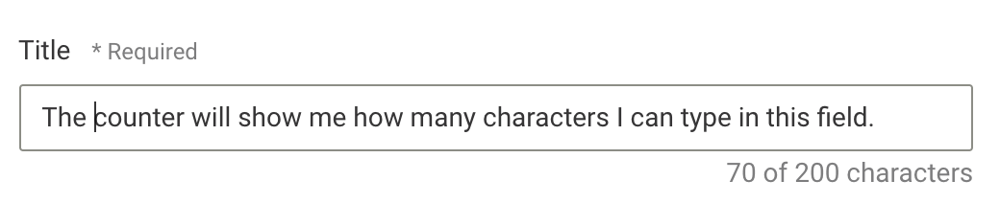

# Metadata editor configuration

## Scope

This documentation assumes that you already setup the metadata field(s) on the server side.

To find out more about metadata on the server you can read the [server documentation](../server-api/metadata.md) or study [examples](../../guides/metadata/metadata-examples.md).


## Introduction

The editor offers a UI library of reusable elements (text fields, select boxes, etc.) for which customers can write their own business logic where necessary. You can also write your own custom UI elements by just requiring them in your project.


## Available UI elements

There are UI elements, forms, for:

- text input (example below)
- textarea input
- select box
- multiselect box
- image selection
- checkbox
- datetime (date and time)
- slug (URL escaped title)
- section header (not a form, only a title)

The following subchapters discuss them and show the available options.

### Text Input

ContentType metadata config:
```js
metadata: [{
  ...,
  ui: {
    component: 'liMetaTextForm',
    service: 'customServicePlugin', // optional
    config: {
      label: 'foo', // optional, takes camelized name otherwise
      placeholder: 'bar', // optional, takes camelized name otherwise
      readOnly: false, // optional, false by default
      maxLength: 200 // optional, integer, not used by default. Enables small UI, see screenshow below

    }  
  }
}]
```

You need to make sure that your server-side metadata field is of type `li-text` otherwise you will get errors.
`readOnly` and `maxLength` let you customize the behavior of the text input. The text input will automatically display some visual help if a `maxLength` is set:

Visual helper added in: `release-2020-09`



The `service` option lets you customize the business logic of a metadata form field. Check the section [registering a metadata service](#registering-a-metadata-service) later on how to register a service.
The service plugin for a text input allows you to customize the logic for the following methods:

```js
{
  // init the value of the text input
  init (identifier) {},

  // set the value
  set (identifier, text) {}
}
```

There is a sample implementation in `plugins/metadata_services/default_text_service.coffee` to help you get started.

### Textarea input

This is almost exactly the same as the text input, except for the `rows` config.

ContentType metadata config:
```js
metadata: [{
  ...,
  handle: 'title',
  type: 'li-text',
  config: {
    required: true,
    requiredErrorMessage: 'Please provide a title',
    maxLength: 200 // enables server validation and a UI-character counter (see screenshot below)
  },
  ui: {
    component: 'liMetaTextareaForm',
    service: 'customServicePlugin', // optional
    config: {
      label: 'foo', // optional, takes camelized name otherwise
      placeholder: 'bar', // optional, takes camelized name otherwise
      readOnly: false, // optional, false by default
      maxLength: 200, // optional, integer, not used by default
      rows: 10 // optional, integer, 5 by default
    }
  }
}]
```

You need to make sure that your server-side metadata field is of type `li-text` otherwise you will get errors.
`readOnly` and `maxLength` let you customize the behavior of the text input.
The `service` option lets you customize the business logic of a metadata form field. Check the section [registering a metadata service](#registering-a-metadata-service) later on how to register a service.
The service plugin for a textarea input is exactly the same as for the text input and allows you to customize the logic for the following methods:

```js
{
  // init the value of the text input
  init (identifier) {},

  // set the value
  set (identifier, text) {}
}
```

There is a sample implementation in `plugins/metadata_services/default_text_service.coffee` to help you get started.

### Select Box

ContentType metadata config:
```js
metadata: [{
  ...,
  ui: {
    component: 'liMetaSelectForm',
    service: 'customServicePlugin', // mandatory
    config: {
      label: 'foo', // optional, takes camelized name otherwise
      placeholder: 'bar' // optional, takes camelized name otherwise
    }
  }
}]
```

You need to make sure that your server-side metadata field is of type `li-enum` or a suitable format you defined yourself in a customized server, otherwise you will get errors.
The `service` option lets you customize the business logic of a metadata form field. Check the section [registering a metadata service](#registering-a-metadata-service) later on how to register a service.
The service plugin for a select box allows you to customize the logic for the following methods:

```js
{
  // asynchronous
  // needs to call cb with cb(null, selectables) or cb(error)
  // the selectables need to be in the format {name: 'name', value: 'value'}
  getSelectables (callback) {},

  // called when the select box is first rendered and needs to get an initial value
  // you will probably use `metadata.get` to get the required value
  initSelection (identifier) {},

  // executed when a user select an item.
  // the identifier is the name of your metadata field, the selection contains the name/value pair
  // you will probably call `metadata.set` in here
  select (identifier, selection) {},

  // true if you want to define your own directive for the display of results in the select box
  // false otherwise
  hasCustomItem () {},

  // the name of a directive that you want to use to render the items (lines) in the select box when
  // it is opened. This is handy for example if you want to render them in a hierarchical view.
  // make sure that you require the directive in your service so it is loaded.
  getCustomItem () {}
}
```

There is a sample implementation in `plugins/metadata_services/default_select_service.coffee` to help you get started.

### Multiselect Box

ContentType metadata config:
```js
metadata: [{
  ...,
  ui: {
    component: 'liMetaMultiselectForm',
    service: 'customServicePlugin', // mandatory
    config: {
      label: 'foo', // optional, takes camelized name otherwise
      placeholder: 'bar' // optional, takes camelized name otherwise
    }
  }
}]
```

You need to make sure that your server-side metadata field is of a suitable format you defined yourself in a customized server (there is no core data type for multiselects), otherwise you will get errors.
The `service` option lets you customize the business logic of a metadata form field. Check the section [registering a metadata service](#registering-a-metadata-service) later on how to register a service.
The service plugin for a multiselect box allows you to customize the logic for the following methods:

```js
{
  // asynchronous
  // needs to call cb with cb(null, selectables) or cb(error)
  // the selectables need to be in the format {name: 'name', value: 'value'}
  getSelectables () {},

  // called when the select box is first rendered and needs to get an initial value
  // you will probably use `metadata.get` to get the required value
  initSelection (identifier) {},

  // executed when a user adds a selection to the multiselection.
  // the identifier is the name of your metadata field, the selection contains the name/value pair
  // you will probably call `metadata.set` in here
  select (identifier, selection) {},

  // executed when a user removes a selection of the multiselect.
  // the identifier is the name of your metadata field
  // you will probably call `metadata.set` in here
  unselect (identifier) {}
}
```

There is a sample implementation in `plugins/metadata_services/default_multiselect_service.coffee` to help you get started.


### Image

ContentType metadata config:
```js
metadata: [{
  handle: 'teaserImage',
  type: 'li-image',
  config: {
    imageRatios: ['16:9', '1:1']
  },
  ui: {
    component: 'liMetaImageForm'
  }
}]
```

This defines an image with two crops: 16:9 and 1:1.

You can automatically extract images from the document and set the metadata
automatically unless you change the metadata manually at which point the automatic
extraction will stop.

```js
fieldExtractor: [
  {
    // the metadata field 'teaserImage' is the target of this extraction
    identifier: 'teaserImage',
    // the extraction is of type image
    type: 'image',
    // extract from component 'image' the value in the directive 'image'
    matches: ['image.image']
  }
]
```
This would autofill the metadata property 'teaserImage' with the first image
from the document in a 'image' component.

### Checkbox

ContentType metadata config:
```js
metadata: [{
  ...,
  ui: {
    component: 'liMetaCheckboxForm',
    config: {
      label: 'foo' // optional, takes camelized name otherwise
    }
  }
}]
```

You need to make sure that your server-side metadata field is of type `li-boolean` or a suitable custom format, otherwise you will get errors.

### Datetime

ContentType metadata config:
```js
metadata: [{
  ...,
  ui: {
    component: 'liMetaDatetimeForm',
    service: 'customServicePlugin', // optional
    config: {
      label: 'foo' // optional, takes camelized name otherwise
    }
  }
}]
```

You need to make sure that your server-side metadata field is of type `li-datetime` or a suitable custom format, otherwise you will get errors.
The `service` option lets you customize the business logic of a metadata form field. Check the section "registering a metadata service" later on how to register a service.
The service plugin for a datetime allows you to customize the logic for the following methods:

```js
{
  // set the date, possibly applying formatting options
  setDate (identifier, value) {},

  // get the date, possibly applying formatting options
  getDate (identifier) {},

  // this lets you define what dates a user can select in the UI. Handy if you want for example
  // to disallow past dates.
  isValidDate (date) {}
}
```

There is a sample implementation in `plugins/metadata_services/default_date_service.coffee` to help you get started.

### Reference and Reference List

ContentType metadata config for a single reference:
```js
metadata: [{
  ...,
  type: 'li-reference',
  config: {
    referenceType: 'document',
  },
  ui: {
    component: 'liMetaReferenceForm'
    config: {
        // enables display filters for the reference modal
        // see: "Register a Custom Display Filter" for general filter documentation
        displayFilters: []
    }
  }
}]
```

ContentType metadata config for a reference list:
```js
metadata: [{
  ...,
  type: 'li-reference-list',
  config: {
    referenceType: 'documents'
    displayFilters: []
  },
  ui: {
    component: 'liMetaReferenceForm',
    config: {
      sortable: true, // enable sorting by drag and drop
      displayFilters: [] // enable display filters
    }
  }
}]
```


### Slug

ContentType metadata config:
```js
metadata: [{
  ...,
  ui: {
    component: 'liMetaSlugForm',
    service: 'customServicePlugin', // optional
    config: {
      label: 'foo', // optional, takes camelized name otherwise
      placeholder: 'bar', // optional, takes camelized name otherwise
      canReset: false // optional, false by default
    }
  }
}]
```

You need to make sure that your server-side metadata field is of type `li-text` or a suitable custom format, otherwise you will get errors.
The `canReset` option if set to true renders a reset button next to the slug input that resets the input to its initial value.
The `service` option lets you customize the business logic of a metadata form field. Check the section "registering a metadata service" later on how to register a service.
The service plugin for a slug allows you to customize the logic for the following methods:

```js
{
  // define the logic for the initial value of a slug
  // For example: existing value or normalized metadata title
  initSlug (identifier) {},

  // gives you the unnormalized slug input (user input) and lets you define your custom
  // normalization logic (depending on what you want to allow in a URL)
  setSlug (identifier, slug) {},

  // only important if `canReset` is set to true
  // defines to what value the field will be reset
  resetSlug (identifier) {}
}
```

There is a sample implementation in `plugins/metadata_services/default_slug_service.coffee` to help you get started.


## Registering a metadata service

Some of the forms require you to provide a service that implements the business logic behind those fields. In order to register a service you will need to [add it as a customization](../../guides/add_customizations.md#editor). To add a fictional metadata service `foobar` you would add the following line:

```js
editor.metadataServices.register('foobar', require('path/to/foobar'))
```

The file `foobar.js` defines the metadata service *and gives you a metadata instance as well as the angular injector*. It should always have the following format:

```js
module.exports = function ({metadata, $injector}) {
  // your implementation goes here
}
```

In the future we want to write our own injector for this to control more tightly what can be injected and what is private in the core.

## Creating a new metadata form element (core)
<!-- TODO GH This is outdated, get an example from NZZ and describe it -->

Currently, new UI elements can only be created in the core. As a core developer you might need to create one though at some point. Here are some things to look out for.

All UI elements should be implemented as Angular components and get at least the 2 bindings `name` and `type`. `name` is the name of the metadata field and `type` the type of screen for which it is instantiated, i.e. `article` or `page`.

A new UI element has to be required in `ld_metadata_view.coffee`.

The template should have the following markup structure:

```html
<div class="ld-form-group ld-form-group--horizontal">
  <div class="ld-form-group__label">
    <!-- add your label here -->
  </div>
  <div class="ld-form-group__content">
    <!-- add your content here -->
  </div>
</div>
```
