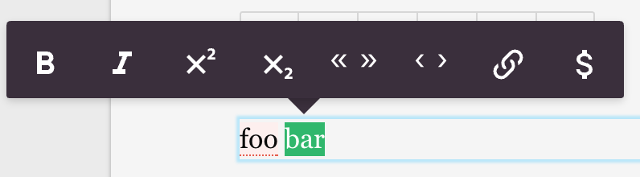
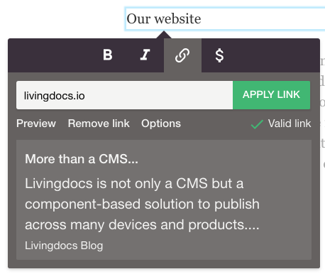

# Text editing

Most of the text editing is handled by [editable.js](https://github.com/livingdocsIO/editable.js), an open-source library, maintained by Livingdocs. The Livingdocs editor allows different configurations to adapt the behavior of editable.js.

## Toolbar



When you select some text in the editor you get a popover with some options on how to format text or what special characters to include. You can fully customize the options in the popover, like if you want to be able to toggle text bold, italic, etc. The configuration can be set for both web (default) or print (only relevant if you use the Livingdocs print editor).

#### Formatting Options

```js
app: {
  editable: {
    'default': {
      'bold': true,
      'italic': true,
      'superscript': false,
      'subscript': false,
      'quotes': ['«', '»'],
      'singleQuotes': ['‹', '›'],
      'link': true,
      'specialChars': true
    },
    'print': {}
  }
}
```
The example would result in a toolbar with a button for toggling text `bold`, `italic`, make it a `link` and adding `specialChars`.


Some example quotes configs:
```js
// swiss
quotes: ['«', '»']
singleQuotes: ['‹', '›']

// german
quotes:  ['„', '“']
singleQuotes: ['‚', '‘']

// german with guillemets
quotes: ['»', '«']
singleQuotes: ['›', '‹']

// english
quotes: ['“', '”']
singleQuotes: ['‘', '’']
```


#### Special Characters

The `specialChars` can be configured separately. The button for special chars (a `$` sign) opens a second popover with a tabbed selection of special characters that you want to allow your users to insert. A configuration for `specialChars` looks as follows.

```js
app: {
  specialChars: [
    {
    'name': 'general',
    'label': 'General',
    'charList': [
      {
          'name': 'EN DASH',
          'label': '–',
          'caption': null,
          'value': '–',
          'description': 'Dash of 1 en length'
        }, {
          'name': 'VULGAR FRACTION ONE HALF',
          'label': '½',
          'caption': null,
          'value': '½',
          'description': 'Fraction: one half'
        }
      }, {
        'name': 'white_spaces',
        'label': 'White Spaces',
        'charList': [
          {
            'name': 'EN SPACE',
            'label': '◅···▻',
            'caption': 'en',
            'value': ' ',
            'description': 'EN Space'
          }, {
            'name': 'FOUR-PER-EM SPACE',
            'label': '◅··▻',
            'caption': '1/4',
            'value': ' ',
            'description': '1/4 EM Space'
          }
        ]
      }
    ]
  }
}
```

#### Advanced Formatting Options

In addition to configuring what options the text toolbar gives to your users you can also configure to some extent the HTML markup that is inserted when a formatting option is selected. Currently, you can configure the markup for `bold`, `italic` and `link`. An example is below.

```js
app: {
  editable: {
    formatting: {
      boldMarkup: {
        type: 'tag',
        name: 'strong',
        attribs: {
          'class': 'foo'
        }
      },
      italicMarkup: {
        type: 'tag',
        name: 'em',
        attribs: {
          'class': 'bar'
        }
      },
      linkMarkup: {
        type: 'tag',
        name: 'a',
        attribs: {
          'class': 'foo bar'
        }
      }
    }
  }
}
```

A common use case for this is when you want to insert some CSS classes around your formatted text, as in the example above. You are not restricted to the `class` attribute however but can configure any HTML attribute you like.


#### Paste Formatting Options

You can configure how pasted text content is filtered.

Here you see the default configuration. Any property you define
in `pastedHtmlRules` will be merged into the default configuration.
```js
app: {
  editable: {
    formatting: {
      // ...
      pastedHtmlRules: {

        // Elements and their attributes to keep in pasted text
        // Note that elements not explicitly allowed here will not be removed, their
        // tags will get stripped but their content will be kept. Use `blacklistedElements`
        // to get rid of a whole element (tag+content)
        allowedElements: {
          'a': {
            'href': true,
            'rel': true,
            'target': true
          },
          'strong': {},
          'em': {},
          'br': {}
        },

        // Elements that have required attributes.
        // If these are not present the elements are filtered out.
        // Required attributes have to be present in the 'allowed' object
        // as well if they should not be filtered out.
        requiredAttributes: {
          'a': ['href']
        },

        // Elements that should be transformed into other elements
        transformElements: {
          'b': 'strong',
          'i': 'em'
        },

        // A list of elements which should be split into paragraphs.
        splitIntoBlocks: ['h1', 'h2', 'h3', 'h4', 'h5', 'h6', 'p', 'blockquote'],

        // A list of HTML block level elements.
        // -> prevent missing whitespace between text when block-level
        // elements are removed.
        blockLevelElements: [
          'h1', 'h2', 'h3', 'h4', 'h5', 'h6', 'div', 'p', 'pre', 'hr', 'blockquote',
          'article', 'figure', 'header', 'footer', 'ul', 'ol', 'li', 'section', 'table', 'video'
        ],

        // A list of elements that will get completely removed when pasted. Their tags
        // and content (text content and child elements) will get removed.
        blacklistedElements: ['style', 'script'],

        // Do not remote a tags if the href is a relative path
        keepInternalRelativeLinks: false
      }
    }
  }
}
```


## Text Editing Behavior

Newlines with Shift+Enter. Default: true
```js
app: {
  editable: {
    allowNewline: false
  }
}
```

Allows the users to make a newline in a paragraph by pressing Shift+Enter. This will result in a `<br>` tag an might not always be wanted thus the ability to turn this off.

Events on Mouse selection. Default: false
```js
app: {
  editable: {
    mouseMoveSelectionChanges: true
  }
}
```

By default the editable selection event is only fired once the user releases the mouse over a selection. With this setting you can already get events when the user still holds the mouse while making a selection. This is only useful if you want to somehow support the user during the process of making a selection and it will fire lots of events so be cautious with this one.

## Spellcheck

Livingdocs allows you to use the default browser spellcheck, a custom spellcheck server or no spellchecking at all. The browser spellcheck is the default browser behaviour and will differ between Chrome, Firefox etc. The custom spellcheck requires a spellcheck service that analyzes the text and returns a list of words that have been spelled wrong. Thus the custom spellchecker is completely customizable.

Spellchecking turned off:
```js
app: {
  editable: {
    // This will simply disable spellchecking on the `contenteditable` element.
    browserSpellcheck: false
  }
},
spellcheck: {
  isEnabled: false
}
```

Default browser spellchecking:
```js
app: {
  editable: {
    browserSpellcheck: true
  }
},
spellcheck: {
  isEnabled: false
}
```

Custom spellchecker (examples are NZZs vademecum or Duden):
```js
app: {
  editable: {
    // This will simply disable spellchecking on the `contenteditable` element. This is
    // recommended when using a custom spellchecker.
    browserSpellcheck: false
  }
},
spellcheck: {
  isEnabled: true,
  'host': 'http://your-spellcheck-server.com'
}
```

## Character Counter

A character counter can be configured. The counter can be limited to only
count text within certain components.

```js
textcount: {
  isEnabled: true,
  timeout: 200
}
```

#### Excluding components and directives (configured in the livingdocs component library)

It is also possible to only count the text of selected components or directives. This
is configured in the component library of a livingdocs design.

Exclude whole components from the text counter (example component config):
```js
{
  "name": "aside",
  "label": "Aside",
  "excludeFromTextCount": true
}
```

Exclude individual directives from the text counter (example component config):
```js
{
  "name": "quote",
  "label": "Quote",
  "directives": {
    "text": {"excludeFromTextCount": true},
    "source": {"excludeFromTextCount": true}
  }
}
```


## Links



#### Options
If you set the internal hosts as regex, you can define default behavior for internal and external links.
```js
{
  links:{
    allowRelativeUrls: false,
    allowAnchorLinks: false,
    allowMailToUrls: true,
    internalHostsRegex: ['^(https?://)?(www.)?foo.com', '^(https?://)?(www.)?bar.io'],
    internalDefaults: {
      openInNewWindow: false,
      follow: true
    },
    externalDefaults: {
      openInNewWindow: true, -> // will resolve to `<a target="_blank"></a>`
      follow: false -> // will resolve to `<a rel="nofollow"></a>`
    }
  }
}
```
