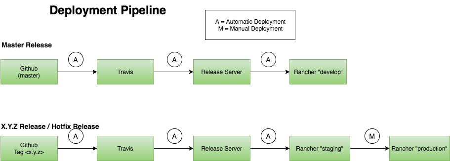
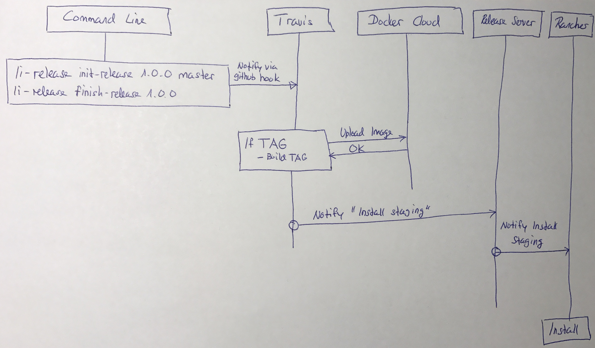

# Livingdocs-Service Deployment Pipeline

At the moment there exist two pipelines which are actively used. The `master`- and the `release` pipeline.

As you can see everything is automated except the step to production. This is intentional to control the time when something goes to production.

The `master` pipeline is used for development. As soon as something is merged to the master branch, this version will be deployed on develop.

The `release` pipeline is used for production. If we decide to make a new release, we kick off a new release by the command line and the current release will be installed to `staging`. If we are ready for production, we deploy on production.

## Livingdocs-Service Deployment Pipeline in More Detail

Downstream deployment pipelines have all the same base process. In this example we use `livingdocs-service-server` for an illustration.

- A new release will be created via the command line
- Github notifies travis via webhook
- Travis executes a script to build a docker image.
- The image will be tagged and pushed to docker cloud
- Travis notifies the livingdocs release-server to make a new deployment
- The release-server notifies rancher to install a new release.

Generally it's possible to push directly from travis to rancher. But the release server was introduced to make an async deployment possible (you'll get an immediate feedback from the release-server and then you can continue with your travis build).
