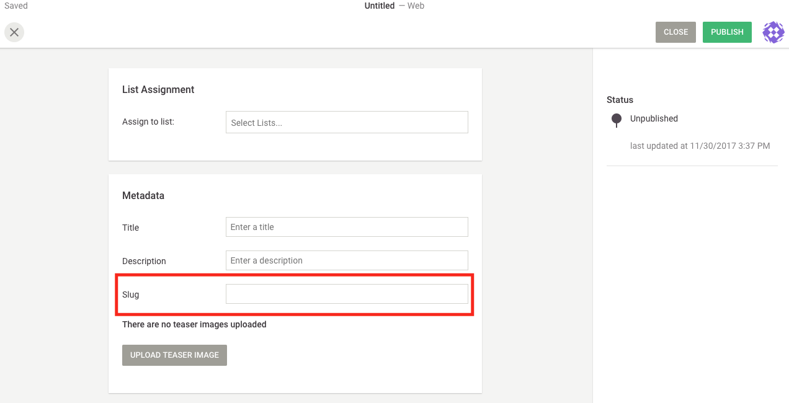

# Metadata examples


## Fully customized metadata component

We would like to add a new metadata field, a `slug`, in the publish screen.



### Server

First we need to define a new property in our Elasticsearch's mappings.

In `app/search/custom-mappings/metadata.json`, add the `slug` property:
```JSON
{
  "properties": {
    "slug": {
      "type": "string",
      "index": "not_analyzed"
    }
  }
}
```

Then, we extend the configuration of the **web** channel for documents of type **article**.

In `conf/channels/web/article/all.js` to:
```js
module.exports = {
  metadata: {
    slug: {
      plugin: 'bp-slug',
      config: {
        required: true,
        requiredErrorMessage: 'please provide a slug'
      }
    }
  },
  metadataFormArrangement: [
    {
      slug: 'slug',
      form: 'bp-slug-form',
      config: {
        service: 'bpSlugService',
        label: 'Slug',
        placeholder: 'Set a slug'
      }
    }
  ]
};

```

There is a new `metadata` key: `slug`. It has a custom server `plugin` set to `'bp-slug'`. We are going to see later on how to define this plugin.

There is also a new object in the `metadataFormArrangement` array. It describes how the editor handles the `slug` metadata. It has a form: `'bp-slug-form'`, and a custom service: `'bpSlugService'`.

The form is an Angular's component and the custom service refers to some business logic code.

The `bp` prefix stands for one of our downstream named: *boilerplate*. It's generally a good practice to namespace custom components.

Next step is to create a file to implement a simple custom server plugin.
`plugins/metadata/bp-slug.js`:
```js
mmodule.exports = {
  name: 'bp-slug',
  schema: {
    type: 'string'
  }
}
```

Finally we need to reset Elasticsearch.
```bash
grunt search-index:document:reset
```

As a side note, in the server, custom plugins are probably ready to use. See `conf/environments/all.js`:
```js
module.exports = {
  metadataPlugins: path.resolve('./plugins/metadata')
}
```


### Editor

In the editor we need to create the form defined in the server as `'bp-slug-form'`.

Add the following files in `plugins/metadata/bp-slug/form`:

- `index.js`
  ```js
  module.exports = (editorModule) => {
    editorModule.component('bpSlugForm', {
      template: require('./template.html'),
      controller: require('./controller'),
      bindings: {
        name: '@', // The name of the metadata field:'slug'
        type: '@' // The type of document for which this form is used: 'article'
      }
    })
  }
  ```

- `template.html`
  ```html
  <div class="ld-form-group ld-form-group--horizontal">
    <div class="ld-form-group__label">
      <label>{{$ctrl.label}}</label>
    </div>
    <div class="ld-form-group__content">
      <input class="ld-text-input ld-text-input--full-width"
        ng-change="$ctrl.enteringText()"
        type="text"
        ng-model="$ctrl.slug"/>
    </div>
  </div>
  ```

- `controller.js`
  ```js
  module.exports = class BpSlugController {
    static get $inject () { return ['editor'] }

    constructor (editor) {
      const metadataForm = editor.workspace.metadataForm
      const {service, label} = metadataForm.getFormConfig(this.name, this.type)
      this.service = metadataForm.getService(service)
      this.slug = this.service.get(this.name)
      this.label = label
    }

    enteringText () {
      this.slug = this.service.set(this.name, this.slug)
    }
  }
  ```

In the server there was also a custom service named: `'bpSlugService'`, we need to create it.

Add `plugins/metadata/bp-slug/service/index.js`:
```js
class BpSlugService {

  constructor (metadata, $injector) {
    this.metadata = metadata
  }

  set (identifier, slug) {
    const normalized = slug.replace(/ /g, '-')
    this.metadata.set(identifier, normalized)
    return normalized
  }

  get (identifier) {
    return this.metadata.get(identifier)
  }

}

module.exports = ({metadata, $injector}) => {
  return new BpSlugService(metadata, $injector)
}
```

Finally, the form and the service are to be registered.

In `app/editor.js`:

```js
const editorModule = window.angular.module('livingdocs-editor')

require('../plugins/metadata/bp-slug/form/bp-slug')(editorModule)

liEditor.metadataServices
  .register(
    'bpSlugService',
    require('../plugins/metadata/bp-slug/service')
  )
```

### Comment

The whole implementation for this already exists in the boilerplates projects:
- https://github.com/upfrontIO/livingdocs-server-boilerplate
- https://github.com/upfrontIO/livingdocs-editor-boilerplate

One would need to "activate" it by uncommenting the server's configurations and the editor's registrations.
