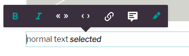
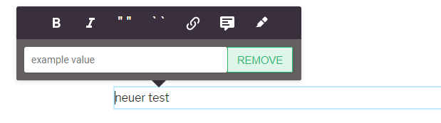

# Content-Type Config

You can define as many contentTypes per project as you want. A contentType represents a specific kind of document like an article or an image gallery. The contentTypes define which components can be used in a document and which metadata are present.

Whenever you create a document you have to choose of what contentType it will be. The contentType of a document cannot be changed after creation.

You might also come across the `documentType`. It distinguishes between articles and pages. It is considered legacy by now, whenever possible differentiate by the content-type.

_Good to know_ If you use a reference design, then for every `contentType` there must be a `layout` in the reference design. The name layout of the layout must be exactly the same as the `contentType.handle`.

We plan to allow to move all layout options which are currently defined in the design to the `contentType` configuration. The current situation is an intermediary step to limit the required changes when upgrading to the latest version.

## Example

```javascript
// projectConfig.contentTypes[{...}]
{
  handle: 'gallery',
  documentType: 'article', // either 'article', 'page' or 'data-record'
  isAuthor: false, // only true if this content-type represents an author, must be 'data-record'

  info: {
    label: 'Boilerplate Article',
    description: 'The most simple article'
  },

  editorWrapper: '<div class="doc-section"></div>',
  defaultContent: [{component: 'title', position: 'fixed'}],

  // define the server-side metadata
  metadata: [{
    handle: 'author',
    type: 'li-text',
    ui: {component: 'liMetaTextForm'}
  }, {
    handle: 'description',
    type: 'li-text',
    config: {
      required: true,
      requiredErrorMessage: 'please provide a short description'
    },
    ui: {component: 'liMetaTextForm'}
  }],

  metadataGroups: [{
    label: 'text',
    properties: ['description']
  }],

  // Overwrites config in `settings`
  imageSourcePolicy: [{
    provider: 'upload',
    enabled: true
  }, {
    provider: 'hugo',
    enabled: false
  }, {
    provider: 'url',
    enabled: true,
    hosts: ['//pixabay.com']
  }],

  // You'll find the renditions example further below
  renditions: require.resolve('./path/to/rendition/config'),

  // Configuration for the Editor behaviour, has UI support
  editor: {
    ui: {
      // flag whether the list assignment on the publish (metadata)
      // screen should be shown for this content-type
      showListAssignment: true,
      // flag whether the component list in the sidebar should show icons and
      // desriptions (true) or only the titles (false)
      useExpandedComponentStyle: true,
      // flag whether the document title at the toolbar can be edited
      disableEditTitleAtToolbar: false
    },

    frontend: {
      // One or multiple deliveryLinks are show in the publish panel
      // They should point to your frontends
      // url can be a pattern containing these placeholders:
      // :path
      // :routingPath
      // :id
      // :projectId
      // :slug
      deliveryLinks: [
        {
          url: 'http://localhost:9999/:slug',
          icon: 'link-variant',
          label: 'Publish link'
        }
      ]
    }
  },

  // With 'documentCreationDisabled: true',
  // you can't create documents with this content-type
  documentCreationDisabled: true, // default false

  // either show 'edit' or 'publish' view after creating a document
  viewAfterDocumentCreation: 'publish' // default is 'edit'
}
```

## Default Content
*has UI support*

The default content defines what components are pre-set on your document upon creation.

NOTE: the default content only gets applied when a document is created manually, i.e. in the editor. If you create documents programmatically (e.g. import), you need to define the content yourself.

The default content is simply a (valid) Livingdocs JSON applying to your design. We advise you to use the UI in the "Project Setup" for adapting the default content.

One useful property on components within the default content is the `position: fixed` property. It allows to fix a component in place, useful, e.g. for headers. [Read more](../editor-configuration/editing-features.md#pin-components)

## Editor Wrapper

Defines a HTML string that wraps the document when used in the editor. Use the class `doc-section` where you want the content to be inserted.

```
<div class="doc-section" style="padding: 20px"></div>
```

The example above would put a padding of 20px on documents in the editor to give some space on the sides.

## Metadata
*has UI support*

Metadata can be freely configured for each content-type. An article might have different metadata fields than an image gallery.

The schema of the metadata array looks as follows:
```javascript
  metadata: ms.arrayOf(ms.strictObj({
    id: 'string',
    handle: 'string:required',
    type: 'string:required',
    config: ms.obj({
      required: 'boolean',
      requiredErrorMessage: 'string'
    }),
    ui: ms.obj({
      component: 'string:required',
      service: 'string', // any of the available here https://docs.livingdocs.io/reference-documentation/editor/metadata
      label: 'string',
      config: ms.obj({
        canReset: 'boolean',
        limitTo: 'integer',
        maxSelectable: 'integer',
        placeholder: 'string',
        readOnly: 'boolean',
        rows: 'integer', // for select service
        sortable: 'boolean' // for li-reference-list
      })
    })
  }))
```

We advise to use the "Project Setup" UI for metadata changes if possible.

## Metadata Groups
*has UI support*

The Metadata Groups allow you to logically group the fields for display on the publish panel.

The schema looks as follows:
```javascript
  metadataGroups: ms.arrayOf(ms.strictObj({
    label: 'string',
    properties: ms.arrayOf(ms.string())
  }))
```
e.g.:
```javascript
  metadataGroups: [{
      label: 'SEO',
      properties: ['keywords', 'title']
  }]
```

## Components and Component Groups
*has UI support*

The `components` entry tells the Livingdocs editor which subset of all components in the design should be usable within a content-type. For example, a gallery should probably only have images.
The groups allow you to define how the components are shown in the Livingdocs editor sidebar of a document.

Example:
```javascript
components: [{name: 'subtitle'}, {name: 'paragarph'}, {name: 'image'}],
componentGroups: [{
  name: 'text',
  label: 'Text',
  components: ['subtitle', 'paragraph']
}, {
  name: 'media',
  label: 'Media',
  components: ['image']
}]
```

## Public API config

The `publicationIndex` config allows you to define how documents of this content-type are indexed into the elastic search publication index which in turn is used by the public API. You can for example change the date field by which API results are sorted.

For details on the configuration and how it interacts with the metadata configuration, see our section on [searching publications](../server-configuration/publication-index.md).

## Routing
*has UI support*

The routing setting defines how the routes cache (redis) builds lookup route entries for this content-type. We advise you to use the UI under "Project Setup - Categories / Routing" to setup your routing config.

Example:
```javascript
  routing: {
    enabled: true,
    pathPatterns: {
      type: 'article', // article or page, if article :id must be present
      current: '/s/:slug--:id',
      legacy: []
    }
  }
```

You can use the value of metadata fields in the path. e.g. `:slug` will enter the value of the metadata field `slug` at this point. The special field `:id` is always there and allows you to insert the document id.

## Image Source Policy

You may set a `contentType` specific sourcePolicy here.

```javascript
{
  sourcePolicy: [{
    provider: 'upload',
    enabled: false
  }, {
    provider: 'hugo',
    enabled: true
  }, {
    provider: 'url',
    enabled: true,
    hosts: ['https://cdn.pixabay.com']
  }]
}
```

The above example disables direct image uploads to Livingdocs and allows only the external image DAM hugo.

## Teaser Previews

You can configure teaser previews for this content-type that are displayed on the publish panel, e.g. how an article will look like when referenced from the start page. This is useful for your editors to see the provided metadata in the real, visual context.

The schema is as follows:
```javascript
  teaserPreview: ms.strictObj({
    enabled: ms.boolean(),
    renderSettings: ms.arrayOf(ms.strictObj({
      handle: 'string:required',
      windowWidth: 'integer:required',
      windowHeight: 'integer',
      wrapper: 'string'
    })),
    teasers: ms.arrayOf(ms.strictObj({
      label: 'string',
      renderSetting: 'string',
      componentName: 'string:required',
      directives: ms.arrayOf(ms.strictObj({
        name: 'string:required',
        source: ms.arrayOf('string'),
        target: 'string'
      }))
    }))
  })
```

Apart from the general settings (`renderSettings`) you define an entry for each teaser (`teasers`) giving it the Livingdocs component (from the design) that should be used for rendering as well as a mapping of metadata values to component directives. See our guide on [teaser previews](../server-configuration/teaser-preview-config.md) for more details.

## Desk-Net
*has UI support*

We advise you to setup the Desk-Net configuration from the "Project Setup" entry of the same name. There is also a [video](https://vimeo.com/368750546) explaining the setup.

See our [Desk-Net plugin guide](../../guides/desknet-integration.md) for comprehensive infos (custom code parts require enterprise version).

## Renditions
*enterprise only*

Renditions can only be changed in the enterprise model since they require custom code.

Example `./path/to/rendition/config`:

```javascript
const CheerioHtml = require('../../../lib/render-pipeline/output/cheerio_html')

module.exports = {
  // a label
  'web': {
    output: {
      // an output renderer
      'html': {
        outputRenderer: new CheerioHtml({
          // middlewares for content alterations
          middleware: [
            addSocialLinks,
            addPublicationDate
          ]
        }),
        // resolve definitions for includes
        resolveIncludes: ['embed-teaser', 'list', 'categoryList']
      }
    }
  },
  'app': {
    output: {
      'json': appRenderer
    }
  }
}
```

## Enable Push Notifications for a ContentType
*enterprise only*

To enable push notifications for a specific content type you must have a metadata field called `pushNotifications`. Name and plugin must match exactly.

```javascript
metadata: [{
  handle: 'pushNotifications',
  type: 'li-push-notifications'
}]
```

With this in place you can set the channel configuration for your push notification topics \(see example config above\) and the firebase configuration in the [server config](../server-configuration/config.md#push-notifications).

## Text Formatting

The text formatting toolbar can be customized per content-type in addition to the global config in the [editor settings](editor_settings.md).



Enable or disable the existing elements for text formatting.

Example:
```js
textFormatting: {
  bold: {enabled: true},
  italic: {enabled: true},
  superscript: {enabled: false},
  subscript: {enabled: false},
  singleQuotes: ['`', '`'],
  quotes: ['"', '"'],
  link: {enabled: true},
  specialChars: {enabled: false}
}
```

Extend the text formatting toolbar with custom configured elements. The elements will be shown after the default elements. Add this configuration to the textFormatting configuration above.

Example:
```js
 customElements: [{
      label: 'blue color',
      handle: 'bluecolor',
      // the tag which is set around the selection
      tagName: 'span',
      // the icon which will be displayed. Only existing icons in the editor can be used.
      icon: 'format-color-highlight',
      // the attributes which are set on the tag
      attributes: [{name: 'class', value: 'blue'}]
    }]
```

Add placeholder config to a custom element. This enables the possibility for the user to add a value to the defined placeholder attribute. The existing value can be removed and after a change applied. This can be used when the user should have the possibility to add some information to a selection. The information can be used for example in the delivery.



Example:
```js
 customElements: [{
      label: 'icon',
      handle: 'customIcon',
      tagName: 'span',
      icon: 'format-color-highlight',
      attributes: [{name: 'class', value: 'custom-icon'}],
      // the placeholder attribute which will be filled with the inserted value
      placeholder: {name: 'ld-placeholder'}
    }]
```
