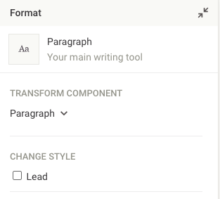

# Design

The Livingdocs design is defined by 2 top-level project config properties: `designSettings` and `components`.

The components define the building blocks out of which you can create your documents. They are basically small HTML templates for things like paragraphs, images or embeds.

The design settings define global design properties like the CSS to use or how components are grouped together.

An example:
```javascript
// projectConfig.designSettings: {...}
"designSettings": {
    "assets": {
      "css": [
        "https://cdnjs.cloudflare.com/ajax/libs/materialize/1.0.0/css/materialize.min.css"
      ]
    },
    "componentProperties: [{
        label: 'Lead',
        type: 'option',
        value: 'paragraph--lead',
        name: 'paragraph-style-lead'
    }, {
        label: 'Background Color',
        type: 'style',
        cssProperty: 'background-color',
        name: 'css-background-color'
    }],
    "componentGroups": [
      {
        "name": "text",
        "label": "Text",
        "components": [
          "title",
          "p"
        ]
      },
      {
        "name": "media",
        "label": "Media",
        "components": [
          "image",
          "insta"
        ]
      }
    ],
    "defaultComponents": {
      "paragraph": "p",
      "image": "image"
    },
    "fieldExtractor": [
      {
        "identifier": "title",
        "type": "text",
        "matches": [
          "title.title"
        ]
      }
    ]
},
"components": [
    {
      "name": "title",
      "label": "Title",
      "iconUrl": "https://livingdocs-assets.s3.amazonaws.com/magazine-design/assets/images/icons-components/icon_header_simple.svg",
      "directives": [
        {
          "type": "editable",
          "name": "title",
          "maxLength": 5
        }
      ],
      "html": "<h2 doc-editable=\"title\">\n  Title\n</h2>"
    },
    {
      "name": "p",
      "label": "Paragraph",
      "iconUrl": "https://livingdocs-assets.s3.amazonaws.com/magazine-design/assets/images/icons-components/icon_text.svg",
      "html": "<p class=\"text\" doc-editable=\"text\">\n  Paragraph\n</p>"
    },
    {
      "name": "image",
      "label": "Bild",
      "iconUrl": "https://livingdocs-assets.s3.amazonaws.com/magazine-design/assets/images/icons-components/icon_image.svg",
      "directives": [
        {
          "name": "image",
          "type": "image",
          "allowOriginalRatio": true,
          "imageRatios": [
            "16:9",
            "1:1",
            "4:3",
            "3:4"
          ]
        }
      ],
      "html": "<div class=\"m-asset-image m-asset-image--numbered\">\n  <div class=\"m-asset-image__image\">\n    \n  </div>\n  <div class=\"m-asset-image__options\">\n    <div class=\"a-asset-input\" doc-editable=\"caption\">Caption</div>\n    <div class=\"a-asset-input\" doc-editable=\"source\">Source</div>\n  </div>\n</div>"
    },
    {
      "name": "insta",
      "label": "Instagram",
      "iconUrl": "https://livingdocs-assets.s3.amazonaws.com/magazine-design/assets/images/icons-components/icon_image.svg",
      "directives": [
        {
          "name": "insta",
          "type": "include",
          "service": "instagram"
        }
      ],
      "html": "<div doc-include=\"insta\">\n  <div>Instagram Include</div>\n</div>"
    }
]
```

## Assets

Livingdocs uses CSS and possible JS assets to render documents. The `assets` object contains 2 keys, `css` and `js`, both of which are arrays and contain fully specified URLs to your CSS and JS files respectively. We advise you to upload the files to an AWS S3 bucket or similar and link them.

## Component Properties

Component properties give users of the Livingdocs editor easy styling options for components. There are three types of properties:
- `option`, turns a style (css class) on or off
- `select`, select from a set of css classes
- `style`, in tandem with [doc-style directives](directives/style.md), sets the `style` attribute of a tag

The `value` in case of option or select contains a CSS class from your CSS asset files.



The schema looks as follows.
```javascript
componentProperties: ms.arrayOf(ms.allOf([{
    if: ms.obj({type: ms.const('option')}),
    then: ms.strictObj({
    type: ms.required.enum('option'),
    name: 'string:required',
    label: 'string',
    value: 'string:required'
    })
}, {
    if: ms.obj({type: ms.const('select')}),
    then: ms.strictObj({
    type: ms.required.enum('select'),
    name: 'string:required',
    label: 'string',
    // must contain one empty option
    options: ms.required.arrayOf(ms.strictObj({
        caption: 'string:required',
        value: 'string'
    }))
    })
}, {
    if: ms.obj({type: ms.const('style')}),
    then: ms.strictObj({
    type: ms.required.enum('style'),
    name: 'string:required',
    label: 'string',
    cssProperty: 'string:required'
    })
}]))
```

## Component Groups
*has UI support*

With component groups you can visually group together similar components, e.g. "Text components" for use in the Livingdocs editor sidebar.
We advise you to use the UI in "Project Setup - Component Library" to create and re-arrange groups.

## Default Components

Livingdocs knows 2 types of default components:
- Paragraph, automatic insert when a user presses "Enter" in the editor, typically a p tag
- Image, automatic insert when a user drags an image to Livingdocs, e.g. from the Desktop

You have to configure the handle of the respective component that should be inserted.

## Field Extractor

The field extractor allows you to prefill metadata fields with values from the document. A common use case is to use the document title in a metadata field `title`.
In `identifier` you define the handle of the metadata field that you want to prefill.
In `type` you define what type the data has. This can be any of `text` (for `doc-editable` directives), `image` (for `doc-image`) and `cssProperty` (for `doc-style`). Other design directives are currently not supported.
In `matches` you define an array of component.directive pairs from which the content should be prefilled. E.g. for a component named "title" that has a doc-editable directive "title", you would write "title.title".
In `cssProperty` you can define which CSS Property you want to extract, e.g. `color`. This only makes sense if the `type` is `cssProperty`.

## Components

Components are the building blocks of Livingdocs documents. In essence a component is a combination of an HTML template with declarative Livingdocs directive attributes (`doc-` directives) and a JSON with configuration for those directives.

```javascript
  "name": "p",
  "label": "Paragraph",
  "iconUrl": "https://livingdocs-assets.s3.amazonaws.com/magazine-design/assets/images/icons-components/icon_text.svg",
  "directives": [{
    "name": "p",
    "type": "editable",
    "plainText": true
  }],
  "html": "<p class=\"text\" doc-editable=\"text\">\n  Paragraph\n</p>"
```

The above component definition will render a paragraph with editable text. Only plaintext is allowed in this text.

Livingdocs supports the following directive types.

| Type  | Description           |
|:---------|:-----------|
| editable | The content of this tag is editable text by the user. [details](directives/editable.md) |
| image    | The user can select and image that is set as a `src` attribute on `` tags and as `background-image` style on other tags. [details](directives/image.md) |
| container | This tag can contain other components. [details](directives/container.md) |
| link | The href attribute of this tag can be set to a link by the user. [details](directives/link.md) |
| include | Inside of this tag, a remote micro service will render an edge-side include of the given type. [details](directives/include.md) |
| html | The content of this tag is freeform HTML. This can be used to embed tweets or IFrames. [details](directives/html.md) |
| style | Allows a user to set the `style` attribute on a DOM node [details](directives/style.md) |

For the declaration in HTML always prepend `doc-` to the type.

Apart from directives, components also have properties.

- `allowedParents`, array of strings, defines in which components that have container directives (you must give the component name) this component may be added
- `excludeFromTextCount`, true | false, if true no editable directives in this component are counted towards the document text count
- `properties`, array of strings, references to component properties (see above) that should be shown in the properties panel if this component is selected in the editor
- `iconUrl`, string, fully specified URL to an icon that is displayed for this component in the editors sidebar
- `label`, string, the title that this component has
- `description`, string, a descriptive text for this component
- `name`, string, the system name of this component