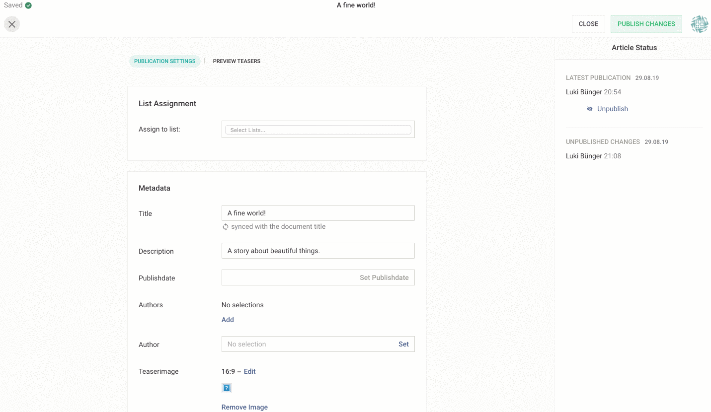

# Teaser Preview



The Teaser Preview adds an additional read-only view to the publication section of the Livingdocs Editor. It is by default disabled and can only be enabled and configured through a [content type config](../project-config/content_types.md). 

We basically configure a mapping that translates a subset of the **_current document_** (the one we are editing / publishing) into a state that gets rendered using components from your design. Further we can also control the dimensions and look of the preview.

**Please note**: This documentation assumes that you have a [channel](../project-config/README.md) and a [design](../../guides/create_designs.md) and at least one [content type](../project-config/content_types.md) properly set up.


## Minimalist example

```
teaserPreview: {
  enabled: true,
  renderSettings: [{
    handle: 'normal',
    windowWidth: 320
  }],
  teasers: [{
    componentName: 'title',
    label: 'Title Teaser',
    renderSetting: 'normal',
    directives: [{
      name: 'title',
      source: ['metadata.title']
    }]
  }]
}
```

This roughly translates into the following:

> Render component `'title'` into a viewport using render settings `'normal'` with the directive `'title'` prefilled  with what was found under `'metadata.title'` on the source object.


## Source object schema

A subset of a document structure that you will be able to write lookups against. The `metadata` object gives access to all properties you set up using [metadata plugins](../server-api/metadata.md) 

```
{
  // The document id
  id: 100
  // The documents title
  title: 100,
  // Any metadata on the document
  metadata: {
    // title,
    // description,
    // teaserImage,
    ...
  }
}
```

## Full schema

```
teaserPreview: {
  // Whether the preview is enabled.
  enabled: true,  
  
  // A set of objects that define the size of the 
  // rendered preview viewport. This section 
  // controls the actual preview.
  renderSettings: [{

    // An identifier of your choosing.
    handle: 'sidebar',

    // A numeric value (absolute pixels) for the viewport width.
    windowWidth: 640,
    
    
    // Optional. A numeric width (absolute pixels) for the viewport height. 
    // Only set this if you want to enforce fixed dimensions. If ommitted, the height
    // of viewport will auto-adjust.
    windowHeight: 320,

    // Optional. A DOM string representing a wrapping component for the teaser.
    // Use this to give the teaser some context e.g. by emulating a sidebar.
    wrapper: '<div class="sidebar"></div>'
  }],

  // A set of teaser components you want to have rendered as previews.
  // Basically any component from your design can act as a teaser.
  teasers: [{
    
    // The name of the component as defined in the related design.
    componentName: 'teaser-sidebar',
    
    // Optional. The label for the teaser preview. Falls back to the label as
    // defined in the related design.
    label: 'Sidebar Teaser',
    
    // Refers to a handle in `renderSettings`
    renderSetting: 'sidebar',
    
    // A list of directives you want to prefill with content
    directives: [
      {
        // The name of the directive. 
        name: 'embed',

        // A list of possible lookups on the passed source object.
        // Accepts dot-formatted strings for nested value access. 
        // The first lookup in the list that gets a match against the 
        // source object will get used to determine the value of the 
        // directive mapping.
        source: ['metadata.myCustomid', 'id'],
        
        // Optional. If you target directives that operate on object content
        // (e.g. `doc-include` directives), you can provide a dot-formatted
        // target parameter. The resolved source value will then get set on the 
        // content object.
        // If you omit this, the resolved source value will get set on the directive
        // "as is". This is useful when targeting `doc-editable` directives  
        target: 'params.mediaId'
      }
    ]
  }]
}
```

### Stuff worth noting

- Render settings should usually omit the `windowHeight` parameter as this lets the viewport auto-adjust its height. 
- Use the `windowHeight` setting to create a fixed view port. This is useful if you want to render teasers depending on a static display aspect ratio.
- Use the wrapper to emulate the context of your teasers. Remember, you have all your design styles/classes at your disposal.
- Mind your media queries! As the preview will live in an `iframe` with all the design styles loaded, the `windowWidth` will directly affect width-related media queries. You could also use this to your advantage to e.g. preview mobile versions of teasers.
- If a rendered wrapper is wider than `windowWidth`, the contents are scaled, or zoomed out, to fit the required width.    

## Examples

### Example 1:

In a design, with a teaser component `teaser`:
```
<div class="teaser">
    <h1 doc-editable="title"></h1>
    </img>
    <p doc-image="lead"></p>
</div>
```

Extend a [content-type config](../project-config/content_types.md): 

```
contentTypes: [{
  handle: 'regular',
  documentType: 'article',
  teaserPreview: {
    enabled: true,
    renderSettings: [{
      handle: 'sidebar',
      width: 320
    }],
    teasers: [{
      name: 'teaser',
      size: 'sidebar',
      directives: [{
        name: 'title',
        source: [
          'metadata.title',
          'title'
        ]
      }, {
        name: 'image',
        source: ['metadata.teaserImage']
      }, {
        name: 'lead',
        source: [
          'metadata.description',
          'metadata.title'
        ]
      }]
    }]
  }
}]
```   

### Example 2:

In a design, with a teaser component `embed-teaser`:
```
<div class="embed-teaser" doc-include="embed">
</div>
```

Extend a [content-type config](../project-config/content_types.md): 

```
contentTypes: [{
  handle: 'regular',
  documentType: 'article',
   teaserPreview: {
    enabled: true,
    renderSettings: [{
      handle: 'wide',
      wrapper: '<section style="width:700px;display:flex;justify-content: center;"></section>',
      windowWidth: 640
    }],
    teasers: [{
      componentName: 'embed-teaser',
      label: 'Sidebar Teaser',
      renderSetting: 'sidebar',
      directives: [{
        name: 'embed',
        source: ['id'],
        target: 'params.mediaId'
      }]
    }]
  },
}]
```
