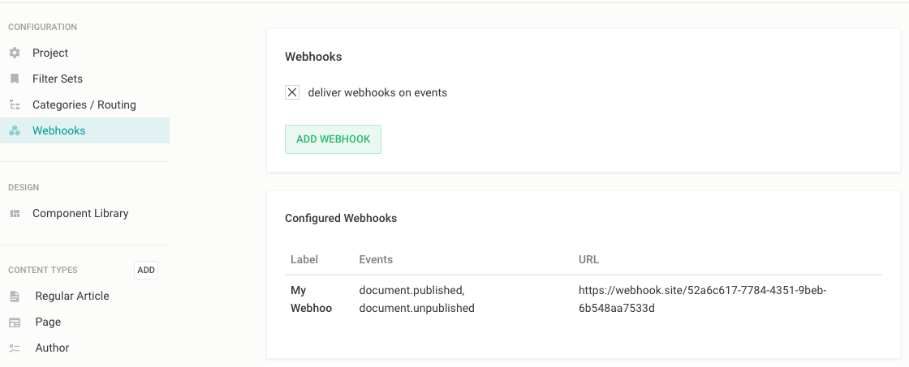

# Webhooks
- added in `release-2020-05`

Webhooks are registered HTTP endpoints that are called on specific events. Registered webhooks can be called when a document is published (`document.published`) or unpublished (`document.unpublished`).
You can configure multiple webhooks that are called on only one or both of these events.

## Configuration

The feature is enabled by default, you can disable it in your [server configuration](../server-configuration/config.md#webhooks).

In the project menu, select "Project Setup", then select "Webhooks" in the "Configuration" section of the menu. You can activate/deactivate all your configured webhooks using the setting "deliver webhooks on events".



Add a new Webhook by clicking "Add Webhook" or edit an existing one by clicking on it's entry in the list. This shows a form to configure the webhook.

- `handle` needs to be unique on your project
- `label` is used for UI only
- `description` is only visible in this form and can be used to document the reason for this webhook or other humans to talk to for questions about the endpoint
- `url` will be called with a POST request when a selected event happens
- `secret` is used to sign the request. Use this to [secure your webhooks](#securing-your-webhooks)
- `active` needs to be `true` for this webhook to be called
- `events` let's you define which events should trigger your webhook

For testing purposes the service at https://webhook.site may come in handy. It gives you an URL you can use to send webhooks to and look at all the requests in a webinterface.


### Configuration storage

The configuration of webhooks is stored in `channelConfig.settings.webhooks`.

```
webhooks: {
  active: true
  configurations: [{
    handle: 'my-webhook',
    label: 'My Webhook',
    description: 'A description for future self and coworkers',
    url: 'https://example.com/my-webhook-endpoint',
    secret: 'a-secret-token-to-sign-the-request'
    active: true
    events: ['document.published', 'document.unpublished']
  }
}]
```

## Payload
The payload sent to your webhook endpoints looks like this. The `deliveryId` is unique for every call.

`document.published`
```
{
  "event": "document.published",
  "deliveryId": "o4-0Rdu0f695qnlun0iY-",
  "projectId": 8,
  "projectHandle": "magazine",
  "webhookHandle": "my-webhook",
  "publicationEvent": {
    "createdAt": "2020-04-22T11:09:17.439Z",
    "projectId": 8,
    "channelId": 10,
    "documentId": 40,
    "contentType": "regular",
    "documentType": "article",
    "eventType": "publish",
    "publicationId": 113
  }
}
```

`document.unpublished`
```
{
  "event": "document.unpublished",
  "deliveryId": "HMCywrXG5EDPqwrogRfum",
  "projectId": 8,
  "projectHandle": "magazine",
  "webhookHandle": "my-webhook",
  "publicationEvent": {
    "createdAt": "2020-04-22T11:09:16.800Z",
    "projectId": 8,
    "channelId": 10,
    "documentId": 40,
    "contentType": "regular",
    "documentType": "article",
    "eventType": "unpublish",
    "publicationId": 112
  }
}
```

## Securing your webhooks
If you have defined a `secret` for your webhook, Livingdocs uses this to create a signature of the payload and sends it with the request in the HTTP header `x-livingdocs-signature`.
The signature is created using HMAC-SHA256 and will be sent in `x-livingdocs-signature` in the form `sha256=<hex digest>` for example `sha256=d8a47af83666a771d57117aa28ef8d3243a3de43`.

Here is sample code in JavaScript to validate the signature in your endpoint:

```js
// set payload to the body received with the request to your endpoint
const payload = request.body
const signature = request.headers['x-livingdocs-signature']

// secret needs to be the same you configured with the webhook in livingdocs
const secret = 'a-secret-token-to-sign-the-request' // you should not hardcode this but read it from an environment variable

// compute the hmac on the received payload using the same secret
const crypto = require('crypto')
const hmac = crypto.createHmac('sha256', secret)
const payloadSignature = Buffer.from(`sha256=${hmac.update(payload).digest('hex')}`, 'utf8')
const checksum = Buffer.from(signature, 'utf8')

// use timingSafeEqual to compare the signature sent from livingdocs with the computed checksum
if (crypto.timingSafeEqual(payloadSignature, checksum)) {
  // payload is valid, move on
} else {
  // abort, this is not a valid request
}
```