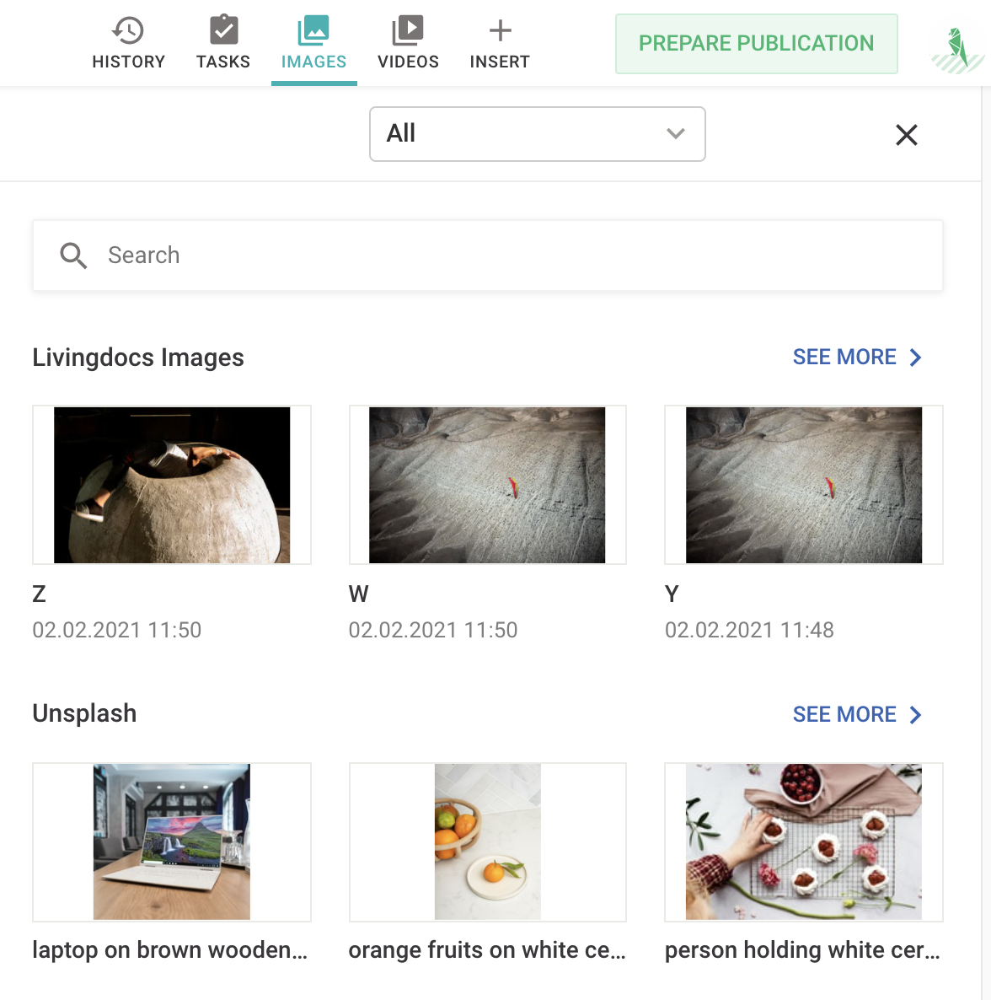

# Media Sources

Added in: `release-2021-03`

With [Media Sources](/reference/media-source-example.md) you can integrate asset research/import into Livingdocs. Instead of going onto another provider like Unsplash and then drag + drop images into Livingdocs, you can have Unsplash assets search results embedded into Livingdocs directly.

If you have integrated a Media Source properly, the Livingdocs editor also shows the search results of the Media Source which can be added to the document like any other asset via drag+drop.



## Example

To integrate a Media Source into Livingdocs you have to do 3 things:
- write a media source plugin (search/import function)
- register the plugin
- configure the Media Source on a [Media Type](/reference-docs/project-config/media_types.md) in the project config.

### Step 1 - Write a Media Source Plugin

First you have to implement a Media Source plugin which has 3 properties:
- `handle` - unique identifier which will be referenced later in the config
- `searchMediaImage` - middleware to request the asset provider and transform the resultset into a Livingdocs format
- `fetchMediaImage` - middleware to fetch the asset


```js
// plugins/media-sources/example_plugin
module.exports = {

  handle: 'examplePlugin',

  // Implement a search result for the Livingdocs Editor from an asset provider
  // based on a search query
  async searchMediaImage ({projectId, query, offset, limit, config, log}) {
    const res = await axios.get(myImageServiceUrl)

    // {
    //   totalResults: 100,
    //   entries: [
    //     {id: 1, title: 'title-1', width: 1024, height: 768},
    //     {id: 2, title: 'title-2', width: 1024, height: 768},
    //     {id: 3, title: 'title-3', width: 1024, height: 768}
    //   ]
    // }
    const data = res.data

    const results = data.entries.map(result => {
      return {
        metadata: {
          title: result.title
        },
        asset: {
          key: result.id,
          width: result.width,
          height: result.height,
          // when the remote service supports image resizing, pass '{{width}}' as search parameter
          // the editor will replace {{width}} and the image can then requested in the right size
          previewUrl: `https://li-test.ch/${result.id}.png?w={{width}}`
        }
      }
    })

    return {
      total: data.totalResults,
      results
    }
  },

  // When you want to drag+drop an asset from a MediaSource search result into a document
  // you must also define a fetch function to import the asset into the Media Library
  async fetchMediaImage ({projectId, key, config, log}) {
    // fetch image from remote service
    const buffer = await fs.readFile(`test/fixtures/${key}`)

    return {
      fileName: key,
      buffer
    }
  }
}
```


### Step 2 - Register the Media Source Plugin

```js
liServer.registerInitializedHook(async () => {
  const mediaLibraryApi = liServer.features.api('li-media-library')
  mediaLibraryApi.registerMediaSource(require('./plugins/media-sources/example_plugin'))
})
```

### Step 3 - Configure the Media Source

As a last step, a Media Source needs to be added to a [Media Type](/reference-docs/project-config/media_types.md) in the project config. It's important that the plugin property of the Media Source config matches the handle of the plugin. The media source config also has a `config` property which will be passed to the plugin on runtime.

```js
// mediaTypes in project config
modules.exports = {
  type: 'mediaImage',
  handle: 'image',
  info: {
    label: 'Image',
    description: 'Media type for images'
  }
  metadata: [...],
  // add a media source here
  mediaSources: [
    {
      handle: 'example',
      // the plugin name must match with the registered plugin(-handle)
      plugin: 'examplePlugin',
      info: {
        // this label is shown in the editor
        label: 'Example'
      },
      // config will be passed to the plugin
     config: {
       accessKey: '****'
     }
    }
  ],
}
