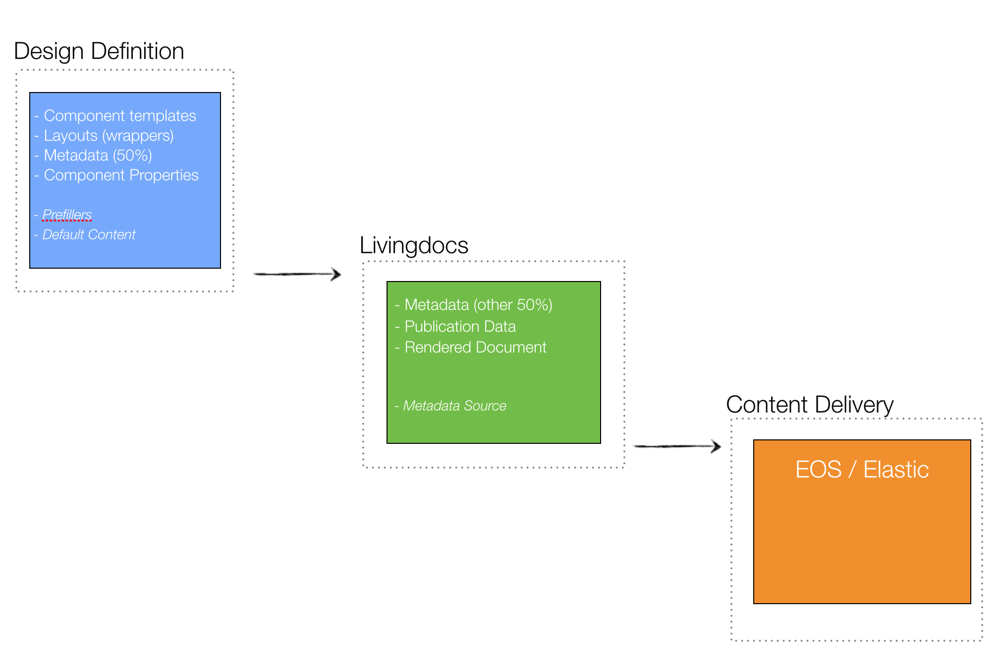

## Migration subjects

The above schema shows the different systems involved with Livingdocs data. The definition is given in the design, i.e., Morpheus' config.json. Livingdocs uses this definition to edit and publish documents and send them to the delivery channel.

The following list looks at the different relevant data definitions at each step and describes how the data affects migration scenarios. The data definitions in italics are only given for completeness and are not relevant for migrations.

#### Component Templates

Those are the building blocks of livingdocs. A template contains definitions for the following parts:
- HTML structure
- directives (editable parts)
- directive configuration
- properties

The most crucial parts for the migration are the directives and directive configurations. A directive tells livingdocs what is editable in an HTML template and how. There are 6 types of directives:
- doc-editable (editable text)
- doc-image (editable image)
- doc-link (editable link)
- doc-html (placeholder for arbitrary HTML)
- doc-container (define a directive as container for other directives)
- doc-optional (visibility toggle)

doc-optional changes are not relevant for the migration since they merely change the behavior of a component in the editor, not its data model nor its generated output.
All other directive are relevant. Adding a new directive is unproblematic and does not require a migration. Removing a directive, renaming it, or changing the type of a directive is a breaking change and requires a migration.

In the same way directive configurations have to be generally seen as breaking. With those it depends though on a case by case basis and it makes sense to whitelist some configuration changes. TODO: create whitelist

#### Layouts

The layouts define HTML wrapper blocks that are wrapped around the whole HTML of a livingdocs article. They are always used to render the article inside the livingdocs editor and depending on implementation also on the delivery frontends.

Changes in the markup of a layout are not subject to a migration. Depending on the frontend implementation they might require a re-publishing of existing articles.
Adding new layouts is also not subject to a migration. Removing or renaming a layout though is a breaking change and requires a migration.

#### Metadata (design part)

The metadata section of a design defines which parts of an article's content should be automatically parsed for use in metadata. There are two types of content that can be parsed for the metadata: text and images. 

Changes to the metadata that introduce objects that are more than one level deep are breaking changes and will make saving the document impossible. They do not require a migration but a change in the (Livingdocs) server-side validation code (JSON schema). Additions of objects with only one level or any other datatype are not breaking.

Changes in the metadata are generally not subject to migrations. Existing metadata is saved on a document and remains even if the metadata extractor entry was removed.
The more relevant question in this regard is whether the document contains all the metadata information that the frontend requires. A (possibly versioned) validation of this required metadata should be introduced in the publishing process, i.e., documents should only be allowed for publication if they fulfill all metadata requirements from the frontend.
Such a metadata validation does currently not exist. It could be added to the design specification (e.g., as "requiredMetadata").

#### Component Properties

These are properties that define the visual behavior of a component. Examples are the left and right floating properties on images. Properties are defined in the configuration of a design and are "instantiated" on each component that should be able to use it.

Adding new properties or property values is not a breaking change and requires no further action. Changing or removing a property is also not a breaking change, however it might change the visual representation of a component. If a user sets an image to be left-floating and the left-floating property is removed, then the image will be just rendered at its default position (in the middle). This does not break the document, i.e., prevents it from opening or displaying, but it removes the intention of the user who set it as left-floating. A migration might be used here but it is not required.

#### Metadata (editor part)

This is metadata that is set explicitly in the editor using custom code. Examples are a future publication date or tags. The migration relevance for this kind of metadata is equivalent to the one from the design.

#### Publication Data

This data comes directly with a publication. Examples are the publication date or the id of the document. The migration relevance for this data is equivalent to the metadata (i.e, only concerns frontends).

#### Rendered Document

The rendered document is delivered by the Livingdocs Server with the help of the various render decorators that produce channel-specific output. For the livingdocs editor the render decorators are currently a black-box, i.e., there is no WYSIWYG for everything going on in the render decorators. We could (and should) think of preview modes using the render decorators.

Changes to the render decorators are not subject to migrations. They do require a re-publish of the document however to be applied. The same is true for changes in the rendering behavior of the Livingdocs Engine (though changes should be much rarer there).

## Migration algorithm

Out of the discussion of the different data definitions in the previous chapter we can deduce an algorithm for migration scenarios.

### Requires a data migration of existing Livingdocs documents

- when component directives are changed or removed
- when component directive properties are changed that are not white-listed
- when a layout is renamed or removed

### Requires a re-publishing of existing Livingdocs documents

- when a layout is changed (depending on whether the frontend implementation uses it)
- when a render decorator is changed
- when the Livingdocs Engine is changed with respect to rendering output (very rare)

### Optional data migration and republishing

- When component properties are changed. This decision has to be taken on a case-by-case basis.

## Decisions

Out of the above consideration we devise a list of features to be developed to support migration scenarios in Livingdocs.

### Design versions

A design gets a version number that is inspired by semver and consists of three digits. A change in the first digit represents a breaking change that requires a migration. A change in the second digit represents a possible data loss (e.g., changing component property) and has an optional migration associated. A change in the third digit represents a non-breaking change that does not require a migration.
For example a change from version 1.0.0 to 2.0.0 requires a migration. A change from version 1.0.1 to 1.0.2 does not require a migration.

The design version that was used to create and edit the document is stored with each document. The current (latest) design version is stored with each design. When the editor tries to open a document with a new design version 2.0.0 but the document was created with design version 1.0.0 the migration is run automatically on this document upon opening. If no migration was found (an error condition) then the user can still open and edit the document with the old design version (1.0.0) but she is warned that she is working on an outdated design and should alert technical support.

### Re-publishing job

The re-publishing of existing documents is not a one-to-one correspondence with migrations. E.g., when a migration is performed, a re-publishing is not necessarily needed. For this reason, re-publishing should be handled separately in a job, e.g., a grunt task. This grunt task can be run in the deployment process if necessary. Whether a re-publish should be done or not should be marked in the deployment notes of the specific deployment.

### Migration deploy helpers (optional)

Although migrations run on a per document basis (as we saw above) in order to ensure no-downtime-working, we should run them as a batch jobs whenever they are deployed to a server. In this way documents are already migrated when opened by a user and wait-time is reduced.
Also, we could add a deployment script that recognizes breaking changes in the design version and checks if a migration is present for this change and aborts the deployment if this is not the case.

### Versioning helper (optional)

To make the versioning of the design easier we could develop a script that analyzes the changes from one design version to the next and proposes a design version to the user or warns the user if it suspects that a breaking change is done without making a change in the first digit of the version.

### Metadata schema (optional)

Implement a (JSON) schema for the metadata that is required by a frontend to publish the document. In this way a frontend can define what properties from the metadata it requires to render the document and can prevent publishing of the document if it is not present. Frontends are not versioned thus a change in the required metadata might interfere with the re-publishing job if a new metadata field is required that was previously not present. In this case a data migration is necessary. The proposal would be to add this schema to the design definition and handle it with respect to data migrations equivalent to changes to the component properties.
