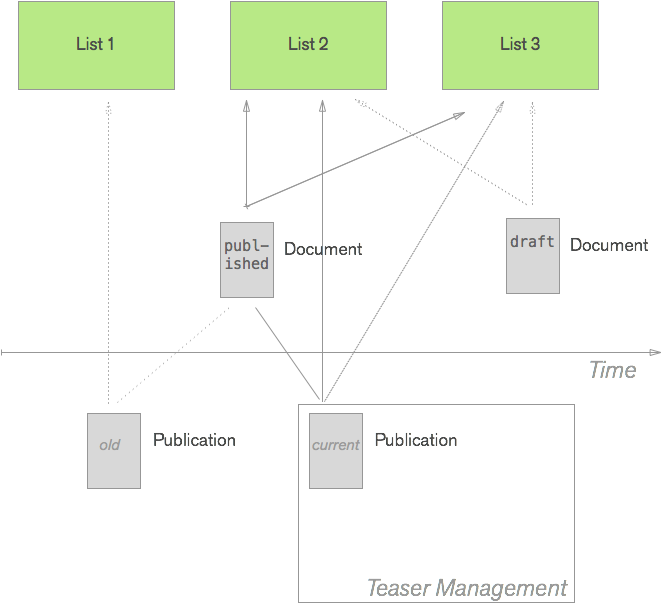

## Teaser Assignment

By default every list is empty and a document is not assigned to any lists. The user has 2 ways to create an assignment of a document to a list:
- on the publish panel of a document by selecting the list
- on the TM user interface by dragging a document on a list manually

### Document to list relation

On a data-structure level the relation between lists and documents is stored in three places. 

The first two are the metadata of the document and publication records. It is worth noting that a list relation can only exist to a published document. Unpublished documents can not belong to any lists. The entry will look like the following:
```json
metadata:
  listIds: [1, 2, 3]
```

The second one is a join table called `documents_in_lists` that joins the two tables `document_lists` and `documents` and in addition to the relation stores the way in which the relation was conceived, e.g., on the publish panel. This table is currently only used for bookkeeping and has no use in delivery or editing.

### Document vs. Publication

As mentioned before a relation to a list can only be done on a published document. This bears the question why not only the publication model has the relation. The reason to set up the relation with the document is that the document represent the main data model entity while a publication is in principle only a view on a document at a certain point in time. Thus we chose to always use the document and its id as the main entity (also in elastic).

A consequence of this is that list assignments on the publication will propagate back to the document. So if an editor uses the TM to drag a document to a list, then not only the publication of this document is updated but also the document itself.



The figure above illustrates this point by showing 3 sets of states:
- an old publication which is assigned to List 1
- the current publication which is assigned to List 2 and List 3
- the current draft of the document which is also assigned to List 2 and List 3

The TM user interface always works with the latest publication of a document (filled lines) and the listId assignment of the draft is ensured to be the same as the one of the current publication. The draft (latest state) of a document can only overwrite the list assingment once a user hits "Publish" in the publish panel and with this creates a new publication record.

NOTE: Never ever trigger an automated publish from the TM user interface. This could lead to unwantend draft changes to suddenly become public. The update of the `listIds` is controlled and does not publish any other information.

### adding / removing teasers from a list

As discussed above, every publication comes with its assigned `listIds` from the publish panel (publish call to the API). After that you can still add or remove a publication from a list. To do this you can use 2 API endpoints:

```
POST /document_lists/:id/add-candidate
Parameters: document_id, assignment_content (any of 'publish', 'search')

POST /document_lists/:id/remove-candidate
Parameters: document_id
```

Both of these endpoints will also automatically update the respective publication record in elastic. The document record is not updated on elastic.
We use those endpoints in the TM user interface when dragging a document from the search into a list or removing a document from a list.

### using the list assignment

The list assignment is used to filter the documents for a list's proposal. Every list defines an elastic query on how to fetch and order documents that may appear in the list. In addition each list contains an entry that filters the documents based on the existence of its own `listId`. The following is an example of a query for the list with id 6:
```json
{
  "sort": {
    "publication_date": {
      "order": "desc"
    }
  },
  "query": {
    "filtered": {
      "filter": {
        "bool": {
          "must": [
            {
              "term": {
                "publication.space_id": 1
              }
            },
            {
              "term": {
                "publication.metadata.listIds": 6
              }
            }
          ]
        }
      }
    }
  }
}
```
Note that the list assignment does not affect the publication of a list, i.e., the pinned documents that appear in a published list. Those are fetched exclusively from the `pinned` member of the `document_lists` table.

