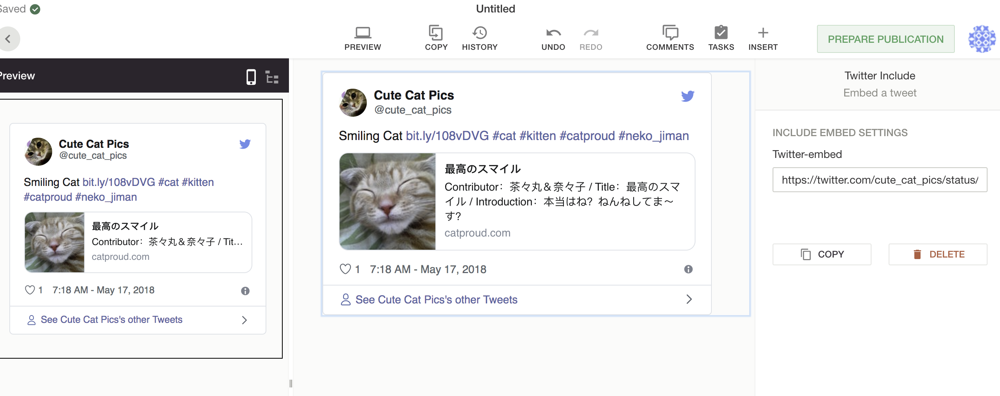

# Add an Twitter include (embed)

This guide will show you how to add a custom Include for Twitter. We will show the implementation for the design, server and editor.
This is more of a quick-guide where you can just copy and paste code. For a deeper understanding you can dive into [server-customization](../reference-docs/doc-includes/server_customization.md) and [editor-customization](../reference-docs/doc-includes/editor_customization.md)



*The screenshot above shows an twitter card in an article with the "preview-feature" triggered so it appears twice*

## Design definition

In the design you will define the component. This is pretty basic.

```json
{
  "name": "twitterIncludeComponent",
  "html": "<div style='border: 1px solid black;padding: 20px;'  doc-include='twitterInclude' class='placeholder'></div>",
  "label": "Twitter Include",
  "description": "Embed a tweet",
  "directives": {
    "twitterInclude": {
      "service": "twitterInclude"
    }
  }
}
```

## Server - rendering the include and defining the service

In the server you will define the `twitterInclude` service.

This twitterInclude service has one main job -
rendering the include with parameters filled in the editor.

```js
// server.js
liServer.features.register('custom-includes', require('./doc-includes'))

// ./doc-includes/index.js
module.exports = async function (feature, server) {
  const includesApi = server.features.api('li-includes')
  await includesApi.registerServices([
    require('../../plugins/includes/tweet')
  ])
}

// ../../plugins/includes/tweet.js
const fetch = require('node-fetch')
module.exports = {
  name: 'twitterInclude',
  uiComponents: [
    {
      type: 'angular-component',
      sidebarLabel: 'Twitter-include',
      sidebarContentComponent: 'liTwitterInclude' // Sidebar: liTwitterInclude from the core-editor.
    }
  ],
  rendering: {
    type: 'function',
    function: renderTweet
  }
}

// we are using the twitter oembed api, so we expect a link in the editor
// we will resolve the tweet html from the link
// Alternatively you could paste the embed code <blockquote... /> and just use that
function renderTweet (params, options, cb) {
  fetch(`https://publish.twitter.com/oembed?url=${params.embedLink};omit_script=true`, {method: 'GET'})
  .then(res => res.json())
  .then(tweetData => {

  // these are the possible params. Only "html" is required
  // But we will need the twitter script and define a way to trigger it in the editor later
  const include = {
    html: tweetData.html,
    embed: 'liTwitterPlugin', // TwitterPlugin from the core-editor.
    dependencies: {
      js: [
        {
          src: 'https://platform.twitter.com/widgets.js',
          namespace: 'includes.twitter'
        }
      ]
    }
  }
  return cb(null, include)
  }).catch(err => cb(err))
}
```


## Editor - Sidebar and trigger twitter script

You will have to define two things, the sidebar where one can paste the embed code or twitter link and in certain cases once the script has already loaded you will need to trigger it again. For example when components are moved or a second twitter component been pasted in the same document.

We have a special `onRendered` hook for includes where you can trigger a script.


Registering the sidebar and plugin. liTwitterInclude and liTwitterPlugin are both within the core.
If you were to copy this setup, they would already be defined and you wouldn't need to copy this step
```js
// Sidebar
liEditor.includes.register('liTwitterInclude', {
  template: require('../plugins/doc-includes/twitter-include/template.html'),
  controller: require('../plugins/doc-includes/twitter-include/controller'),
  bindings: {
    directive: '=',
    componentView: '=',
    component: '='
  }
})

// execute the twitter widgets load for the twitter script
liEditor.includePlugins.register('liTwitterPlugin', {
  controller: require('../plugins/include-plugin/twitter'),
})
```

Registering the HTML for the sidebar, you can decide what parameters the user can enter here
```js
// ../plugins/doc-includes/twitter-include/template.html
<div class="ld-panel" ng-if="$ctrl.directive">
  <div class="ld-panel__header">
    <h2 class="ld-panel__header__title">Include embed settings</h2>
  </div>
  <div class="ld-panel__body">
    <form name="idForm" novalidate>
      <div class="ld-form-group"
        ng-class="{'has-error': idForm.idInput.$invalid && idForm.idInput.$touched}">
        <div class="ld-form-group__label">
          <label class="ld-form-label">Twitter-embed</label>
        </div>
        <div class="ld-form-group__content">
          <input
            name="idInput"
            class="ld-text-input"
            ng-model="$ctrl.embedLink"
            ng-change="$ctrl.save()"
            ng-model-options="{debounce: 512}"
            placeholder="Twitter embed link"
            required>
        </div>
      </div>
    </form>
  </div>
</div>
```

The controller for the HTML, here you save the parameters onto the document.
In the server the render function will now be triggered
```js
// ../plugins/doc-includes/twitter-include/controller.js
module.exports = class twitterInclude {
  $onInit () {
    const params = this.directive.getParams()
    this.embedLink = params && params.embedLink
  }

  save () {
    this.directive.addParams({
      embedLink: this.embedLink
    })
  }
}
```

Once the server has returned the include object with the HTML and scripts,
as everything has loaded the `onRendered` hook will be fired and you can fire `twttr.widgets.load()` and it should be nicely displayed!
```js
// ../plugins/include-plugin/twitter
module.exports = {
  /**
   *
   * @param {Object} componentData {componentModelId, directiveName, include, renderer}
   */
  onRendered (err, componentData) {
    if (err) return
    const {twttr} = componentData.renderer.renderingContainer.window
    twttr != null ? twttr.ready(() => twttr.widgets.load()) : undefined
  }
}
```